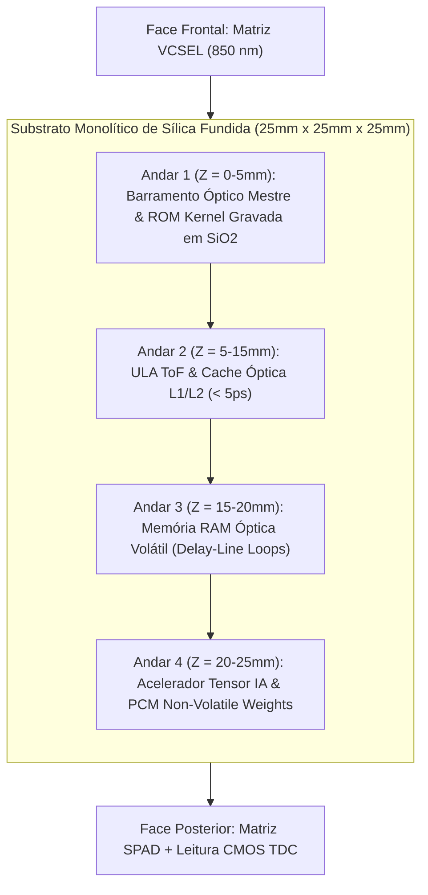

# Processador Óptico Tridimensional por Tempo de Voo (SilicaCore)

> **Arquitetura Computacional Volumétrica em Substrato de Sílica Fundida com Lógica ToF e Hierarquia de Memória Fotônica de Três Níveis**

[](LICENSE)
[](https://creativecommons.org/licenses/by/4.0/)
[](https://go.dev/)
[]()

---

## 📌 Sumário
- [1. Visão Geral e Motivação](#1-visão-geral-e-motivação)
- [2. Contexto Institucional & Pesquisa Aberta](#2-contexto-institucional--pesquisa-aberta)
- [3. Fundamentação Física e Equações de Propagação](#3-fundamentação-física-e-equações-de-propagação)
- [4. Hierarquia de Memória Fotônica](#4-hierarquia-de-memória-fotônica)
- [5. Arquitetura Lógica e Estrutura Volumétrica](#5-arquitetura-lógica-e-estrutura-volumétrica)
- [6. Simulador Numérico em Go (Golang)](#6-simulador-numérico-em-go-golang)
- [7. Referências Bibliográficas Científicas](#7-referências-bibliográficas-científicas)
- [8. Estrutura do Repositório](#8-estrutura-do-repositório)
- [9. Licença e Contribuição](#9-licença-e-contribuição)

---

## 1. Visão Geral e Motivação

À medida que os limites físicos da litografia de semicondutores se aproximam da escala atômica, a eletrônica tradicional enfrenta dois grandes gargalos:
1. **Dissipação Térmica Parasita:** O movimento de elétrons em condutores metálicos gera aquecimento por efeito Joule ($P = I^2 R$) e limites de latência RC em interconexões de alta densidade.
2. **Gargalo de von Neumann:** A transferência física constante de dados entre a memória DRAM/SRAM e a ULA gasta até 80% da energia total.

O **SilicaCore** propõe uma alternativa volumétrica em **substrato monolítico de sílica fundida ($SiO_2$)**, unificando processamento e memória no mesmo bloco óptico. Em vez de codificar a informação na amplitude da luz, a lógica opera no **domínio temporal determinístico** através da medição precisa do tempo de voo (*Time-of-Flight*) de pulsos laser de femtossegundos.

---

## 2. Contexto Institucional & Pesquisa Aberta

Este repositório adota a filosofia de **Ciência Aberta (*Open Science*)**:
- **Prova de Anterioridade Temporal:** Registro transparente e criptograficamente datado do desenvolvimento da arquitetura via commits Git.
- **Colaboração em Rede na UTFPR:** Conexão entre o curso de Sistemas para Internet (UTFPR - Guarapuava) e laboratórios de Física, Fotônica e Engenharia Elétrica de outros campi (Curitiba / Pato Branco).
- **Abordagem Simulation-First:** Engine de alta performance desenvolvida em **Go (Golang)** explorando concorrência nativa por *goroutines* para validar $1.000.000+$ de operações de CPU e memória.

---

## 3. Fundamentação Física e Equações de Propagação

- **Substrato:** Sílica Fundida ($SiO_2$), $n \approx 1.4500$ em $\lambda = 850\text{ nm}$.
- **Velocidade de Propagação:** $v = \frac{c}{n} \approx 0.20675 \text{ mm/ps}$.
- **Linha Rápida ($d_1 = 20.0\text{ mm}$):** $t_1 = 96.73\text{ ps}$.
- **Linha Atrasada ($d_0 = 40.675\text{ mm}$):** $t_0 = 196.73\text{ ps}$.
- **Separação Temporal ($\Delta t$):** $100.0\text{ ps}$.
- **Margem de Jitter ($\sigma_{\text{total}} = 11.24\text{ ps}$):** **$8.90\sigma$** ($\text{BER} < 10^{-12}$).

---

## 4. Hierarquia de Memória Fotônica

O SilicaCore introduz três camadas de memória fotônica integradas diretamente ao substrato:

1. **Cache L1/L2 Óptica ($\le 5.0\text{ ps}$):** Ressonadores de Micro-anéis (*Micro-ring Resonators*) com chaveamento bistável não-linear (*Alexoudi et al., IEEE JSTQE 2020; Bogaerts et al., 2012*).
2. **Memória RAM Óptica Volátil ($\sim 96.73\text{ ps}$):** Cavidades em Linha de Atraso Recirculante em Anel Fechado com desacoplamento $95/5$ e amplificação por SOAs (*Yao, IEEE PTL 1993*).
3. **Memória Não-Volátil Persistente:**
   - **Kernel do SO:** Nanofilamentos gravados por laser de femtossegundo em $SiO_2$ para inicialização instantânea na velocidade da luz (*Zhang et al., PRL 2014*).
   - **Pesos de IA:** Filmes de Mudança de Fase Fotônica (PCM - $GST / Sb_2Se_3$) para computação *In-Memory* (*Ríos et al., Nature Photonics 2015; Feldmann et al., Nature 2019*).

Documento detalhado: [04-hierarquia-de-memoria-optica.md](docs/architecture/04-hierarquia-de-memoria-optica.md).

---

## 5. Arquitetura Lógica e Estrutura Volumétrica



Documentações completas da arquitetura:
- [01-visao-geral-hardware.md](docs/architecture/01-visao-geral-hardware.md)
- [02-logica-tempo-de-voo.md](docs/architecture/02-logica-tempo-de-voo.md)
- [03-unidades-funcionais-alu-gpu-ia.md](docs/architecture/03-unidades-funcionais-alu-gpu-ia.md)
- [04-hierarquia-de-memoria-optica.md](docs/architecture/04-hierarquia-de-memoria-optica.md)
- [whitepaper-v1.md](docs/papers/whitepaper-v1.md)

---

## 6. Simulador Numérico em Go (Golang)

```bash
cd simulations/go

# Rodar a simulação estatística Monte Carlo (1.000.000 operações de CPU e Memória)
go run ./cmd/simulator

# Executar a suíte de testes unitários
go test -v ./...
```

---

## 7. Referências Bibliográficas Científicas

1. **Ríos, C., et al. (2015).** "Integrated all-photonic non-volatile multi-level memory." *Nature Photonics*, 9(11), 700–706.
2. **Feldmann, J., et al. (2019).** "All-optical spiking neurosynaptic networks with self-learning capabilities." *Nature*, 569(7755), 208–214.
3. **Zhang, J., et al. (2014).** "Seemingly unlimited lifetime data storage in white fused silica by ultrafast laser writing." *Physical Review Letters*, 112(3), 033901.
4. **Alexoudi, A., et al. (2020).** "Integrated Photonic Memories for High-Performance Computing." *IEEE Journal of Selected Topics in Quantum Electronics*, 26(2), 1–15.
5. **Bogaerts, W., et al. (2012).** "Silicon microring resonators." *Laser & Photonics Reviews*, 6(1), 47–73.
6. **Yao, X. S. (1993).** "High-frequency optical delay line memory." *IEEE Photonics Technology Letters*, 5(3), 371–374.
7. **Prucnal, P. R. (2006).** *Photonic Processors in Optical Networking*. CRC Press.

---

## 8. Estrutura do Repositório

```text
.
├── README.md                                # Cartão de visitas e documentação principal
├── LICENSE                                  # Licença Apache 2.0 / CC BY 4.0
├── .gitignore                               # Exclusões de build e caches
├── docs/                                    # Especificações de Engenharia e Artigos
│   ├── architecture/
│   │   ├── 01-visao-geral-hardware.md
│   │   ├── 02-logica-tempo-de-voo.md
│   │   ├── 03-unidades-funcionais-alu-gpu-ia.md
│   │   └── 04-hierarquia-de-memoria-optica.md
│   ├── papers/
│   │   └── whitepaper-v1.md                 # Artigo científico completo com citações
│   └── assets/diagramas/
├── simulations/                             # Motor de Simulação em Go
│   └── go/
│       ├── go.mod
│       ├── cmd/
│       │   └── simulator/
│       │       └── main.go                  # CLI executável
│       └── pkg/
│           └── optical/
│               ├── core.go                  # Equações, latências de memória e parâmetros
│               ├── tof.go                   # Monte Carlo em Goroutines & Hierarquia de Memória
│               └── tof_test.go              # Suíte de testes em Go
└── planning/                                # Gestão de Metas e Roadmap
    ├── roadmap.md
    ├── tasks.md
    └── specs.md
```

---

## 9. Licença e Contribuição

- **Código Go e Scripts de Simulação:** Licenciados sob a [Apache License 2.0](LICENSE).
- **Documentação e Artigos Técnicos:** Licenciados sob a [Creative Commons Attribution 4.0 International (CC BY 4.0)](https://creativecommons.org/licenses/by/4.0/).
