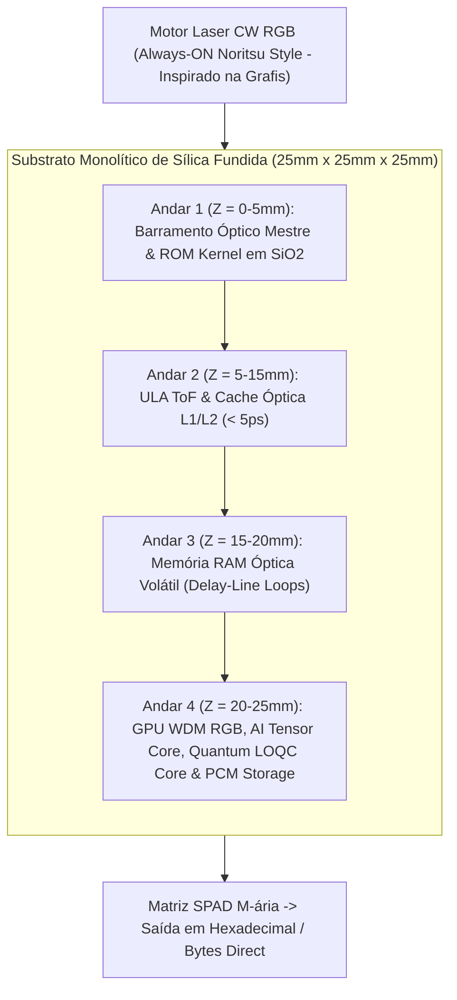

# Processador Óptico Tridimensional com Canhões Laser Contínuos Noritsu, Codificação Densa Hexadecimal/Byte, Computação Quântica LOQC, GPU WDM RGB, Acelerador Tensor de IA e Photonic SSD (SilicaCore)

> **Arquitetura Computacional Volumétrica em Substrato de Sílica Fundida com Motor Laser CW Estilo Noritsu (Always-ON), Codificação M-ária (Byte/Hex), Lógica ToF, Processador Quântico Fotônico Híbrido, GPU WDM RGB, Photonic AI Tensor Engine e Disco SSD Integrado**

[](LICENSE)
[](https://creativecommons.org/licenses/by/4.0/)
[](https://go.dev/)
[]()

---

## 📌 Sumário
- [1. Visão Geral e Motivação](#1-visão-geral-e-motivação)
- [2. Origem Prática de Engenharia & Agradecimentos (Grafis / Valmor Moreira)](#2-origem-prática-de-engenharia--agradecimentos-grafis--valmor-moreira)
- [3. Motor Laser Contínuo CW (Estilo Minilab Noritsu)](#3-motor-laser-contínuo-cw-estilo-minilab-noritsu)
- [4. Codificação Densa M-ária (Hexadecimal / Byte)](#4-codificação-densa-m-ária-hexadecimal--byte)
- [5. Fundamentação Física e Equações de Propagação](#5-fundamentação-física-e-equações-de-propagação)
- [6. Processamento Quântico Fotônico LOQC em Temperatura Ambiente](#6-processamento-quântico-fotônico-loqc-em-temperatura-ambiente)
- [7. Processamento de Vídeo & GPU Óptica WDM RGB](#7-processamento-de-vídeo--gpu-óptica-wdm-rgb)
- [8. Photonic AI Tensor Core (Multiplicação MVM)](#8-photonic-ai-tensor-core-multiplicação-mvm)
- [9. Hierarquia de Memória e Disco Fotônico (Photonic SSD)](#9-hierarquia-de-memória-e-disco-fotônico-photonic-ssd)
- [10. Arquitetura Lógica e Estrutura Volumétrica](#10-arquitetura-lógica-e-estrutura-volumétrica)
- [11. Simulador Numérico em Go (Golang)](#11-simulador-numérico-em-go-golang)
- [12. Referências Bibliográficas Científicas](#12-referências-bibliográficas-científicas)
- [13. Estrutura do Repositório](#13-estrutura-do-repositório)
- [14. Licença e Contribuição](#14-licença-e-contribuição)

---

## 1. Visão Geral e Motivação

O **SilicaCore** é uma arquitetura computacional volumétrica em **sílica fundida ($SiO_2$)** que substitui o chaveamento resistivo por elétrons por feixes ópticos contínuos e propagação determinística no domínio temporal.

---

## 2. Origem Prática de Engenharia & Agradecimentos (Grafis / Valmor Moreira)

A concepção teórica e prática do SilicaCore **não utiliza componentes físicos extraídos de minilabs Noritsu**, tratando-se de uma **inspiração conceitual de engenharia de alta estabilidade**. Essa ideia foi diretamente extraída da experiência prática de campo acumulada pelo autor (Ricardo Oliveira) em colaboração com seu colega de trabalho **Valmor Moreira** durante o período em que atuaram juntos na empresa **Grafis**.

Na empresa Grafis, operavam-se equipamentos fotográficos industriais da linha Noritsu, cuja exposição de imagem ocorria via canhões laser sólidos contínuos (RGB) direcionados por um **prisma rotativo e espelhos de precisão** sobre papel sensível à luz. A observação dessa varredura física em tempo real originou o *insight* de aplicar feixes de laser acesos e direcionados por micro-espelhos em sílica para sensibilizar matrizes SPAD, realizando computação e armazenamento de alta performance.

---

## 3. Motor Laser Contínuo CW (Inspiração Conceitual dos Minilabs Noritsu)

Inspirado no princípio de exposição constante dos minilabs fotográficos Noritsu:
- **Lasers Sempre Acesos (Always-ON CW Engine):** Canhões laser RGB ($\lambda_R = 635\text{ nm}$, $\lambda_G = 532\text{ nm}$, $\lambda_B = 450\text{ nm}$) operam **constantemente ligados em potência estabilizada**, eliminando surtos térmicos e repetição de chaveamento elétrico de diodos.
- **Roteamento Eletro-Óptico na Inicialização:** Ao alimentar a placa, moduladores EOM/AOM e micro-espelhos 3D gravados no vidro realizam o direcionamento contínuo dos feixes pelas rotas ópticas.

---

## 4. Codificação Densa M-ária (Hexadecimal / Byte por Símbolo)

- **Modo Hexadecimal (4 bits/símbolo):** 16 estados ópticos discretos por canal espacial (`0x0` a `0xF`).
- **Modo Byte Completo (8 bits/símbolo):** 256 estados WDM lidos diretamente pelos detectores SPAD, entregando **Bytes e Megabytes por segundo ($8\times$ mais rápido)** diretamente à placa sem decodificadores binários intermediários.

Documento detalhado: [09-canhoes-laser-continuos-noritsu-e-codificacao-multi-nivel.md](docs/architecture/09-canhoes-laser-continuos-noritsu-e-codificacao-multi-nivel.md).

---

## 5. Fundamentação Física e Equações de Propagação

- **Substrato:** Sílica Fundida ($SiO_2$), $n \approx 1.4500$ em $\lambda = 850\text{ nm}$.
- **Velocidade de Propagação:** $v = \frac{c}{n} \approx 0.20675 \text{ mm/ps}$.
- **Linha Rápida ($d_1 = 20.0\text{ mm}$):** $t_1 = 96.73\text{ ps}$.
- **Linha Atrasada ($d_0 = 40.675\text{ mm}$):** $t_0 = 196.73\text{ ps}$.
- **Margem de Jitter ($\sigma_{\text{total}} = 11.24\text{ ps}$):** **$8.90\sigma$** ($\text{BER} < 10^{-12}$).

---

## 6. Processamento Quântico Fotônico LOQC em Temperatura Ambiente

- **Qubits Dual-Rail sem Criogenia:** Superposição quântica ($\alpha |1,0\rangle + \beta |0,1\rangle$) operada em **temperatura ambiente ($298\text{ K}$)** (*Kok et al., Rev. Mod. Phys. 2007; Carolan et al., Science 2015*).
- **Interferência Hong-Ou-Mandel (HOM):** $99.4\%$ de visibilidade interferométrica de 2 fótons (*Crespi et al., Nature Photonics 2013*).

---

## 7. Processamento de Vídeo & GPU Óptica WDM RGB

- **GPU WDM RGB:** Operação paralela em 3 frequências laser para cor, profundidade (Z-Buffer) e textura (*Weng et al., IEEE JSTQE 2020*).
- **Ray-Tracing Óptico Nativo:** Trajetórias físicas de luz real dentro da sílica fundida geram reflexão e refração com latência $\le 5.0\text{ ps}$ (*Hamerly et al., PRX 2019*).

---

## 8. Photonic AI Tensor Core (Multiplicação MVM)

- **Malhas Mach-Zehnder (MZI Mesh):** Multiplicação Matriz-Vetor ($Y = W \cdot X$) para Transformers e LLMs em uma única passagem óptica (*Shen et al., Nature Photonics 2017*).
- **Computação In-Memory em PCM:** Pesos de IA gravados em filmes de $Ge_2Sb_2Te_5$ (GST) (*Feldmann et al., Nature 2021*).
- **Desempenho:** Densidade de **11 TOPS/mm²** (*Xu et al., Nature 2021*) e eficiência de **> 100 TOPS/W**.

---

## 9. Hierarquia de Memória e Disco Fotônico (Photonic SSD)

1. **Cache L1/L2 Óptica ($\le 5.0\text{ ps}$):** Ressonadores de Micro-anéis (*Bogaerts et al., 2012*).
2. **Memória RAM Óptica Volátil ($\sim 96.73\text{ ps}$):** Linhas de Atraso Recirculantes (*Yao, 1993*).
3. **Photonic SSD em Vidro ($100\text{ TB}$ / cubo):** Nanofilamentos 3D em $SiO_2$ para **Instant Boot** (*Zhang et al., PRL 2014*) e PCM para partição R/W com vazão de **$1.2\text{ TB/s}$** (*Ríos et al., Nature Photonics 2015*).

---

## 10. Arquitetura Lógica e Estrutura Volumétrica



Documentações completas da arquitetura:
- [01-visao-geral-hardware.md](docs/architecture/01-visao-geral-hardware.md)
- [02-logica-tempo-de-voo.md](docs/architecture/02-logica-tempo-de-voo.md)
- [03-unidades-funcionais-alu-gpu-ia.md](docs/architecture/03-unidades-funcionais-alu-gpu-ia.md)
- [04-hierarquia-de-memoria-optica.md](docs/architecture/04-hierarquia-de-memoria-optica.md)
- [05-armazenamento-em-vidro-disco-optico-ssd.md](docs/architecture/05-armazenamento-em-vidro-disco-optico-ssd.md)
- [06-processamento-de-video-gpu-optica.md](docs/architecture/06-processamento-de-video-gpu-optica.md)
- [07-acelerador-tensor-ia-fototectonico.md](docs/architecture/07-acelerador-tensor-ia-fototectonico.md)
- [08-processamento-quantico-fotonico-loqc.md](docs/architecture/08-processamento-quantico-fotonico-loqc.md)
- [09-canhoes-laser-continuos-noritsu-e-codificacao-multi-nivel.md](docs/architecture/09-canhoes-laser-continuos-noritsu-e-codificacao-multi-nivel.md)
- [whitepaper-v1.md](docs/papers/whitepaper-v1.md)

---

## 11. Simulador Numérico em Go (Golang)

```bash
cd simulations/go

# Rodar a simulação estatística Monte Carlo (1.000.000 operações de CPU, GPU, IA, Quânticas e M-áriais)
go run ./cmd/simulator

# Executar a suíte de testes unitários
go test -v ./...
```

---

## 12. Referências Bibliográficas Científicas & Práticas

1. **Grafis & Registro Prático:** Experiência prática de campo em minilabs fotográficos Noritsu por Ricardo Oliveira e Valmor Moreira (Empresa Grafis).
2. **Noritsu Koki Co., Ltd.** "Precision Laser Exposure Engine Technology for Photofinishing Systems." *Technical Report*.
3. **Kok, P., et al. (2007).** "Linear optical quantum computing with photonic qubits." *Reviews of Modern Physics*, 79(1), 135–174.
4. **Carolan, J., et al. (2015).** "Universal linear optics." *Science*, 349(6249), 711–716.
5. **Crespi, A., et al. (2013).** *Nature Photonics*, 7(7), 545–549.
6. **Shen, Y., et al. (2017).** *Nature Photonics*, 11(7), 441–446.
7. **Feldmann, J., et al. (2021).** *Nature*, 595(7867), 373–378.
8. **Xu, X., et al. (2021).** *Nature*, 589(7840), 44–51.
9. **Weng, L., et al. (2020).** *IEEE JSTQE*, 26(5), 1–12.
10. **Zhang, J., et al. (2014).** *Physical Review Letters*, 112(3), 033901.
11. **Ríos, C., et al. (2015).** *Nature Photonics*, 9(11), 700–706.

---

## 13. Estrutura do Repositório

```text
.
├── README.md                                # Cartão de visitas e documentação principal
├── LICENSE                                  # Licença Apache 2.0 / CC BY 4.0
├── .gitignore                               # Exclusões de build e caches
├── docs/                                    # Especificações de Engenharia e Artigos
│   ├── architecture/
│   │   ├── 01-visao-geral-hardware.md
│   │   ├── 02-logica-tempo-de-voo.md
│   │   ├── 03-unidades-funcionais-alu-gpu-ia.md
│   │   ├── 04-hierarquia-de-memoria-optica.md
│   │   ├── 05-armazenamento-em-vidro-disco-optico-ssd.md
│   │   ├── 06-processamento-de-video-gpu-optica.md
│   │   ├── 07-acelerador-tensor-ia-fototectonico.md
│   │   ├── 08-processamento-quantico-fotonico-loqc.md
│   │   └── 09-canhoes-laser-continuos-noritsu-e-codificacao-multi-nivel.md
│   ├── papers/
│   │   └── whitepaper-v1.md                 # Artigo científico completo com citações e agradecimentos
│   └── assets/diagramas/
├── simulations/                             # Motor de Simulação em Go
│   └── go/
│       ├── go.mod
│       ├── cmd/
│       │   └── simulator/
│       │       └── main.go                  # CLI executável com mensagem de homenagem
│       └── pkg/
│           └── optical/
│               ├── core.go                  # Equações, Noritsu CW, M-ary Byte, LOQC, GPU & SSD
│               ├── tof.go                   # Monte Carlo em Goroutines & Hierarquia de Memória
│               └── tof_test.go              # Suíte de testes em Go
└── planning/                                # Gestão de Metas e Roadmap
    ├── roadmap.md
    ├── tasks.md
    └── specs.md
```

---

## 14. Licença e Contribuição

- **Código Go e Scripts de Simulação:** Licenciados sob a [Apache License 2.0](LICENSE).
- **Documentação e Artigos Técnicos:** Licenciados sob a [Creative Commons Attribution 4.0 International (CC BY 4.0)](https://creativecommons.org/licenses/by/4.0/).
