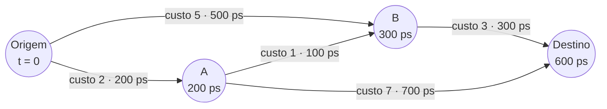
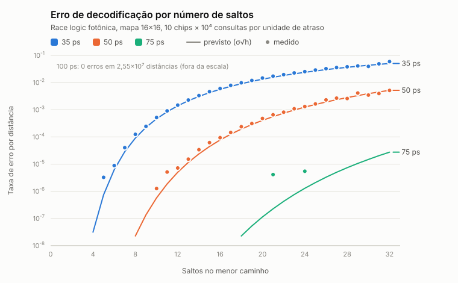
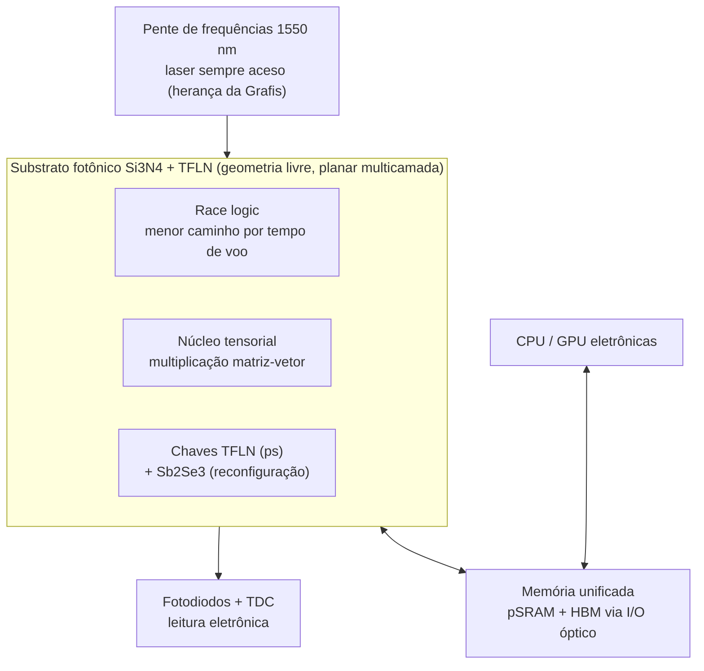

<div align="center">

# SilicaCore

### Computação por tempo de voo: a primeira luz a chegar é a resposta.

*Um acelerador fotônico de pesquisa aberta que resolve menor caminho em grafos deixando pulsos de luz apostarem corrida, com cada número checado contra a física.*

[](LICENSE) [](https://creativecommons.org/licenses/by/4.0/) [](https://go.dev/) [](https://meep.readthedocs.io/) [](planning/roadmap.md)

**[A ideia](#a-ideia-em-30-segundos)** · **[Resultados](#o-que-os-números-dizem)** · **[O que a física mudou](#o-que-a-física-nos-obrigou-a-mudar)** · **[Rodar agora](#experimente-em-um-minuto)** · **[Artigo](docs/papers/artigo-preliminar.md)**

</div>

---

## A ideia em 30 segundos

Um processador comum calcula o menor caminho num mapa passo a passo: lê um nó, compara distâncias, reordena uma fila, repete milhares de vezes.

O SilicaCore faz outra pergunta: **e se o próprio mapa fosse o computador?**

- Cada **estrada** do mapa vira um trecho de guia de onda, com comprimento proporcional ao seu custo.
- Cada **cruzamento** vira um detector que, ao receber o primeiro pulso, dispara um novo pulso para todas as saídas.
- Um único pulso sai da origem e se espalha pelo grafo. **O momento em que a luz chega a cada ponto é a distância até ele.**

Ninguém precisa comparar nada: quem chega primeiro já é, por definição, o caminho mais curto. É a ideia de *race logic* (Madhavan, Sherwood e Strukov, ISCA 2014) transposta para fótons em chips de nitreto de silício e niobato de lítio.



*O pulso chega a B em 300 ps pelo desvio S→A→B, antes dos 500 ps do caminho direto: a distância de B é 3. No destino, o primeiro pulso chega em 600 ps: distância 6.*

---

## O que os números dizem

Resultados do simulador em Go (física de perdas, jitter, leitura e área), com a estatística feita para aguentar uma banca:

| | Resultado | Como foi obtido |
| :--- | :--- | :--- |
| **Correção** | **0 erros em 25,5 milhões de distâncias** (< 1,2×10⁻⁷ com 95% de confiança) | Mapa 16×16, 10 chips simulados × 10⁴ consultas, unidade de atraso de 100 ps |
| **Velocidade** | **42 ns por consulta** (11,5 ns de corrida + 30,7 ns de leitura) | Contra ~50–100 µs de Dijkstra; ~2.000× medido numa CPU de 2012, **~150–800× estimado** contra CPUs atuais |
| **Área** | **648 mm²** para o bloco 16×16 | Cabe num retículo de litografia (858 mm²) |
| **Escala** | **64×64 em 16 chips, 0 erros, 31 ns** origem→destino | Exige unidade de 150 ps e acoplamento entre chips ≤ 1,5 dB por face; com 150 ps, cada bloco precisa cair para ~12×12 para caber no retículo |
| **Roteamento** | **1,3 dB por porta** em Si₃N₄ + TFLN | Contra 46,6 dB dos espelhos internos do conceito original |
| **Física dos guias** | Curva de 50 µm: **0,003 dB**; transição para o niobato: **< 0,003 dB** | Simulação eletromagnética FDTD 2D (Meep), confirmando que as premissas do modelo são conservadoras |

<p align="center">
  
</p>
<p align="center"><em><b>Figura 1.</b> O erro medido (pontos) segue a previsão teórica de ruído acumulado (linhas) em cada unidade de atraso. Com 100 ps, nenhum erro em 2,55×10⁷ distâncias.</em></p>

> [!NOTE]
> A leitura eletrônica dos resultados, e não a luz, é o que domina o tempo. O ganho não é O(1): cresce com a distância máxima do mapa. Esses limites estão quantificados no [artigo preliminar](docs/papers/artigo-preliminar.md), não escondidos.

---

## De onde veio a ideia

Na empresa **Grafis**, o autor (Ricardo Oliveira) e o colega **Valmor Moreira** operavam equipamentos fotográficos industriais: lasers **sempre acesos** varriam papel fotossensível guiados por um prisma rotativo e espelhos de precisão.

Observando a máquina surgiu a pergunta que deu origem ao projeto: se um feixe contínuo e bem guiado grava uma imagem com precisão micrométrica, por que não usá-lo para **computar**?

O primeiro desenho era um cubo de vidro com espelhos internos. A física respondeu. E a resposta levou a algo mais interessante.

---

## O que a física nos obrigou a mudar

Este projeto trata cada afirmação como hipótese. Quando o modelo desmentiu uma ideia, ela foi trocada, e o motivo ficou registrado:

| Ideia original | O que a física mostrou | Como ficou |
| :--- | :--- | :--- |
| Cubo maciço de sílica com espelhos internos | Feixe livre abre para ~2,8 mm e perde **46,6 dB por porta** | Substrato fotônico planar multicamada, compatível com wafers industriais |
| Espelho eletro-óptico na própria sílica | Sílica não tem efeito Pockels; reflexão exigiria incidência de 0,002° | Chaves de **niobato de lítio em filme fino (TFLN)**, acima de 67 GHz |
| "206 GHz" de clock pelo tempo de voo | Tempo de voo é latência, não período de clock | **~5,1 GHz por canal**, limitado pela janela de decisão |
| Margem de 8,9σ e erro < 10⁻¹² | O critério correto é Q = Δt/2σ = 4,45 | Erro de ~4×10⁻⁶ na porta, corrigido no simulador |
| Gigabytes de RAM em linhas de atraso | 16 GB exigiriam **~3.000 km** de guia de onda | Memória unificada: pSRAM fotônica (~25 ps) + HBM via I/O óptico |
| 0,05 pJ/bit e >100 TOPS/W | Lasers, conversores e controle dominam o consumo | ~1,9 pJ/bit no modelo; 0,84 TOPS/W é o teto medido em sistemas publicados |
| Race logic "sem erros" com 50 ps | Com 10⁵ consultas aparecem 1,2×10⁻⁴ erros por distância | Unidade de 100 ps, validada estatisticamente |

O resultado é uma proposta menor que o sonho inicial, e por isso mesmo **defensável e publicável**.

---

## Arquitetura



- **Guias de Si₃N₄** (800 nm × 0,7 µm, monomodo) formam as espirais de atraso, com perda < 0,1 dB/cm.
- **TFLN** faz a comutação em picossegundos; **Sb₂Se₃** guarda os pesos do grafo sem consumir energia parado.
- O SilicaCore é um **coprocessador**: lógica booleana comum, shading de jogos e controle continuam na eletrônica.

---

## Experimente em um minuto

Requer [Go 1.26+](https://go.dev/dl/).

```bash
git clone https://github.com/Roliveira96/SilicaCore.git
cd SilicaCore/simulations/go

go test ./...                     # suíte de testes
go run ./cmd/simulator            # relatório completo: física, memória, energia e race logic
go run ./cmd/racestats            # campanha de 10⁵ consultas com intervalo de confiança
go run ./cmd/racemultichip        # composição em vários chips: modo exato vs hierárquico
```

<details>
<summary><b>Regenerar a Figura 1 e rodar as simulações eletromagnéticas</b></summary>

```bash
# Figura 1 a partir do CSV da campanha (sem dependências)
go run ./cmd/racestats -chips 10 -queries 10000 -csv ../results/race_logic_hops_16x16.csv
python3 ../results/plot_race_logic_hops.py

# FDTD 2D com Meep (instalado via conda-forge: pymeep)
cd ../fdtd
bash run_sweeps.sh bends          # curvas de 90° em Si3N4
bash run_sweeps.sh transition     # transição Si3N4 -> TFLN
```
</details>

---

## Onde estamos

- [x] Modelo físico: orçamento de perdas, jitter, taxa de erro, energia e memória
- [x] Race logic fotônica com validação estatística e composição multi-chip
- [x] Artigo preliminar com Figura 1 ([rascunho](docs/papers/artigo-preliminar.md))
- [x] Bancada experimental em fibra desenhada ([doc 13](docs/architecture/13-bancada-experimental-em-fibra.md))
- [x] Simulação eletromagnética FDTD 2D de curvas e transições ([doc 11, seção 2.1](docs/architecture/11-roteamento-e-comutacao-optica.md))
- [ ] FDTD 3D das mesmas estruturas
- [ ] Montagem da bancada: porta ToF, nó de race logic e grafo 3×3
- [ ] Submissão (WSCAD/SBESC) e editais de iniciação científica

Detalhes em [roadmap](planning/roadmap.md) e [tarefas](planning/tasks.md).

---

## Limites conhecidos

Porque um projeto sério diz onde não funciona:

- **Não substitui a CPU.** É um acelerador para problemas específicos (grafos, multiplicação de matrizes).
- **Várias premissas ainda não foram medidas**, como a latência e o jitter do nó e a perda dos enlaces entre chips. Todas estão marcadas como `ASSUMPTION` no código, e a [bancada](docs/architecture/13-bancada-experimental-em-fibra.md) foi desenhada para medi-las.
- **Área limita a escala:** o bloco 16×16 ocupa quase um retículo inteiro.
- **O núcleo quântico é conceitual**, e seus detectores exigiriam criogenia (1–4 K).

---

## Documentação

| Tema | Documentos |
| :--- | :--- |
| **Comece por aqui** | [Artigo preliminar](docs/papers/artigo-preliminar.md) · [Roteamento, materiais e race logic](docs/architecture/11-roteamento-e-comutacao-optica.md) |
| **Hardware e lógica** | [Visão geral](docs/architecture/01-visao-geral-hardware.md) · [Lógica por tempo de voo](docs/architecture/02-logica-tempo-de-voo.md) · [Camadas funcionais](docs/architecture/03-unidades-funcionais-alu-gpu-ia.md) · [Lasers e codificação](docs/architecture/09-canhoes-laser-continuos-cw-e-codificacao-multi-nivel.md) |
| **Memória e IA** | [Hierarquia de memória](docs/architecture/04-hierarquia-de-memoria-optica.md) · [Armazenamento em vidro](docs/architecture/05-armazenamento-em-vidro-disco-optico-ssd.md) · [Memória unificada, jogos e IA local](docs/architecture/12-memoria-unificada-jogos-e-ia-local.md) · [Acelerador tensorial](docs/architecture/07-acelerador-tensor-ia-fototectonico.md) |
| **Outros núcleos** | [GPU óptica](docs/architecture/06-processamento-de-video-gpu-optica.md) · [Quântico LOQC](docs/architecture/08-processamento-quantico-fotonico-loqc.md) · [Energia](docs/architecture/10-consumo-energetico-e-comparativo-silicio.md) |
| **Experimento** | [Bancada em fibra 1550 nm](docs/architecture/13-bancada-experimental-em-fibra.md) |
| **Histórico** | [Whitepaper v1.1](docs/papers/whitepaper-v1.md) · [Especificações](planning/specs.md) |

<details>
<summary><b>Estrutura do repositório</b></summary>

```text
.
├── docs/
│   ├── architecture/        # 13 documentos de arquitetura, validados contra o simulador
│   └── papers/              # artigo preliminar, whitepaper e figuras
├── simulations/
│   ├── go/                  # simulador (pkg/optical) e comandos (cmd/simulator, racestats, racemultichip)
│   ├── fdtd/                # simulações eletromagnéticas 2D com Meep
│   └── results/             # CSVs de resultados e gerador da Figura 1
└── planning/                # roadmap, tarefas e especificações
```
</details>

---

## Como citar

```bibtex
@misc{silicacore2026,
  author       = {Oliveira, Ricardo},
  title        = {SilicaCore: race logic fotônica em Si3N4/TFLN com orçamento físico e validação estatística},
  year         = {2026},
  howpublished = {\url{https://github.com/Roliveira96/SilicaCore}}
}
```

## Licença

Código sob [Apache 2.0](LICENSE). Documentação e artigos sob [CC BY 4.0](https://creativecommons.org/licenses/by/4.0/).

## Agradecimentos

A **Valmor Moreira** e à **Grafis**, onde a observação de lasers industriais sempre acesos plantou a pergunta que virou este projeto.

<div align="center">
<em>Ciência aberta: cada número deste README é reproduzível com os comandos acima.</em>
</div>
