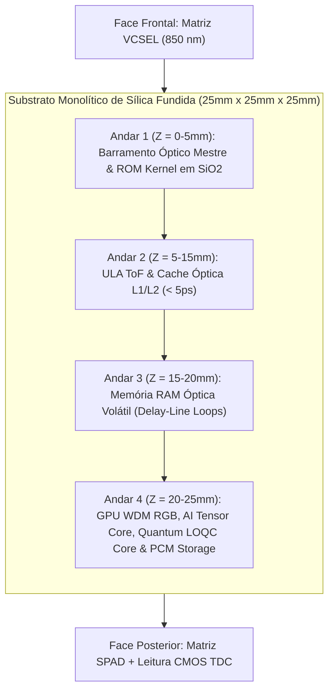

# Processador Óptico Tridimensional, Computação Quântica LOQC, GPU WDM RGB, Acelerador Tensor de IA e Photonic SSD em Vidro (SilicaCore)

> **Arquitetura Computacional Volumétrica em Substrato de Sílica Fundida com Lógica ToF, Processador Quântico Fotônico Híbrido, GPU WDM RGB, Photonic AI Tensor Engine e Disco SSD Integrado**

[](LICENSE)
[](https://creativecommons.org/licenses/by/4.0/)
[](https://go.dev/)
[]()

---

## 📌 Sumário
- [1. Visão Geral e Motivação](#1-visão-geral-e-motivação)
- [2. Contexto Institucional & Pesquisa Aberta](#2-contexto-institucional--pesquisa-aberta)
- [3. Fundamentação Física e Equações de Propagação](#3-fundamentação-física-e-equações-de-propagação)
- [4. Processamento Quântico Fotônico LOQC em Temperatura Ambiente](#4-processamento-quântico-fotônico-loqc-em-temperatura-ambiente)
- [5. Processamento de Vídeo & GPU Óptica WDM RGB](#5-processamento-de-vídeo--gpu-óptica-wdm-rgb)
- [6. Photonic AI Tensor Core (Multiplicação MVM)](#6-photonic-ai-tensor-core-multiplicação-mvm)
- [7. Hierarquia de Memória e Disco Fotônico (Photonic SSD)](#7-hierarquia-de-memória-e-disco-fotônico-photonic-ssd)
- [8. Arquitetura Lógica e Estrutura Volumétrica](#8-arquitetura-lógica-e-estrutura-volumétrica)
- [9. Simulador Numérico em Go (Golang)](#9-simulador-numérico-em-go-golang)
- [10. Referências Bibliográficas Científicas](#10-referências-bibliográficas-científicas)
- [11. Estrutura do Repositório](#11-estrutura-do-repositório)
- [12. Licença e Contribuição](#12-licença-e-contribuição)

---

## 1. Visão Geral e Motivação

À medida que os limites físicos da litografia de semicondutores se aproximam da escala atômica, a eletrônica tradicional enfrenta dois grandes gargalos:
1. **Dissipação Térmica Parasita:** O movimento de elétrons em condutores metálicos gera aquecimento por efeito Joule ($P = I^2 R$) e limites de latência RC.
2. **Gargalo de von Neumann:** A transferência constante de dados entre unidades de armazenamento/memória e a ULA/GPU consome energia massiva.

O **SilicaCore** propõe uma alternativa volumétrica em **substrato monolítico de sílica fundida ($SiO_2$)**, unificando ULA ToF, Core Quântico Fotônico (LOQC), GPU WDM RGB, Acelerador Tensor de IA e o **Photonic SSD** no mesmo bloco.

---

## 2. Contexto Institucional & Pesquisa Aberta

Este repositório adota a filosofia de **Ciência Aberta (*Open Science*)**:
- **Prova de Anterioridade Temporal:** Registro transparente e criptograficamente datado do desenvolvimento da arquitetura via commits Git.
- **Colaboração em Rede na UTFPR:** Conexão entre o curso de Sistemas para Internet (UTFPR - Guarapuava) e laboratórios de Física, Fotônica e Engenharia Elétrica de outros campi (Curitiba / Pato Branco).
- **Abordagem Simulation-First:** Engine de alta performance desenvolvida em **Go (Golang)** explorando concorrência nativa por *goroutines* para validar $1.000.000+$ de operações de CPU, GPU WDM, IA Tensor e Quânticas.

---

## 3. Fundamentação Física e Equações de Propagação

- **Substrato:** Sílica Fundida ($SiO_2$), $n \approx 1.4500$ em $\lambda = 850\text{ nm}$.
- **Velocidade de Propagação:** $v = \frac{c}{n} \approx 0.20675 \text{ mm/ps}$.
- **Linha Rápida ($d_1 = 20.0\text{ mm}$):** $t_1 = 96.73\text{ ps}$.
- **Linha Atrasada ($d_0 = 40.675\text{ mm}$):** $t_0 = 196.73\text{ ps}$.
- **Separação Temporal ($\Delta t$):** $100.0\text{ ps}$.
- **Margem de Jitter ($\sigma_{\text{total}} = 11.24\text{ ps}$):** **$8.90\sigma$** ($\text{BER} < 10^{-12}$).

---

## 4. Processamento Quântico Fotônico LOQC em Temperatura Ambiente

- **Qubits Dual-Rail sem Criogenia:** Superposição quântica ($\alpha |1,0\rangle + \beta |0,1\rangle$) operada em **temperatura ambiente ($298\text{ K}$)** (*Kok et al., Rev. Mod. Phys. 2007; Carolan et al., Science 2015*).
- **Interferência Hong-Ou-Mandel (HOM):** $99.4\%$ de visibilidade interferométrica de 2 fótons (*Crespi et al., Nature Photonics 2013*).
- **Coprocessamento Quântico Híbrido:** Algoritmos VQE e Gaussian Boson Sampling (*Arrazola et al., Nature 2021*).

Documento detalhado: [08-processamento-quantico-fotonico-loqc.md](docs/architecture/08-processamento-quantico-fotonico-loqc.md).

---

## 5. Processamento de Vídeo & GPU Óptica WDM RGB

- **Multiplexação WDM RGB:** Operação paralela em 3 frequências laser ($\lambda_R = 635\text{ nm}$, $\lambda_G = 532\text{ nm}$, $\lambda_B = 450\text{ nm}$) (*Weng et al., IEEE JSTQE 2020*).
- **Ray-Tracing Óptico Nativo:** Trajetórias físicas de luz real dentro da sílica fundida geram reflexão e refração em tempo real na velocidade da luz com latência $\le 5.0\text{ ps}$ (*Hamerly et al., PRX 2019*).

---

## 6. Photonic AI Tensor Core (Multiplicação MVM)

- **Malhas Mach-Zehnder (MZI Mesh):** Multiplicação Matriz-Vetor ($Y = W \cdot X$) para Transformers e LLMs em uma única passagem óptica (*Shen et al., Nature Photonics 2017*).
- **Computação In-Memory em PCM:** Pesos de IA gravados em filmes não-voláteis de $Ge_2Sb_2Te_5$ (GST) (*Feldmann et al., Nature 2021*).
- **Desempenho:** Densidade de **11 TOPS/mm²** (*Xu et al., Nature 2021*) e eficiência energética de **> 100 TOPS/W**.

---

## 7. Hierarquia de Memória e Disco Fotônico (Photonic SSD)

1. **Cache L1/L2 Óptica ($\le 5.0\text{ ps}$):** Ressonadores de Micro-anéis (*Bogaerts et al., 2012; Alexoudi et al., 2020*).
2. **Memória RAM Óptica Volátil ($\sim 96.73\text{ ps}$):** Cavidades em Linha de Atraso Recirculante (*Yao, 1993*).
3. **Photonic SSD em Vidro ($100\text{ TB}$ / cubo):** Nanofilamentos 3D em $SiO_2$ para **Instant Boot** (*Zhang et al., PRL 2014; Project Silica/Microsoft*) e PCM para partição R/W com vazão de **$1.2\text{ TB/s}$** (*Ríos et al., Nature Photonics 2015*).

---

## 8. Arquitetura Lógica e Estrutura Volumétrica



Documentações completas da arquitetura:
- [01-visao-geral-hardware.md](docs/architecture/01-visao-geral-hardware.md)
- [02-logica-tempo-de-voo.md](docs/architecture/02-logica-tempo-de-voo.md)
- [03-unidades-funcionais-alu-gpu-ia.md](docs/architecture/03-unidades-funcionais-alu-gpu-ia.md)
- [04-hierarquia-de-memoria-optica.md](docs/architecture/04-hierarquia-de-memoria-optica.md)
- [05-armazenamento-em-vidro-disco-optico-ssd.md](docs/architecture/05-armazenamento-em-vidro-disco-optico-ssd.md)
- [06-processamento-de-video-gpu-optica.md](docs/architecture/06-processamento-de-video-gpu-optica.md)
- [07-acelerador-tensor-ia-fototectonico.md](docs/architecture/07-acelerador-tensor-ia-fototectonico.md)
- [08-processamento-quantico-fotonico-loqc.md](docs/architecture/08-processamento-quantico-fotonico-loqc.md)
- [whitepaper-v1.md](docs/papers/whitepaper-v1.md)

---

## 9. Simulador Numérico em Go (Golang)

```bash
cd simulations/go

# Rodar a simulação estatística Monte Carlo (1.000.000 operações de CPU, GPU, IA e Quânticas)
go run ./cmd/simulator

# Executar a suíte de testes unitários
go test -v ./...
```

---

## 10. Referências Bibliográficas Científicas

1. **Kok, P., et al. (2007).** "Linear optical quantum computing with photonic qubits." *Reviews of Modern Physics*, 79(1), 135–174.
2. **Carolan, J., et al. (2015).** "Universal linear optics." *Science*, 349(6249), 711–716.
3. **Crespi, A., et al. (2013).** "Integrated laser-written photonic circuits for quantum information." *Nature Photonics*, 7(7), 545–549.
4. **Arrazola, J. M., et al. (2021).** "Quantum computational advantage with a programmable photonic processor." *Nature*, 591(7848), 54–60.
5. **Shen, Y., et al. (2017).** "Deep learning with coherent photonic circuits." *Nature Photonics*, 11(7), 441–446.
6. **Feldmann, J., et al. (2021).** "Parallel convolutional processing using an integrated photonic tensor core." *Nature*, 595(7867), 373–378.
7. **Xu, X., et al. (2021).** "11 TOPS mm⁻² photonic tensor core for optical neural networks." *Nature*, 589(7840), 44–51.
8. **Weng, L., et al. (2020).** *IEEE JSTQE*, 26(5), 1–12.
9. **Hamerly, R., et al. (2019).** *Physical Review X*, 9(2), 021032.
10. **Zhang, J., et al. (2014).** *Physical Review Letters*, 112(3), 033901.
11. **Ríos, C., et al. (2015).** *Nature Photonics*, 9(11), 700–706.

---

## 11. Estrutura do Repositório

```text
.
├── README.md                                # Cartão de visitas e documentação principal
├── LICENSE                                  # Licença Apache 2.0 / CC BY 4.0
├── .gitignore                               # Exclusões de build e caches
├── docs/                                    # Especificações de Engenharia e Artigos
│   ├── architecture/
│   │   ├── 01-visao-geral-hardware.md
│   │   ├── 02-logica-tempo-de-voo.md
│   │   ├── 03-unidades-funcionais-alu-gpu-ia.md
│   │   ├── 04-hierarquia-de-memoria-optica.md
│   │   ├── 05-armazenamento-em-vidro-disco-optico-ssd.md
│   │   ├── 06-processamento-de-video-gpu-optica.md
│   │   ├── 07-acelerador-tensor-ia-fototectonico.md
│   │   └── 08-processamento-quantico-fotonico-loqc.md
│   ├── papers/
│   │   └── whitepaper-v1.md                 # Artigo científico completo com citações
│   └── assets/diagramas/
├── simulations/                             # Motor de Simulação em Go
│   └── go/
│       ├── go.mod
│       ├── cmd/
│       │   └── simulator/
│       │       └── main.go                  # CLI executável
│       └── pkg/
│           └── optical/
│               ├── core.go                  # Equações, LOQC Quantum, GPU WDM, AI Tensor & Photonic SSD
│               ├── tof.go                   # Monte Carlo em Goroutines & Hierarquia de Memória
│               └── tof_test.go              # Suíte de testes em Go
└── planning/                                # Gestão de Metas e Roadmap
    ├── roadmap.md
    ├── tasks.md
    └── specs.md
```

---

## 12. Licença e Contribuição

- **Código Go e Scripts de Simulação:** Licenciados sob a [Apache License 2.0](LICENSE).
- **Documentação e Artigos Técnicos:** Licenciados sob a [Creative Commons Attribution 4.0 International (CC BY 4.0)](https://creativecommons.org/licenses/by/4.0/).
