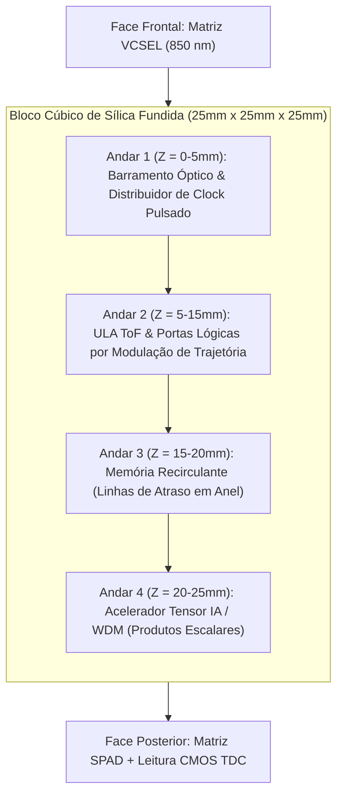

# Processador Óptico Tridimensional por Tempo de Voo (ToF-CPU)

> **Arquitetura Computacional Volumétrica em Substrato de Sílica Fundida com Lógica por Modulação Temporal de Pulsos Laser**

[](LICENSE)
[](https://creativecommons.org/licenses/by/4.0/)
[](https://go.dev/)
[]()

---

## 📌 Sumário
- [1. Visão Geral e Motivação](#1-visão-geral-e-motivação)
- [2. Contexto Institucional & Pesquisa Aberta](#2-contexto-institucional--pesquisa-aberta)
- [3. Fundamentação Física e Equações de Propagação](#3-fundamentação-física-e-equações-de-propagação)
- [4. Arquitetura Lógica e Estrutura Volumétrica](#4-arquitetura-lógica-e-estrutura-volumétrica)
- [5. Simulador Numérico em Go (Golang)](#5-simulador-numérico-em-go-golang)
- [6. Estrutura do Repositório](#6-estrutura-do-repositório)
- [7. Roteiro de Publicação e Oportunidades](#7-roteiro-de-publicação-e-oportunidades)
- [8. Licença e Contribuição](#8-licença-e-contribuição)

---

## 1. Visão Geral e Motivação

À medida que os limites físicos da litografia de semicondutores se aproximam da escala atômica, a eletrônica tradicional enfrenta dois grandes gargalos:
1. **Dissipação Térmica Parasita:** O movimento de elétrons em condutores metálicos gera aquecimento por efeito Joule ($P = I^2 R$) e limites de latência RC em interconexões de alta densidade.
2. **Gargalo de von Neumann:** A transferência física constante de dados entre a memória e a ULA limita severamente a largura de banda em cargas de trabalho de IA e HPC.

O **Processador Óptico ToF** propõe uma alternativa volumétrica em **substrato monolítico de sílica fundida ($SiO_2$)**, unificando processamento e memória no mesmo bloco óptico. Em vez de codificar a informação na amplitude da luz, a lógica opera no **domínio temporal determinístico** através da medição precisa do tempo de voo (*Time-of-Flight*) de pulsos laser de femtossegundos.

```
+-------------------------------------------------------------------------------+
|                             BLOCO DE SÍLICA FUNDIDA                           |
|                                                                               |
|   +---------------+     Feixe de Sinal (Pulse)     +---------------------+    |
|   |  Emissor VCSEL| -----------------------------> | Detector SPAD + TDC |    |
|   |   (850 nm)    |   Linha Rápida d1 (20.0 mm)    | (Janela t1 = 96.7ps)|    |
|   +---------------+                                +---------------------+    |
|           |                                                   ^               |
|           | Feixe de Controle (Chaveamento)                   |               |
|           v                                                   |               |
|   [ Efeito Kerr / Desvio ] ===> Reflexão Interna (d0) --------+               |
|                                 Linha Atrasada (40.675 mm)                    |
|                                 (Janela t0 = 196.7 ps)                        |
+-------------------------------------------------------------------------------+
```

---

## 2. Contexto Institucional & Pesquisa Aberta

Este repositório adota a filosofia de **Ciência Aberta (*Open Science*)**:
- **Prova de Anterioridade Temporal:** Registro transparente e criptograficamente datado do desenvolvimento da arquitetura via commits Git.
- **Colaboração em Rede na UTFPR:** Conexão entre o curso de Sistemas para Internet (UTFPR - Guarapuava) e laboratórios de Física, Fotônica e Engenharia Elétrica de outros campi (Curitiba / Pato Branco).
- **Abordagem Simulation-First:** Engine de alta performance desenvolvida em **Go (Golang)** explorando concorrência nativa por *goroutines* para validar $1.000.000+$ de disparos por segundo.

---

## 3. Fundamentação Física e Equações de Propagação

### 3.1 Propagação no Meio Dielétrico
- **Substrato:** Sílica Fundida ($SiO_2$), $n \approx 1.4500$ em $\lambda = 850\text{ nm}$.
- **Velocidade de Propagação:** $v = \frac{c}{n} \approx 0.20675 \text{ mm/ps}$.
- **Atraso Específico:** $\tau_{\text{prop}} \approx 4.8367 \text{ ps/mm}$.

### 3.2 Tempos Nominais
- **Linha Rápida ($d_1 = 20.0\text{ mm}$):** $t_1 = d_1 \cdot \tau_{\text{prop}} \approx 96.73\text{ ps}$.
- **Linha Atrasada ($d_0 = 40.675\text{ mm}$):** $t_0 = d_0 \cdot \tau_{\text{prop}} \approx 196.73\text{ ps}$.
- **Separação Temporal ($\Delta t$):** $\Delta t = t_0 - t_1 = 100.0\text{ ps}$.

### 3.3 Margem de Jitter Temporal
- Jitter total convoluído (laser + SPAD + quantização TDC LSB 5ps): $\sigma_{\text{total}} \approx 11.24\text{ ps}$.
- Margem de separação: $\frac{\Delta t}{\sigma_{\text{total}}} \approx 8.90\sigma$, assegurando **$\text{BER} < 10^{-12}$**.

---

## 4. Arquitetura Lógica e Estrutura Volumétrica



Documentações completas da arquitetura:
- [01-visao-geral-hardware.md](docs/architecture/01-visao-geral-hardware.md)
- [02-logica-tempo-de-voo.md](docs/architecture/02-logica-tempo-de-voo.md)
- [03-unidades-funcionais-alu-gpu-ia.md](docs/architecture/03-unidades-funcionais-alu-gpu-ia.md)

---

## 5. Simulador Numérico em Go (Golang)

O motor de simulação de Monte Carlo está localizado no diretório [`simulations/go/`](simulations/go/).

### Como Executar a Simulação CLI

```bash
cd simulations/go

# Rodar a simulação concorrente em todas as Goroutines / Núcleos de CPU
go run ./cmd/simulator
```

### Como Executar os Testes Automatizados e Benchmarks

```bash
cd simulations/go

# Executar suíte de testes unitários
go test -v ./...

# Executar benchmarks de performance
go test -bench=. ./pkg/optical
```

---

## 6. Estrutura do Repositório

```text
.
├── README.md                                # Cartão de visitas e documentação principal
├── LICENSE                                  # Licença Apache 2.0 / CC BY 4.0
├── .gitignore                               # Exclusões de build e caches
├── docs/                                    # Especificações de Engenharia e Artigos
│   ├── architecture/
│   │   ├── 01-visao-geral-hardware.md
│   │   ├── 02-logica-tempo-de-voo.md
│   │   └── 03-unidades-funcionais-alu-gpu-ia.md
│   ├── papers/
│   └── assets/diagramas/
├── simulations/                             # Motor de Simulação em Go
│   └── go/
│       ├── go.mod
│       ├── cmd/
│       │   └── simulator/
│       │       └── main.go                  # CLI executável
│       └── pkg/
│           └── optical/
│               ├── core.go                  # Equações e parâmetros de velocidade/atraso
│               ├── tof.go                   # Monte Carlo em Goroutines & Portas Lógicas
│               └── tof_test.go              # Suíte de testes em Go
└── planning/                                # Gestão de Metas e Roadmap
    ├── roadmap.md
    ├── tasks.md
    └── specs.md
```

---

## 7. Roteiro de Publicação e Oportunidades

1. **Iniciação Científica (PIBIC/PIBITI - UTFPR):** Apresentação no **SICITE** (Seminário de Iniciação Científica e Tecnológica da UTFPR).
2. **Conferências Nacionais (SBC / SBF):** **SBESC** (Simpósio Brasileiro de Engenharia de Sistemas Computacionais) e encontros da **SBF**.
3. **Journals Internacionais (IEEE / Optica):** Submissão para *IEEE Photonics Journal* ou *Optics Express*.

---

## 8. Licença e Contribuição

- **Código Go e Scripts de Simulação:** Licenciados sob a [Apache License 2.0](LICENSE).
- **Documentação e Artigos Técnicos:** Licenciados sob a [Creative Commons Attribution 4.0 International (CC BY 4.0)](https://creativecommons.org/licenses/by/4.0/).
