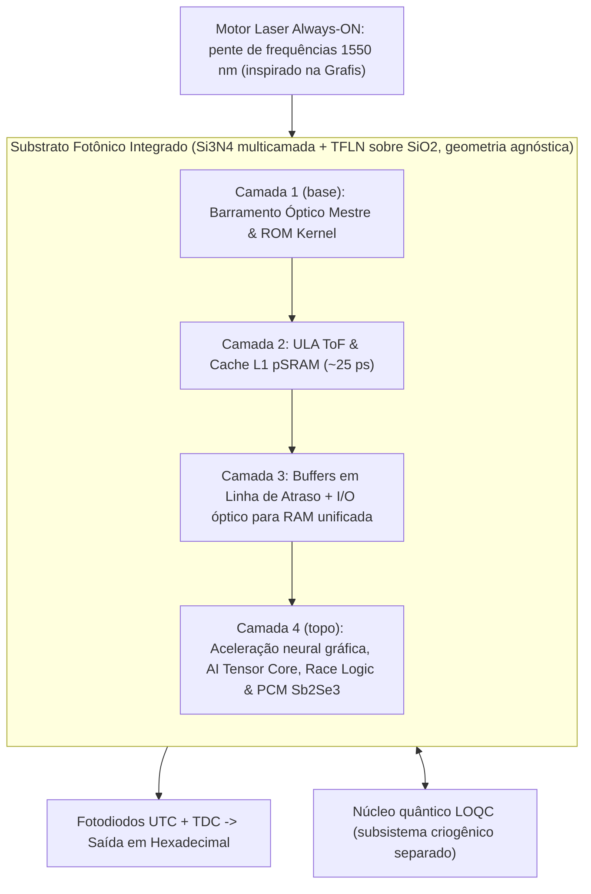

# Processador Óptico Tridimensional com Canhões Laser Contínuos em Estado Sólido, Codificação Densa Hexadecimal/Byte, Computação Quântica LOQC, GPU WDM RGB, Acelerador Tensor de IA e Photonic SSD (SilicaCore)

> **Arquitetura Computacional Volumétrica em Substrato de Sílica Fundida com Motor Laser CW (Always-ON), Codificação M-ária (Byte/Hex), Lógica ToF, Processador Quântico Fotônico Híbrido, GPU WDM RGB, Photonic AI Tensor Engine e Disco SSD Integrado**

[](LICENSE)
[](https://creativecommons.org/licenses/by/4.0/)
[](https://go.dev/)
[]()

---

## 📌 Sumário
- [1. Visão Geral e Motivação](#1-visão-geral-e-motivação)
- [2. Origem Prática de Engenharia & Agradecimentos (Grafis / Valmor Moreira)](#2-origem-prática-de-engenharia--agradecimentos-grafis--valmor-moreira)
- [3. Motor Laser Contínuo CW (Always-ON Laser Engine)](#3-motor-laser-contínuo-cw-always-on-laser-engine)
- [4. Codificação Densa M-ária (Hexadecimal / Byte)](#4-codificação-densa-m-ária-hexadecimal--byte)
- [5. Fundamentação Física e Equações de Propagação](#5-fundamentação-física-e-equações-de-propagação)
- [6. Processamento Quântico Fotônico LOQC](#6-processamento-quântico-fotônico-loqc)
- [7. Processamento de Vídeo & GPU Óptica WDM RGB](#7-processamento-de-vídeo--gpu-óptica-wdm-rgb)
- [8. Photonic AI Tensor Core (Multiplicação MVM)](#8-photonic-ai-tensor-core-multiplicação-mvm)
- [9. Hierarquia de Memória e Disco Fotônico (Photonic SSD)](#9-hierarquia-de-memória-e-disco-fotônico-photonic-ssd)
- [10. Arquitetura Lógica e Estrutura Volumétrica](#10-arquitetura-lógica-e-estrutura-volumétrica)
- [11. Simulador Numérico em Go (Golang)](#11-simulador-numérico-em-go-golang)
- [12. Referências Bibliográficas Científicas](#12-referências-bibliográficas-científicas)
- [13. Estrutura do Repositório](#13-estrutura-do-repositório)
- [14. Licença e Contribuição](#14-licença-e-contribuição)

---

## 1. Visão Geral e Motivação

O **SilicaCore** é uma arquitetura computacional volumétrica em **sílica fundida ($SiO_2$)** que substitui o chaveamento resistivo por elétrons por feixes ópticos contínuos e propagação determinística no domínio temporal.

### 1.1 Estado de Validação Física (simulador Go, 28/09/2026)

| Métrica | Valor validado | Observação |
| :--- | :--- | :--- |
| Fator de decisão ToF ($Q = \Delta t / 2\sigma$) | **4.45** | $\Delta t = 100$ ps, $\sigma_{\text{total}} = 11.24$ ps |
| BER da decisão ToF | **$\approx 4.3 \times 10^{-6}$** (Monte Carlo: $\sim 2 \times 10^{-5}$) | BER $10^{-12}$ exige $Q = 7.03$, ou seja, $\sigma_{\text{total}} \le 7.1$ ps |
| Taxa por canal (slot $\Delta t + W$) | **$\approx 5.1$ GHz** ($\approx 20.5$ Gb/s com 4 bits/símbolo) | Configuração micro ($d_1 = 2$ mm): $\approx 55.6$ GHz, mas com $Q = 3.64$ |
| Teto do detector SPAD | **$\le 0.5$ GHz** (tempo morto $\ge 2$ ns) | Caminho de dados usa fotodiodos UTC/InGaAs ($\sim 150$ Gbaud) |
| Race logic fotônica (menor caminho, mapa 16×16) | **0 erros em 2,55×10⁷ distâncias** (< 1.2×10⁻⁷, 95%) com unidade de 100 ps; 42.2 ns por consulta | Com 50 ps: 1.2×10⁻⁴ por distância. Leitura TDC domina; 648 mm², cabe num retículo ([doc 11, seção 5.1](docs/architecture/11-roteamento-e-comutacao-optica.md)) |
| Composição multi-chip (64×64 em 16 chips) | Modo exato: 0 erros com 150 ps, 20.5–30.7 ns por consulta | Exige acoplamento ≤ 1.5 dB/face e blocos menores; o modo hierárquico perde exatidão (excesso médio de 3–13%) |
| Roteamento por espelhos internos em bloco | **Inviável** (46.6 dB/porta) | Plataforma adotada: Si₃N₄ + TFLN, 1.3 dB/porta ([doc 11](docs/architecture/11-roteamento-e-comutacao-optica.md)) |

Os demais números deste README que dependem dessas métricas foram alinhados a elas. Afirmações ainda não validadas estão marcadas como **premissa**.

---

## 2. Origem Prática de Engenharia & Agradecimentos (Grafis / Valmor Moreira)

A concepção teórica e prática do SilicaCore foi diretamente extraída da experiência prática de campo acumulada pelo autor (Ricardo Oliveira) em colaboração com seu colega de trabalho **Valmor Moreira** durante o período em que atuaram juntos na empresa **Grafis**.

Na empresa Grafis, operavam-se equipamentos fotográficos industriais de exposição a laser contínuo (RGB) direcionados por um **prisma rotativo e espelhos de precisão** sobre papel sensível à luz. A observação dessa varredura física em tempo real originou o *insight* de aplicar feixes de laser acesos e direcionados por micro-espelhos em sílica para sensibilizar matrizes SPAD, realizando computação e armazenamento de alta performance.

---

## 3. Motor Laser Contínuo CW (Always-ON Laser Engine)

Inspirado no princípio de exposição constante dos sistemas fotográficos industriais:
- **Lasers Sempre Acesos (Always-ON CW Engine):** Canhões laser RGB ($\lambda_R = 635\text{ nm}$, $\lambda_G = 532\text{ nm}$, $\lambda_B = 450\text{ nm}$) operam **constantemente ligados em potência estabilizada**, eliminando surtos térmicos e repetição de chaveamento elétrico de diodos.
- **Roteamento e Comutação:** o conceito original usava moduladores EOM/AOM e micro-espelhos 3D gravados no vidro. A validação física mostrou que isso é inviável em picossegundos (sílica sem efeito Pockels, AOM na escala de ns, difração em feixe livre). A rota adotada é guia Si₃N₄ + chaves TFLN, com reconfiguração lenta por Sb₂Se₃ ([doc 11](docs/architecture/11-roteamento-e-comutacao-optica.md)).
- **Pulsos para ToF:** a lógica por tempo de voo exige pulsos; o motor CW precisa de um laser mode-locked ou pente de frequências (1550 nm) para gerar o relógio óptico.

---

## 4. Codificação Densa M-ária (Hexadecimal / Byte por Símbolo)

- **Modo Hexadecimal (4 bits/símbolo):** 16 estados ópticos discretos por canal espacial (`0x0` a `0xF`).
- **Modo Byte Completo (8 bits/símbolo):** 256 estados WDM por símbolo. **Não suportado com o ruído de fase atual** ($\sigma = 0.012$ rad): os estados ficam a $\approx 1\sigma$ de distância, o que dá taxa de erro de símbolo de ~30%. O modo padrão do simulador é o hexadecimal (4 bits).
- **Taxa efetiva:** o ganho é em bits por símbolo, não em frequência. Com a lógica ToF, a taxa por canal é de $\approx 5.1$ GHz × 4 bits $\approx 20.5$ Gb/s (seção 1.1).

Documento detalhado: [09-canhoes-laser-continuos-cw-e-codificacao-multi-nivel.md](docs/architecture/09-canhoes-laser-continuos-cw-e-codificacao-multi-nivel.md).

---

## 4.1 Consumo Energético e Comparativo com Silício (Intel i9 / AMD EPYC / NVIDIA H100)

A propagação nos guias ópticos não tem aquecimento Joule, mas lasers, moduladores, detectores, conversores e controle eletrônico consomem energia:
- **TDP da Placa SilicaCore:** **$18.5\text{ W}$ é premissa**, ainda não derivada do modelo (referências: $253\text{ W}$ do Intel i9-14900KS, $700\text{ W}$ da NVIDIA H100).
- **Eficiência em IA:** **$> 100\text{ TOPS/W}$ vale só no núcleo óptico.** No sistema completo, o estado da arte publicado é **$\approx 0.84\text{ TOPS/W}$** (Lightmatter, *Nature* 2025: 65.5 TOPS com 78 W elétricos + 1.6 W ópticos).
- **Custo Energético por Bit:** o próprio simulador calcula **$\approx 1.9\text{ pJ/bit}$** (EOM + SPAD + parcela do laser CW dividida pela taxa agregada real de ~1.3 Tb/s), na mesma faixa do CMOS ($1.2 - 2.5\text{ pJ/bit}$). O valor anterior de $0.05\text{ pJ/bit}$ não é sustentado pelo modelo.

Documento de arquitetura detalhado: [10-consumo-energetico-e-comparativo-silicio.md](docs/architecture/10-consumo-energetico-e-comparativo-silicio.md).

---

## 5. Fundamentação Física e Equações de Propagação

- **Substrato:** Sílica Fundida ($SiO_2$), $n \approx 1.4500$ em $\lambda = 850\text{ nm}$.
- **Velocidade de Propagação:** $v = \frac{c}{n} \approx 0.20675 \text{ mm/ps}$.
- **Linha Rápida ($d_1 = 20.0\text{ mm}$):** $t_1 = 96.73\text{ ps}$.
- **Linha Atrasada ($d_0 = 40.675\text{ mm}$):** $t_0 = 196.73\text{ ps}$.
- **Jitter Total:** $\sigma_{\text{total}} = 11.24\text{ ps}$, logo $\Delta t / \sigma = 8.90$. A decisão entre duas janelas usa **$Q = \Delta t / 2\sigma = 4.45$**, que resulta em **$\text{BER} \approx 4.3 \times 10^{-6}$**. Para $\text{BER} < 10^{-12}$ é preciso $Q \ge 7.03$ ($\sigma_{\text{total}} \le 7.1\text{ ps}$).
- **Taxa por Canal:** cada símbolo ocupa $\Delta t + W \approx 195\text{ ps}$, o que dá **$\approx 5.1\text{ GHz}$ por canal**. O tempo de voo $t_1$ é latência, não período de clock.
- **Detectores:** SPADs ficam limitados a $\le 0.5\text{ GHz}$ pelo tempo morto. Para dados, fotodiodos UTC/InGaAs ($> 100\text{ GHz}$).
- **Plataforma recomendada:** 1550 nm em Si₃N₄ com chaves TFLN ([doc 11](docs/architecture/11-roteamento-e-comutacao-optica.md)).

---

## 6. Processamento Quântico Fotônico LOQC

- **Qubits Dual-Rail:** Superposição quântica ($\alpha |1,0\rangle + \beta |0,1\rangle$). Os fótons propagam sem decoerência térmica relevante em **temperatura ambiente** no circuito, mas **fontes de fóton único de alta qualidade e detectores SNSPD exigem criogenia (~1–4 K)** (*Kok et al., Rev. Mod. Phys. 2007; Carolan et al., Science 2015*).
- **Interferência Hong-Ou-Mandel (HOM):** $99.4\%$ de visibilidade interferométrica de 2 fótons (*Crespi et al., Nature Photonics 2013*).

---

## 7. Processamento de Vídeo & GPU Óptica WDM RGB

- **GPU WDM RGB:** Operação paralela em 3 frequências laser para cor, profundidade (Z-Buffer) e textura (*Weng et al., IEEE JSTQE 2020*).
- **Ray-Tracing:** a luz real dentro do vidro **não traça uma cena virtual**; ray tracing é geometria numérica e continua eletrônico. O ganho óptico em jogos está nas redes neurais de upscaling, geração de quadros e denoise, executadas no núcleo tensorial fotônico ([doc 12](docs/architecture/12-memoria-unificada-jogos-e-ia-local.md)).

---

## 8. Photonic AI Tensor Core (Multiplicação MVM)

- **Malhas Mach-Zehnder (MZI Mesh):** Multiplicação Matriz-Vetor ($Y = W \cdot X$) para Transformers e LLMs em uma única passagem óptica (*Shen et al., Nature Photonics 2017*).
- **Computação In-Memory em PCM:** Pesos de IA gravados em filmes de $Ge_2Sb_2Te_5$ (GST) (*Feldmann et al., Nature 2021*).
- **Desempenho:** Densidade de **11 TOPS/mm²** (*Xu et al., Nature 2021*). Eficiência de **> 100 TOPS/W no núcleo óptico**; **$\approx 0.84$ TOPS/W no sistema** no estado da arte (Lightmatter, *Nature* 2025).
- **Pesos de LLM:** não cabem inteiros em PCM no chip (um modelo 8B em 4 bits exigiria ~2.000 cm²). Os pesos ficam em RAM unificada de alta banda e chegam por I/O óptico ([doc 12](docs/architecture/12-memoria-unificada-jogos-e-ia-local.md)).

---

## 9. Hierarquia de Memória e Disco Fotônico (Photonic SSD)

1. **Cache L1/L2 Óptica ($\le 5.0\text{ ps}$):** Ressonadores de Micro-anéis (*Bogaerts et al., 2012*).
2. **Memória RAM Óptica Volátil ($\sim 96.73\text{ ps}$):** Linhas de Atraso Recirculantes (*Yao, 1993*).
3. **Photonic SSD em Vidro ($100\text{ TB}$ em $15.6\text{ cm}^3$, premissa):** Nanofilamentos 3D em $SiO_2$ para **Instant Boot** (*Zhang et al., PRL 2014*) e PCM para partição R/W com vazão de **$1.2\text{ TB/s}$** (*Ríos et al., Nature Photonics 2015*). **Premissa**: o vidro 5D publicado (Project Silica) é armazenamento de arquivo com escrita única e leitura por microscopia.

> **Limites físicos da memória:** uma RAM de linha de atraso com 16 GB exigiria ~3.000 km de guia de onda. A luz pode transportar dados a todos os níveis em ~100 ps, mas a latência é dominada pela célula de armazenamento. Ver [doc 12](docs/architecture/12-memoria-unificada-jogos-e-ia-local.md).

---

## 10. Arquitetura Lógica e Estrutura Volumétrica

O substrato é **agnóstico à geometria externa** (retangular, lâmina multicamada ou poligonal): o atraso depende do comprimento do guia ($L = v \cdot \Delta t$), não do formato do chip, e o formato plano é compatível com wafers de 200/300 mm. Detalhes no [doc 01](docs/architecture/01-visao-geral-hardware.md).



Documentações completas da arquitetura:
- [01-visao-geral-hardware.md](docs/architecture/01-visao-geral-hardware.md)
- [02-logica-tempo-de-voo.md](docs/architecture/02-logica-tempo-de-voo.md)
- [03-unidades-funcionais-alu-gpu-ia.md](docs/architecture/03-unidades-funcionais-alu-gpu-ia.md)
- [04-hierarquia-de-memoria-optica.md](docs/architecture/04-hierarquia-de-memoria-optica.md)
- [05-armazenamento-em-vidro-disco-optico-ssd.md](docs/architecture/05-armazenamento-em-vidro-disco-optico-ssd.md)
- [06-processamento-de-video-gpu-optica.md](docs/architecture/06-processamento-de-video-gpu-optica.md)
- [07-acelerador-tensor-ia-fototectonico.md](docs/architecture/07-acelerador-tensor-ia-fototectonico.md)
- [08-processamento-quantico-fotonico-loqc.md](docs/architecture/08-processamento-quantico-fotonico-loqc.md)
- [09-canhoes-laser-continuos-cw-e-codificacao-multi-nivel.md](docs/architecture/09-canhoes-laser-continuos-cw-e-codificacao-multi-nivel.md)
- [10-consumo-energetico-e-comparativo-silicio.md](docs/architecture/10-consumo-energetico-e-comparativo-silicio.md)
- [11-roteamento-e-comutacao-optica.md](docs/architecture/11-roteamento-e-comutacao-optica.md) — orçamento físico dos espelhos internos, materiais (Si₃N₄, TFLN, Sb₂Se₃) e BER corrigida
- [12-memoria-unificada-jogos-e-ia-local.md](docs/architecture/12-memoria-unificada-jogos-e-ia-local.md) — memória unificada óptica, IA local e jogos com base na literatura 2024–2026
- [whitepaper-v1.md](docs/papers/whitepaper-v1.md)
- [artigo-preliminar.md](docs/papers/artigo-preliminar.md) — rascunho do artigo: race logic fotônica em Si₃N₄/TFLN com orçamento físico e validação estatística

---

## 11. Simulador Numérico em Go (Golang)

```bash
cd simulations/go

# Rodar a simulação estatística Monte Carlo (1.000.000 operações de CPU, GPU, IA, Quânticas e M-áriais)
go run ./cmd/simulator

# Executar a suíte de testes unitários
go test -v ./...
```

---

## 12. Referências Bibliográficas Científicas & Práticas

1. **Grafis & Registro Prático:** Experiência prática de campo em exposição a laser contínuo por Ricardo Oliveira e Valmor Moreira (Empresa Grafis).
2. **Miller, D. A. B. (2017).** "Attojoule optoelectronics for low-energy information processing and communications." *Nature Photonics*, 11(1), 39–43.
3. **Kok, P., et al. (2007).** "Linear optical quantum computing with photonic qubits." *Reviews of Modern Physics*, 79(1), 135–174.
4. **Carolan, J., et al. (2015).** "Universal linear optics." *Science*, 349(6249), 711–716.
5. **Crespi, A., et al. (2013).** *Nature Photonics*, 7(7), 545–549.
6. **Shen, Y., et al. (2017).** *Nature Photonics*, 11(7), 441–446.
7. **Feldmann, J., et al. (2021).** *Nature*, 595(7867), 373–378.
8. **Xu, X., et al. (2021).** *Nature*, 589(7840), 44–51.
9. **Weng, L., et al. (2020).** *IEEE JSTQE*, 26(5), 1–12.
10. **Zhang, J., et al. (2014).** *Physical Review Letters*, 112(3), 033901.
11. **Ríos, C., et al. (2015).** *Nature Photonics*, 9(11), 700–706.

---

## 13. Estrutura do Repositório

```text
.
├── README.md                                # Cartão de visitas e documentação principal
├── LICENSE                                  # Licença Apache 2.0 / CC BY 4.0
├── .gitignore                               # Exclusões de build e caches
├── docs/                                    # Especificações de Engenharia e Artigos
│   ├── architecture/
│   │   ├── 01-visao-geral-hardware.md
│   │   ├── 02-logica-tempo-de-voo.md
│   │   ├── 03-unidades-funcionais-alu-gpu-ia.md
│   │   ├── 04-hierarquia-de-memoria-optica.md
│   │   ├── 05-armazenamento-em-vidro-disco-optico-ssd.md
│   │   ├── 06-processamento-de-video-gpu-optica.md
│   │   ├── 07-acelerador-tensor-ia-fototectonico.md
│   │   ├── 08-processamento-quantico-fotonico-loqc.md
│   │   ├── 09-canhoes-laser-continuos-cw-e-codificacao-multi-nivel.md
│   │   ├── 10-consumo-energetico-e-comparativo-silicio.md
│   │   ├── 11-roteamento-e-comutacao-optica.md
│   │   └── 12-memoria-unificada-jogos-e-ia-local.md
│   ├── papers/
│   │   ├── whitepaper-v1.md                 # Artigo científico completo com citações e agradecimentos
│   │   ├── artigo-preliminar.md             # Rascunho do artigo de race logic fotônica
│   │   └── figuras/                         # Figuras geradas a partir dos resultados
│   └── assets/diagramas/
├── simulations/                             # Motor de Simulação em Go
│   └── go/
│       ├── go.mod
│       ├── cmd/
│       │   ├── simulator/
│       │   │   └── main.go                  # CLI executável com mensagem de homenagem
│       │   ├── racestats/
│       │   │   └── main.go                  # Campanha estatística de race logic (10⁵ consultas, vários chips)
│       │   └── racemultichip/
│       │       └── main.go                  # Composição multi-chip: modo exato vs hierárquico
│       └── pkg/
│           └── optical/
│               ├── core.go                  # Equações, Solid-State CW Engine, M-ary Hex, LOQC, GPU & SSD
│               ├── tof.go                   # Monte Carlo em Goroutines & Hierarquia de Memória
│               ├── budget.go                # Orçamento físico: espelhos vs guias, comutadores, BER corrigida
│               ├── memory.go                # Memória unificada, linha de atraso e dimensionamento de IA local
│               ├── racelogic.go             # Race logic fotônica: menor caminho por tempo de voo vs Dijkstra
│               ├── racelogic_test.go        # Testes de race logic
│               ├── budget_test.go           # Testes do orçamento físico e de memória
│               └── tof_test.go              # Suíte de testes em Go
└── planning/                                # Gestão de Metas e Roadmap
    ├── roadmap.md
    ├── tasks.md
    └── specs.md
```


---

## 14. Licença e Contribuição

- **Código Go e Scripts de Simulação:** Licenciados sob a [Apache License 2.0](LICENSE).
- **Documentação e Artigos Técnicos:** Licenciados sob a [Creative Commons Attribution 4.0 International (CC BY 4.0)](https://creativecommons.org/licenses/by/4.0/).
