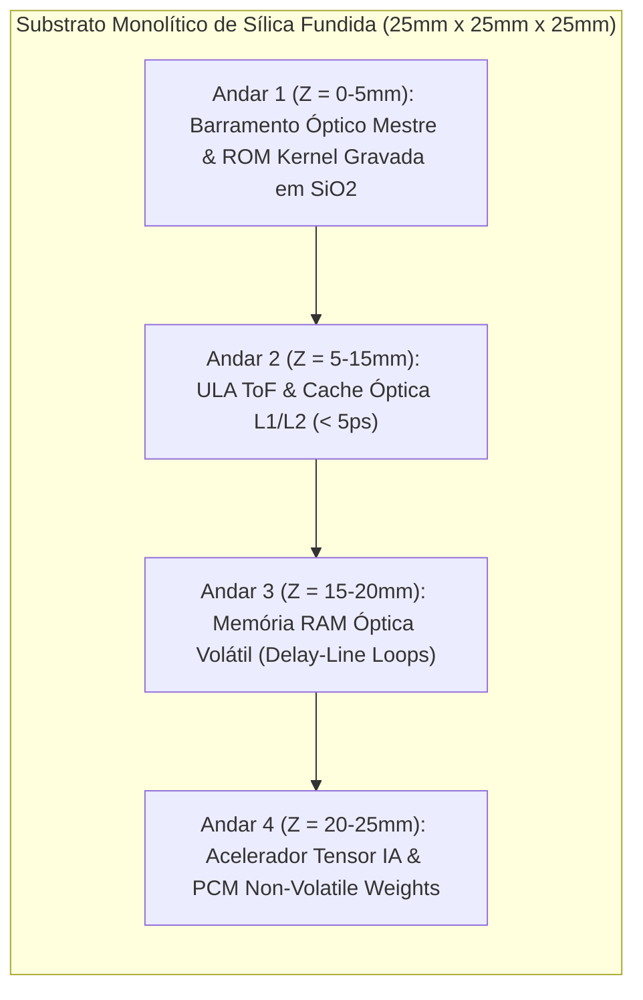

# Divisão Funcional dos Andares Volumétricos (ULA, IA, GPU e Memória)

## 1. Organização por Andares Espaciais (Eixo Z)

O cubo de sílica fundida ($SiO_2$) é dividido tridimensionalmente em quatro zonas funcionais ao longo da profundidade física:

### 1.1 Andar 1 (Base - Z = 0 a 5mm): Barramento Mestre e ROM do Kernel
- **Barramento Óptico:** Distribuição síncrona de relógio pulsado para toda a matriz de fotodiodos SPAD.
- **Memória ROM Não-Volátil do Kernel:** Instruções estáticas de inicialização e firmware gravadas permanentemente por escrita de laser de femtossegundo no substrato de sílica (*Zhang et al., PRL 2014*). Leitura direta na velocidade da luz ($v = c/n = 0.20675\text{ mm/ps}$) sem inicialização ou transferência para DRAM.

### 1.2 Andar 2 (Central - Z = 5 a 15mm): Unidade Aritmética Lógica (ULA) e Cache L1/L2
- **ULA ToF:** Execução de portas lógicas determinísticas (NOT, AND, OR, XOR) por modulação de percurso ($d_1 = 20.0\text{ mm}$ vs. $d_0 = 40.675\text{ mm}$).
- **Cache L1/L2 Óptica de Alta Velocidade:** Micro-anéis de ressonância fotônica (*Bogaerts et al., 2012; Alexoudi et al., IEEE JSTQE 2020*) com chaveamento bistável em $\le 5.0\text{ ps}$ para retenção temporária de operandos.

### 1.3 Andar 3 (Intermediário - Z = 15 a 20mm): Memória RAM Óptica Volátil Dinâmica
- **Linhas de Atraso Recirculantes em Anel Fechado:** Os pacotes de dados permanecem circulando no vidro a $0.20675\text{ mm/ps}$ (*Yao, IEEE PTL 1993*).
- **Leitura Não-Destrutiva:** Divisores de feixe $95/5$ amostram 5% da potência para amostragem pelos detectores enquanto 95% do sinal continua recirculando com ganho compensado por micro-amplificadores SOAs.

### 1.4 Andar 4 (Topo - Z = 20 a 25mm): Acelerador Tensor de IA e Processamento Gráfico
- **Processamento In-Memory de IA:** Matrizes de pesos de redes neurais armazenadas em filmes finos de Materiais de Mudança de Fase Fotônica (PCM - $GST / Sb_2Se_3$) integrados a guias de onda (*Ríos et al., Nature Photonics 2015; Feldmann et al., Nature 2019*).
- **Multiplicação Matriz-Vetor Fotônica:** Multiplicação paralela por interferometria de malha Mesh de Mach-Zehnder sem necessidade de conversão analógico-digital ou acesso à RAM externa.

---

## 2. Referências Bibliográficas Científicas
1. **Zhang, J., et al. (2014).** *Physical Review Letters*, 112(3), 033901.
2. **Alexoudi, A., et al. (2020).** *IEEE Journal of Selected Topics in Quantum Electronics*, 26(2), 1–15.
3. **Bogaerts, W., et al. (2012).** *Laser & Photonics Reviews*, 6(1), 47–73.
4. **Yao, X. S. (1993).** *IEEE Photonics Technology Letters*, 5(3), 371–374.
5. **Ríos, C., et al. (2015).** *Nature Photonics*, 9(11), 700–706.
6. **Feldmann, J., et al. (2019).** *Nature*, 569(7755), 208–214.
