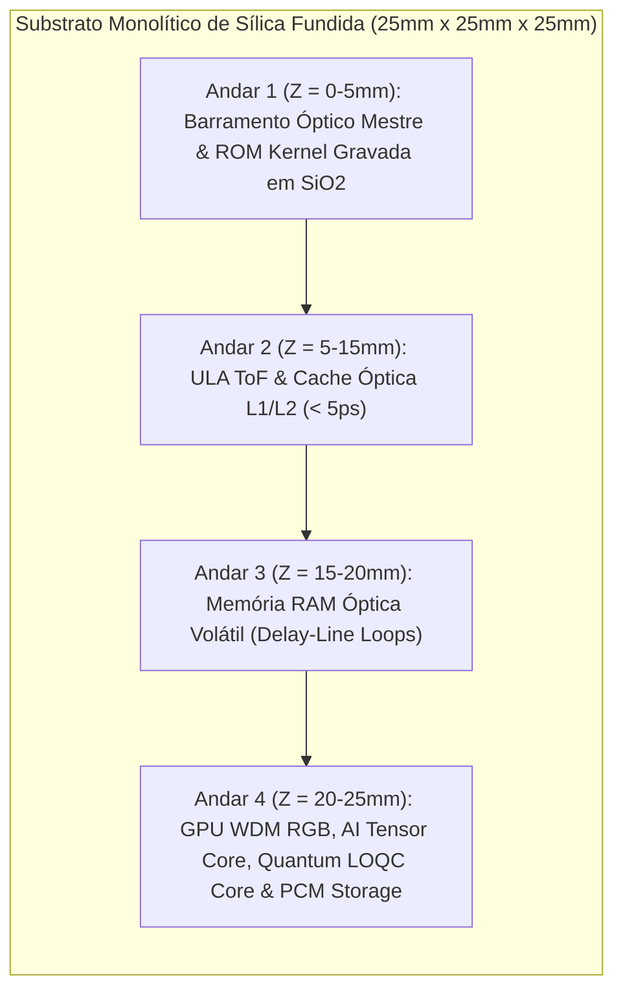

# Divisão Funcional dos Andares Volumétricos (ULA, IA, GPU, Quântico e Memória)

## 1. Organização por Andares Espaciais (Eixo Z)

O cubo de sílica fundida ($SiO_2$) é dividido tridimensionalmente em quatro zonas funcionais ao longo da profundidade física:

### 1.1 Andar 1 (Base - Z = 0 a 5mm): Barramento Mestre e ROM do Kernel
- **Barramento Óptico:** Distribuição síncrona de relógio pulsado para toda a matriz de fotodiodos SPAD.
- **Memória ROM Não-Volátil do Kernel:** Instruções estáticas de inicialização e firmware gravadas permanentemente por escrita de laser de femtossegundo no substrato de sílica (*Zhang et al., PRL 2014*). Leitura direta na velocidade da luz ($v = c/n = 0.20675\text{ mm/ps}$) sem inicialização ou transferência para DRAM.

### 1.2 Andar 2 (Central - Z = 5 a 15mm): Unidade Aritmética Lógica (ULA) e Cache L1/L2
- **ULA ToF:** Execução de portas lógicas determinísticas (NOT, AND, OR, XOR) por modulação de percurso ($d_1 = 20.0\text{ mm}$ vs. $d_0 = 40.675\text{ mm}$).
- **Cache L1/L2 Óptica de Alta Velocidade:** Micro-anéis de ressonância fotônica (*Bogaerts et al., 2012; Alexoudi et al., IEEE JSTQE 2020*) com chaveamento bistável em $\le 5.0\text{ ps}$ para retenção temporária de operandos.

### 1.3 Andar 3 (Intermediário - Z = 15 a 20mm): Memória RAM Óptica Volátil Dinâmica
- **Linhas de Atraso Recirculantes em Anel Fechado:** Os pacotes de dados permanecem circulando no vidro a $0.20675\text{ mm/ps}$ (*Yao, IEEE PTL 1993*).
- **Leitura Não-Destrutiva:** Divisores de feixe $95/5$ amostram 5% da potência para amostragem pelos detectores enquanto 95% do sinal continua recirculando com ganho compensado por micro-amplificadores SOAs.

### 1.4 Andar 4 (Topo - Z = 20 a 25mm): GPU WDM RGB, AI Tensor Core & Processador Quântico Fotônico (LOQC)
- **GPU Óptica por WDM RGB:** Processamento paralelo de vídeo 8K/16K em 3 comprimentos de onda ($\lambda_R = 635\text{ nm}$, $\lambda_G = 532\text{ nm}$, $\lambda_B = 450\text{ nm}$) com motor de *ray-tracing* nativo por refração/reflexão (*Weng et al., IEEE JSTQE 2020; Hamerly et al., PRX 2019*).
- **Photonic AI Tensor Core (MVM):** Multiplicação Matriz-Vetor para Transformers e Redes Neurais via malhas Mach-Zehnder (MZI Mesh) e pesos gravados em filmes PCM ($GST$). Computação *In-Memory* com performance de até **11 TOPS/mm²** e **> 100 TOPS/W** (*Shen et al., Nature Photonics 2017; Feldmann et al., Nature 2021; Xu et al., Nature 2021*).
- **Processador Quântico Fotônico Híbrido (LOQC):** Qubits fotônicos dual-rail em temperatura ambiente ($298\text{ K}$) operando interferência Hong-Ou-Mandel (HOM) e portas lógicas quânticas (Hadamard, Phase, CNOT) para algoritmos híbridos VQE e amostragem de bosons (*Kok et al., Rev. Mod. Phys. 2007; Carolan et al., Science 2015; Crespi et al., Nature Photonics 2013; Arrazola et al., Nature 2021*).

---

## 2. Referências Bibliográficas Científicas
1. **Kok, P., et al. (2007).** *Reviews of Modern Physics*, 79(1), 135–174.
2. **Carolan, J., et al. (2015).** *Science*, 349(6249), 711–716.
3. **Crespi, A., et al. (2013).** *Nature Photonics*, 7(7), 545–549.
4. **Arrazola, J. M., et al. (2021).** *Nature*, 591(7848), 54–60.
5. **Shen, Y., et al. (2017).** *Nature Photonics*, 11(7), 441–446.
6. **Feldmann, J., et al. (2021).** *Nature*, 595(7867), 373–378.
7. **Xu, X., et al. (2021).** *Nature*, 589(7840), 44–51.
