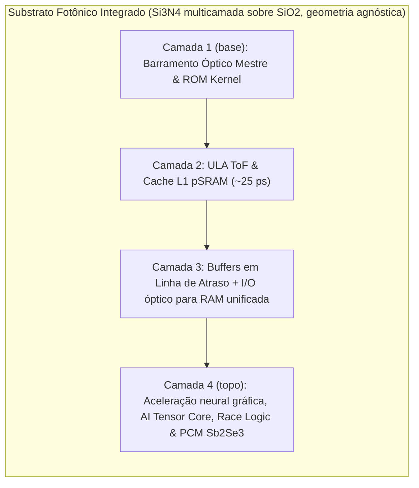

# Divisão Funcional das Camadas do Substrato Fotônico (ULA, IA, GPU, Quântico e Memória)

> **Nota de validação (v1.1, 28/09/2026):** cache ≤ 5 ps, RAM em linha de atraso, ray tracing nativo, > 100 TOPS/W sem distinção e quântico a 298 K foram corrigidos conforme docs [11](11-roteamento-e-comutacao-optica.md) e [12](12-memoria-unificada-jogos-e-ia-local.md). Os andares por profundidade do cubo viraram camadas de uma pilha com geometria externa agnóstica, e a camada 4 ganhou o acelerador de race logic.

## 1. Organização por Camadas da Pilha Fotônica

O substrato fotônico integrado é organizado em quatro camadas funcionais empilhadas (Si₃N₄ multicamada com acopladores verticais de 0.01 dB). A ordem das camadas é lógica; o formato externo do chip é agnóstico (retangular, lâmina ou poligonal):

### 1.1 Camada 1 (Base da Pilha): Barramento Mestre e ROM do Kernel
- **Barramento Óptico:** Distribuição síncrona de relógio pulsado para toda a matriz de fotodiodos SPAD.
- **Memória ROM Não-Volátil do Kernel:** Instruções estáticas de inicialização e firmware gravadas permanentemente por escrita de laser de femtossegundo no substrato de sílica (*Zhang et al., PRL 2014*). Leitura direta na velocidade da luz ($v = c/n = 0.20675\text{ mm/ps}$) sem inicialização ou transferência para DRAM.

### 1.2 Camada 2: Unidade Aritmética Lógica (ULA ToF) e Cache L1 pSRAM
- **ULA ToF:** Portas lógicas por modulação de percurso ($d_1$ vs. $d_0$) com chaves TFLN. Cada porta perde ~1.3 dB na plataforma Si₃N₄ + TFLN, então **a cada ~7 portas o sinal precisa ser regenerado** (doc 11). $Q = 4.45$, $\approx 5.1$ GHz por canal.
- **Cache L1 Óptica:** SRAM fotônica com micro-anéis acoplados em cruz (pSRAM), validada em processo de 45 nm a **40 GHz (~25 ps)** e 0.6 pJ/bit, com capacidade de KB por limite de área (arXiv:2503.19544). **L2/L3** em SRAM eletrônica empilhada sob o die fotônico (doc 12).

### 1.3 Camada 3: Buffers em Linha de Atraso e I/O Óptico para RAM Unificada
- **Linhas de Atraso Recirculantes:** servem como **registradores e buffers**, não como RAM principal. Um laço de 96.7 ps com 64 canais a 100 Gb/s guarda só **619 bits**; 16 GB exigiriam ~3.000 km de guia (*Yao, IEEE PTL 1993*; doc 12).
- **Leitura Não-Destrutiva:** Divisores $95/5$ amostram 5% da potência; o SOA que compensa a perda a cada volta acumula ruído ASE, o que limita o tempo de retenção.
- **RAM principal:** HBM/LPDDR unificada acessada por I/O óptico co-empacotado (~130 ps de transporte + ~30 ns de célula DRAM).

### 1.4 Camada 4 (Topo da Pilha): Aceleração Neural Gráfica, AI Tensor Core, Race Logic & Interface Quântica
- **GPU Óptica por WDM:** acelera as **redes neurais** do pipeline gráfico (upscaling, geração de quadros, denoise de ray tracing) e a interconexão de alta banda. Shading, rasterização e ray tracing de cenas virtuais continuam em FP32 na eletrônica: a luz no vidro não traça uma cena virtual (*Weng et al., IEEE JSTQE 2020; Hamerly et al., PRX 2019*; doc 12).
- **Photonic AI Tensor Core (MVM):** Multiplicação Matriz-Vetor via malhas Mach-Zehnder (MZI) e pesos em PCM **Sb₂Se₃** (o GST absorve em 1550 nm). Até **11 TOPS/mm²** e **> 100 TOPS/W no núcleo óptico**; no sistema completo o estado da arte é **~0.84 TOPS/W** (Lightmatter, *Nature* 2025). Pesos de LLMs grandes ficam em RAM unificada, não no chip (*Shen et al., 2017; Feldmann et al., 2021; Xu et al., 2021*).
- **Race Logic Fotônica:** menor caminho em grafos por corrida de pulsos em atrasos programáveis; 0 erros em 2,55×10⁷ distâncias num mapa 16×16 com unidade de 100 ps (doc 11, seção 5.1).
- **Processador Quântico Fotônico Híbrido (LOQC):** Qubits fotônicos dual-rail (circuito em temperatura ambiente; fontes de fóton único e detectores SNSPD criogênicos a ~1–4 K) operando interferência Hong-Ou-Mandel (HOM) e portas lógicas quânticas (Hadamard, Phase, CNOT) para algoritmos híbridos VQE e amostragem de bosons (*Kok et al., Rev. Mod. Phys. 2007; Carolan et al., Science 2015; Crespi et al., Nature Photonics 2013; Arrazola et al., Nature 2021*).

---

## 2. Referências Bibliográficas Científicas
1. **Kok, P., et al. (2007).** *Reviews of Modern Physics*, 79(1), 135–174.
2. **Carolan, J., et al. (2015).** *Science*, 349(6249), 711–716.
3. **Crespi, A., et al. (2013).** *Nature Photonics*, 7(7), 545–549.
4. **Arrazola, J. M., et al. (2021).** *Nature*, 591(7848), 54–60.
5. **Shen, Y., et al. (2017).** *Nature Photonics*, 11(7), 441–446.
6. **Feldmann, J., et al. (2021).** *Nature*, 595(7867), 373–378.
7. **Xu, X., et al. (2021).** *Nature*, 589(7840), 44–51.
