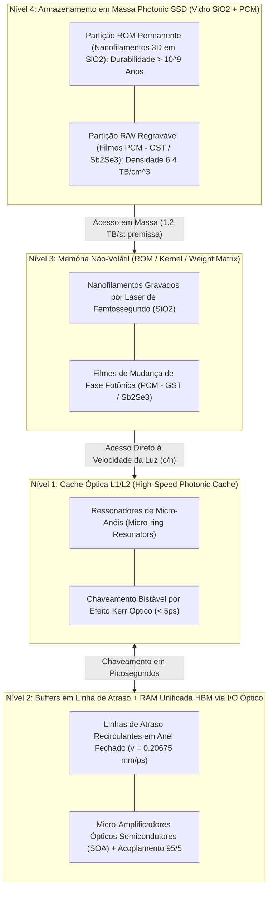

# Hierarquia de Memória Óptica Volumétrica (Cache, RAM e Photonic SSD)

> **Nota de validação (v1.1, 28/09/2026):** a hierarquia foi redesenhada como memória unificada com transporte óptico (doc [12](12-memoria-unificada-jogos-e-ia-local.md)). A latência é dominada pela célula de armazenamento, não pela propagação da luz.

## 1. Visão Geral da Arquitetura de Memória

Para superar o gargalo de von Neumann em sistemas computacionais fotônicos, o **SilicaCore** introduz uma hierarquia de memória óptica tridimensional integrada diretamente ao substrato monolítico de sílica fundida ($SiO_2$). Em vez de depender de transferências elétricas de alta latência e alto consumo térmico entre chips discretos de DRAM/SSD e chips de processamento, a memória no SilicaCore é categorizada em quatro camadas funcionais baseadas no tempo de permanência da informação e no mecanismo de interação fotônica.

---

## 2. Nível 1: Cache Óptica L1 (Alta Velocidade)
- **Mecanismo:** SRAM fotônica (pSRAM) com micro-anéis acoplados em cruz e fotodiodos diferenciais, validada no processo GlobalFoundries 45 nm (arXiv:2503.19544).
- **Latência ($\tau_{\text{cache}}$):** **~25 ps** (40 GHz), 0.6 pJ/bit de chaveamento. O valor anterior de $\le 5$ ps por efeito Kerr não tem demonstração integrada.
- **Capacidade:** KB (limitada por área). L2/L3 em SRAM eletrônica 3D empilhada (64–256 MB, ~2 ns).
- **Função:** Registradores imediatos da ULA ToF na **Camada 2**.

---

## 3. Nível 2: Buffers Ópticos (Linha de Atraso) e RAM Unificada
- **Linhas de Atraso Recirculantes:** extração $95/5$ e ganho por SOA; latência de ciclo de $96.73$ a $196.73$ ps na **Camada 3**. **Capacidade de só 619 bits por laço** (64 canais a 100 Gb/s): servem como registradores e buffers.
- **RAM principal:** HBM/LPDDR unificada via I/O óptico co-empacotado, 64–192 GB. Latência ~30 ns, dominada pela célula DRAM; o transporte óptico dentro do pacote leva ~130 ps.
- **Por que não RAM óptica pura:** 16 GB em linha de atraso exigiriam ~3.000 km de guia de onda (simulador, seção 11).

---

## 4. Nível 3 & 4: Armazenamento em Massa Photonic SSD (Não-Volátil / Persistente)

### 4.1 Partição ROM Permanente (Nanofilamentos 3D em $SiO_2$)
- Voxels 3D gravados por laser de femtossegundo armazenam permanentemente o Kernel do SO, firmware e drivers com durabilidade $> 10^9$ anos (*Zhang et al., PRL 2014; Project Silica/Microsoft*).
- Inicialização instantânea (*Instant Boot*) na velocidade da luz no meio ($v = 0.20675\text{ mm/ps}$).

### 4.2 Partição R/W Regravável (PCM Sb₂Se₃)
- Materiais de mudança de fase permitem gravação e apagamento de pesos de IA e dados (*Ríos et al., Nature Photonics 2015*). **Sb₂Se₃** é preferido ao GST por ser transparente em 1550 nm, com > 1.4×10⁸ ciclos (Yu et al., 2026).
- **Uso recomendado:** pesos de IA de leitura frequente (adaptadores, modelos pequenos). Um LLM de 8B parâmetros em 4 bits exigiria ~2.000 cm² de células, contra 8.6 cm² de um retículo.
- **Densidade de $6.4\text{ TB/cm}^3$ e vazão de $1.2\text{ TB/s}$:** **premissas** não demonstradas para PCM regravável; o armazenamento em massa recomendado é NVMe via enlace óptico (doc 12).

---

## 5. Referências Bibliográficas Científicas

1. **Zhang, J., et al. (2014).** *Physical Review Letters*, 112(3), 033901.
2. **Ríos, C., et al. (2015).** *Nature Photonics*, 9(11), 700–706.
3. **Feldmann, J., et al. (2019).** *Nature*, 569(7755), 208–214.
4. **Alexoudi, A., et al. (2020).** *IEEE Journal of Selected Topics in Quantum Electronics*, 26(2), 1–15.
5. **Bogaerts, W., et al. (2012).** *Laser & Photonics Reviews*, 6(1), 47–73.
6. **Yao, X. S. (1993).** *IEEE Photonics Technology Letters*, 5(3), 371–374.
