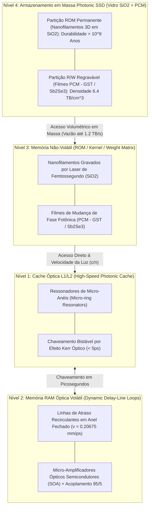

# Hierarquia de Memória Óptica Volumétrica (Cache, RAM e Photonic SSD)

## 1. Visão Geral da Arquitetura de Memória

Para superar o gargalo de von Neumann em sistemas computacionais fotônicos, o **SilicaCore** introduz uma hierarquia de memória óptica tridimensional integrada diretamente ao substrato monolítico de sílica fundida ($SiO_2$). Em vez de depender de transferências elétricas de alta latência e alto consumo térmico entre chips discretos de DRAM/SSD e chips de processamento, a memória no SilicaCore é categorizada em quatro camadas funcionais baseadas no tempo de permanência da informação e no mecanismo de interação fotônica.

---

## 2. Nível 1: Cache Óptica L1/L2 (Alta Velocidade)
- **Mecanismo:** Ressonadores de Micro-anéis (*Micro-ring Resonators*) com chaveamento por efeito Kerr não-linear.
- **Latência ($\tau_{\text{cache}}$):** $\le 5.0\text{ ps}$.
- **Função:** Registradores imediatos da ULA ToF no **Andar 2**.

---

## 3. Nível 2: Memória RAM Óptica Volátil (Dinâmica / Recirculante)
- **Mecanismo:** Linhas de Atraso Recirculantes em Anel Fechado (*Recirculating Delay-Line Loops*) com extração $95/5$ e ganho por SOA.
- **Latência de Ciclo ($\tau_{\text{ram}}$):** $96.73\text{ ps}$ a $196.73\text{ ps}$ no **Andar 3**.

---

## 4. Nível 3 & 4: Armazenamento em Massa Photonic SSD (Não-Volátil / Persistente)

### 4.1 Partição ROM Permanente (Nanofilamentos 3D em $SiO_2$)
- Voxels 3D gravados por laser de femtossegundo armazenam permanentemente o Kernel do SO, firmware e drivers com durabilidade $> 10^9$ anos (*Zhang et al., PRL 2014; Project Silica/Microsoft*).
- Inicialização instantânea (*Instant Boot*) na velocidade da luz no meio ($v = 0.20675\text{ mm/ps}$).

### 4.2 Partição R/W Regravável (PCM $GST / Sb_2Se_3$)
- Filmes finos de Materiais de Mudança de Fase Fotônica permitem gravação e apagamento óptico de blocos de dados de usuário e matrizes de IA (*Ríos et al., Nature Photonics 2015*).
- **Densidade Volumétrica:** $\sim 6.4\text{ TB/cm}^3$ (até $100\text{ TB}$ em um cubo de $25\text{ mm}$).
- **Vazão de Leitura:** Até **$1.2\text{ TB/s}$** via multiplexação WDM paralela.

---

## 5. Referências Bibliográficas Científicas

1. **Zhang, J., et al. (2014).** *Physical Review Letters*, 112(3), 033901.
2. **Ríos, C., et al. (2015).** *Nature Photonics*, 9(11), 700–706.
3. **Feldmann, J., et al. (2019).** *Nature*, 569(7755), 208–214.
4. **Alexoudi, A., et al. (2020).** *IEEE Journal of Selected Topics in Quantum Electronics*, 26(2), 1–15.
5. **Bogaerts, W., et al. (2012).** *Laser & Photonics Reviews*, 6(1), 47–73.
6. **Yao, X. S. (1993).** *IEEE Photonics Technology Letters*, 5(3), 371–374.
