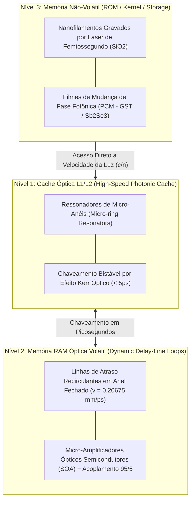

# Hierarquia de Memória Óptica Volumétrica (Cache, RAM e Não-Volátil)

## 1. Visão Geral da Arquitetura de Memória

Para superar o gargalo de von Neumann em sistemas computacionais fotônicos, o **SilicaCore** introduz uma hierarquia de memória óptica tridimensional integrada diretamente ao substrato monolítico de sílica fundida ($SiO_2$). Em vez de depender de transferências elétricas de alta latência e alto consumo térmico entre chips discretos de DRAM e chips de processamento, a memória no SilicaCore é categorizada em três camadas funcionais baseadas no tempo de permanência da informação e no mecanismo de interação fotônica.

---

## 2. Nível 1: Cache Óptica L1/L2 (Alta Velocidade)

### 2.1 Mecanismo Físico e Topologia
A Cache L1/L2 óptica é implementada no **Andar 2** utilizando **Ressonadores de Micro-anéis (*Micro-ring Resonators*)** e microcavidades fotônicas gravadas por litografia integrada. O estado bistável é controlado por modulação de índice de refração não-linear induzida por efeito Kerr óptico ($\Delta n = n_2 I$) ou acoplamento eletro-óptico ultra-rápido.

### 2.2 Especificações Técnicas
- **Latência de Acesso ($\tau_{\text{cache}}$):** $\le 5.0\text{ ps}$ (compatível com a resolução dos conversores Tempo-Digital TDC).
- **Consumo de Energia:** $< 10\text{ fJ/bit}$ por comutação.
- **Função:** Armazenar temporariamente operandos de entrada e saída imediata da ULA ToF e registradores de estado de instrução.

---

## 3. Nível 2: Memória RAM Óptica Volátil (Dinâmica / Recirculante)

### 3.1 Mecanismo Físico
A memória RAM dinâmica no **Andar 3** opera no domínio de **Linhas de Atraso Recirculantes em Anel Fechado (*Recirculating Optical Delay-Line Loops*)**. Pacotes de dados codificados como pulsos de femtossegundos circulam em cavidades guiadas no substrato a uma velocidade constante $v = c/n = 0.20675\text{ mm/ps}$.

### 3.2 Leitura Não-Destrutiva e Compensação de Ganho
- **Extração Parcial:** Divisores de feixe acoplados ($95/5$) amostragem $5\%$ da potência luminosa para leitura pelos detectores SPAD, enquanto $95\%$ permanecem circulando.
- **Compensação de Perdas:** Micro-amplificadores Ópticos Semicondutores (SOA - *Semiconductor Optical Amplifiers*) integrados compensam a atenuação por espalhamento Rayleigh e acoplamento a cada ciclo de recirculação.
- **Latência de Ciclo ($\tau_{\text{ram}}$):** $96.73\text{ ps}$ a $196.73\text{ ps}$ por volta (dependendo do perímetro da cavidade de $20.0\text{ mm}$ a $40.675\text{ mm}$).

---

## 4. Nível 3: Memória Não-Volátil Persistente (ROM / Storage / Kernel)

### 4.1 Tecnologias de Armazenamento Permanente

#### a) Gravação por Laser de Femtossegundo (Nanofilamentos em $SiO_2$)
- **Princípio:** Pulsos ultracurtos de alta intensidade alteram permanentemente a estrutura cristalina da sílica fundida em escala nanométrica, criando variações locais permanentes de índice de refração ($\Delta n$).
- **Aplicação:** Armazenamento imutável do Kernel do Sistema Operacional, controladores de instrução e firmware.
- **Vantagem:** Leitura direta na velocidade da luz sem necessidade de inicialização (*instant boot*) e com vida útil estimada superior a $10^9$ anos.

#### b) Materiais de Mudança de Fase Fotônica (PCM - *Phase-Change Materials*)
- **Princípio:** Filmes finos de ligas de calcogenetos (como $Ge_2Sb_2Te_5$ - GST e $Sb_2Se_3$) depositados sobre os guias de onda ópticos. Pulsos térmicos/ópticos curtos alternam reversivelmente o material entre a fase amorfa (alta transmitância) e cristalina (alta absorção/índice).
- **Aplicação:** Gravação persistente reconfigurável de matrizes de pesos estáticas para modelos de Inteligência Artificial e Redes Neurais Fotônicas no **Andar 4**.

---

## 5. Referências Bibliográficas Científicas

1. **Ríos, C., et al. (2015).** "Integrated all-photonic non-volatile multi-level memory." *Nature Photonics*, 9(11), 700–706. [DOI: 10.1038/nphoton.2015.182](https://doi.org/10.1038/nphoton.2015.182)
2. **Feldmann, J., et al. (2019).** "All-optical spiking neurosynaptic networks with self-learning capabilities." *Nature*, 569(7755), 208–214. [DOI: 10.1038/s41586-019-1157-8](https://doi.org/10.1038/s41586-019-1157-8)
3. **Zhang, J., et al. (2014).** "Seemingly unlimited lifetime data storage in white fused silica by ultrafast laser writing." *Physical Review Letters*, 112(3), 033901. [DOI: 10.1103/PhysRevLett.112.033901](https://doi.org/10.1103/PhysRevLett.112.033901)
4. **Alexoudi, A., et al. (2020).** "Integrated Photonic Memories for High-Performance Computing." *IEEE Journal of Selected Topics in Quantum Electronics*, 26(2), 1–15. [DOI: 10.1109/JSTQE.2019.2934807](https://doi.org/10.1109/JSTQE.2019.2934807)
5. **Bogaerts, W., et al. (2012).** "Silicon microring resonators." *Laser & Photonics Reviews*, 6(1), 47–73. [DOI: 10.1002/lpor.201100017](https://doi.org/10.1002/lpor.201100017)
6. **Yao, X. S. (1993).** "High-frequency optical delay line memory." *IEEE Photonics Technology Letters*, 5(3), 371–374. [DOI: 10.1109/68.205642](https://doi.org/10.1109/68.205642)
