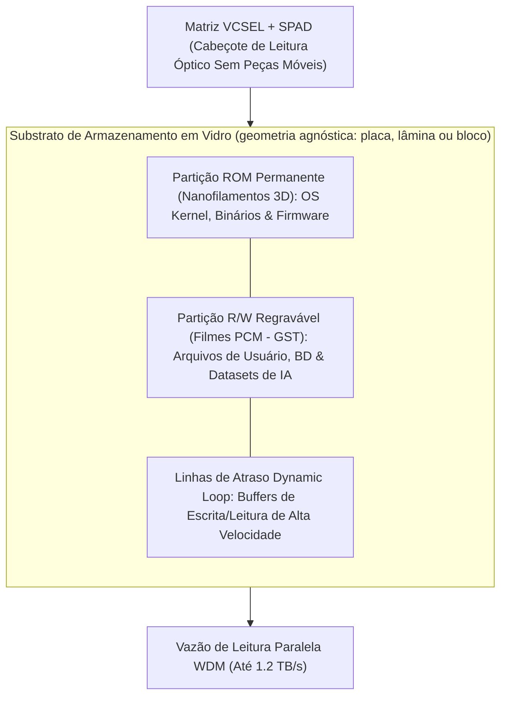

# Arquitetura de Armazenamento em Vidro: Disco Fotônico de Estado Sólido (Photonic SSD)

> **Nota de validação (v1.1, 28/09/2026):** a partição ROM em voxels de vidro é tecnologia real de **arquivo** (escrita única, leitura por microscopia, Project Silica/SOSP 2023), não um SSD de picossegundos. Na arquitetura para jogos e IA local, o armazenamento em massa é NVMe acessado por enlace óptico (doc [12](12-memoria-unificada-jogos-e-ia-local.md)); densidade e vazão abaixo ficam como premissas.

## 1. Visão Geral do Photonic SSD

O **SilicaCore** expande o conceito tradicional de discos rígidos e memórias flash (SSDs NAND) ao integrar o armazenamento de massa permanente e regravável diretamente no substrato monolítico de sílica fundida ($SiO_2$). 

O **Photonic Solid-State Drive (Photonic SSD)** combina a densidade de armazenamento volumétrico tridimensional em escala micrométrica com a leitura óptica síncrona na velocidade da luz no meio ($v = c/n = 0.20675\text{ mm/ps}$), eliminando tanto as peças mecânicas móveis (dos HDDs) quanto a degradação e vazamento de carga elétrica em portas de transistores (dos SSDs eletrônicos).

---

## 2. Camadas Físicas de Armazenamento

### 2.1 Partição ROM Permanente (Nanofilamentos 3D em $SiO_2$)
- **Mecanismo de Gravação:** Pulsos ultracurtos de laser de femtossegundo induzem nanostruturas birrefringentes locais (voxels 3D com modificação permanente do índice de refração $\Delta n$) dispostas em múltiplos planos Z ao longo da profundidade do vidro.
- **Função em Modo SSD:** Atua como o volume estático de sistema (*Read-Only System Partition*), contendo o Kernel do Sistema Operacional, controladores de instrução, drivers e bibliotecas estáticas.
- **Propriedades Físicas:**
  - **Durabilidade:** $> 10^9$ anos sob condições normais de temperatura (*Zhang et al., PRL 2014; Project Silica/Microsoft*).
  - **Imunidade:** Insensível a pulsos eletromagnéticos (EMP), radiação ionizante e variação magnética.
  - **Consumo:** Zero consumo de energia em repouso (*Zero-Power Idle Retention*).

### 2.2 Partição R/W Regravável (Materiais de Mudança de Fase Fotônica - PCM)
- **Mecanismo de Gravação/Apagamento:** Guias de onda ópticos acoplados a microcamadas de calcogenetos. **Sb₂Se₃ é o material recomendado** (transparente em 1550 nm, > 1.4×10⁸ ciclos); o GST absorve fortemente em 1550 nm no estado cristalino.
- **Operação de Escrita (Block Write / Erase):**
  - **Pulso de Gravação (Amorfo $\to$ Cristalino):** Pulso laser curto com aquecimento local promove a cristalização rápida (alto índice de refração / bit `1`).
  - **Pulso de Apagamento (Cristalino $\to$ Amorfo):** Pulso laser curto e intenso derrete localmente o filme seguido de resfriamento ultrarrápido (baixo índice de refração / bit `0`).
- **Função em Modo SSD:** Armazenar arquivos dinâmicos de usuário, bancos de dados, partições modificáveis e matrizes de pesos de IA reconfiguráveis (*Ríos et al., Nature Photonics 2015*).

---

## 3. Desempenho e Comparativo com SSDs Eletrônicos

| Métrica de Desempenho | SSD Eletrônico NAND Flash | Photonic SSD em Sílica (SilicaCore) |
| :--- | :--- | :--- |
| **Mecanismo de Armazenamento** | Carga elétrica em portas flutuantes | Voxels 3D em sílica / Fase cristalina PCM |
| **Densidade Volumétrica** | Planar 3D NAND ($\sim 0.1 \text{ TB/cm}^3$) | Volumétrica 3D ($\sim 6.4 \text{ TB/cm}^3$ / até $100\text{ TB}$ em $15.6\text{ cm}^3$) — **premissa** |
| **Vazão de Leitura (Read Throughput)** | $3.5\text{ GB/s}$ a $14\text{ GB/s}$ (PCIe Gen4/5) | $1.2\text{ TB/s}$ — **premissa**; o vidro publicado é lido por microscopia (Project Silica) |
| **Latência de Acesso** | $50\text{ }\mu\text{s}$ a $100\text{ }\mu\text{s}$ | Voxels 5D: **ms–s** (leitura por imagem). O tempo de voo de ~100–200 ps é só o transporte, não a leitura da célula |
| **Vida Útil / Retenção** | 3 a 10 anos (Vazamento de carga) | **$> 10^9$ anos** (Estabilidade estrutural da sílica) |
| **Consumo em Repouso (Idle Power)** | Miliwatts a Watts | **0 Watts** (Retenção óptica passiva sem alimentação) |

---

## 4. Referências Bibliográficas Científicas

1. **Zhang, J., Gecevičius, M., Beresna, M., & Kazansky, P. G. (2014).** "Seemingly unlimited lifetime data storage in white fused silica by ultrafast laser writing." *Physical Review Letters*, 112(3), 033901. [DOI: 10.1103/PhysRevLett.112.033901](https://doi.org/10.1103/PhysRevLett.112.033901)
2. **Ríos, C., et al. (2015).** "Integrated all-photonic non-volatile multi-level memory." *Nature Photonics*, 9(11), 700–706. [DOI: 10.1038/nphoton.2015.182](https://doi.org/10.1038/nphoton.2015.182)
3. **Microsoft Research (Project Silica).** "Project Silica: Long-term cloud storage in glass." *Microsoft Technology Report*.
