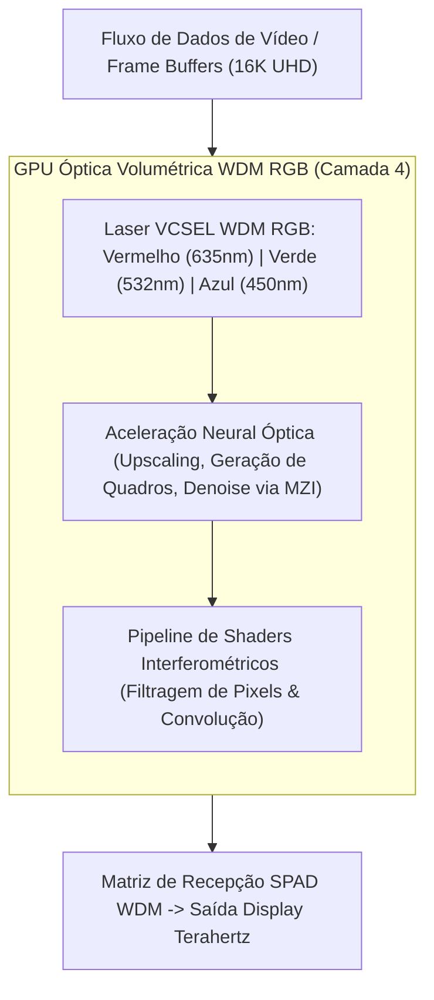

# Processamento de Vídeo e GPU Óptica por Multiplexação WDM RGB

> **Nota de validação (v1.1, 28/09/2026):** o "ray tracing óptico nativo" foi removido: a óptica acelera as partes neurais do pipeline gráfico e a interconexão; o shading escalar/FP32 fica na eletrônica (doc [12](12-memoria-unificada-jogos-e-ia-local.md), seção 4). A plataforma recomendada é 1550 nm; os canais RGB visíveis espalham ~140× mais que 1550 nm.

> **Conceito superado (v1.2, 29/09/2026):** a GPU óptica RGB descrita abaixo **não faz parte da arquitetura proposta**. Os guias são de Si₃N₄ em 1550 nm, os detectores são fotodiodos InGaAs (que não detectam luz visível), e não há "display terahertz" nem shaders interferométricos no plano do projeto. O que permanece: redes neurais do pipeline gráfico (upscaling, denoise) rodariam na unidade tensorial do doc [15](15-andar-de-ia-unidade-tensorial-fotonica.md). O texto fica como registro histórico.

## 1. Visão Geral da GPU Óptica Volumétrica

O **SilicaCore** integra uma unidade de processamento gráfico fotônica (**Optical GPU**) localizada na **Camada 4 da pilha fotônica** do bloco de sílica fundida. Em vez de utilizar rasterizadores eletrônicos baseados em transistores de silício alimentados por correntes elétricas de alta latência, a GPU óptica utiliza **Multiplexação por Comprimento de Onda (WDM - *Wavelength Division Multiplexing*)** em três frequências ópticas fundamentais (RGB - Red, Green, Blue).

---

## 2. Multiplexação WDM RGB e Canais Paralelos de Cor

O sistema opera com três canais ópticos espectralmente isolados que propagam em paralelo através dos mesmos guias de onda gravados por laser de femtossegundo no substrato:

| Canal de Cor | Comprimento de Onda ($\lambda$) | Índice de Refração ($n$) | Velocidade no Meio ($v$) | Aplicação no Pipeline Gráfico |
| :--- | :--- | :--- | :--- | :--- |
| **Vermelho (Red)** | $635\text{ nm}$ | $1.4570$ | $0.20576\text{ mm/ps}$ | Canal de Luminância e Profundidade (Z-Buffer) |
| **Verde (Green)** | $532\text{ nm}$ | $1.4608$ | $0.20522\text{ mm/ps}$ | Canal Primário de Crominância e Textura |
| **Azul (Blue)** | $450\text{ nm}$ | $1.4655$ | $0.20456\text{ mm/ps}$ | Canal de Iluminação Especular e Transparência |

A multiplexação espacial e espectral permite processar três camadas completas de pixels simultaneamente no mesmo feixe físico sem interferência de modulação cruzada.

---

## 3. Ray Tracing: o que Continua Eletrônico

O *ray tracing* calcula intersecções raio-triângulo ($P = O + t \cdot D$) numa **cena virtual** descrita por geometria. A luz que se propaga dentro do chip segue a geometria do chip, não a da cena, então **não existe ray tracing óptico nativo** para jogos. Shading, rasterização e travessia de BVH continuam em lógica eletrônica FP32.

Onde a óptica ajuda no pipeline gráfico:
- **Denoise de ray tracing, upscaling e geração de quadros:** são redes neurais (multiplicações matriz-vetor em INT8/FP8), o ponto forte do núcleo tensorial fotônico.
- **Interconexão:** banda alta e baixa energia por bit entre GPU, CPU e RAM unificada via I/O óptico.
- **Pathfinding:** race logic fotônica para NPCs (doc 11, seção 5.1).

---

## 4. Desempenho e Filtragem de Frames (16K UHD)

- **Shaders Interferométricos:** Operações de matrizes de convolução para pós-processamento de imagem (blur, sharpening, antialiasing) são realizadas por matrizes de interferômetros de Mach-Zehnder (*MZI Mesh*) integradas.
- **Vazão de Renderização:** limitada pela parte eletrônica do pipeline e pela taxa real por canal óptico (~5.1 GHz com lógica ToF, ou ~100 GHz em enlaces com fotodiodos UTC). "Taxas de atualização de terahertz" não são sustentadas por nenhum componente do modelo.

---

## 5. Referências Bibliográficas Científicas

1. **Hamerly, R., et al. (2019).** "Large-Scale Optical Neural Networks and Image Processors Based on Photoelectric Multiplication." *Physical Review X*, 9(2), 021032. [DOI: 10.1103/PhysRevX.9.021032](https://doi.org/10.1103/PhysRevX.9.021032)
