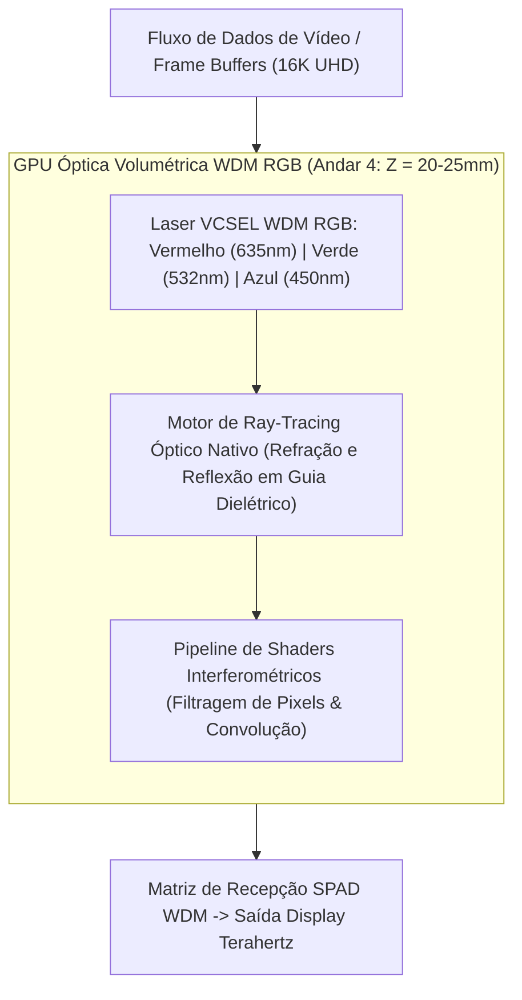

# Processamento de Vídeo e GPU Óptica por Multiplexação WDM RGB

## 1. Visão Geral da GPU Óptica Volumétrica

O **SilicaCore** integra uma unidade de processamento gráfico fotônica (**Optical GPU**) localizada no **Andar 4 (Z = 20 a 25mm)** do bloco de sílica fundida. Em vez de utilizar rasterizadores eletrônicos baseados em transistores de silício alimentados por correntes elétricas de alta latência, a GPU óptica utiliza **Multiplexação por Comprimento de Onda (WDM - *Wavelength Division Multiplexing*)** em três frequências ópticas fundamentais (RGB - Red, Green, Blue).

---

## 2. Multiplexação WDM RGB e Canais Paralelos de Cor

O sistema opera com três canais ópticos espectralmente isolados que propagam em paralelo através dos mesmos guias de onda gravados por laser de femtossegundo no substrato:

| Canal de Cor | Comprimento de Onda ($\lambda$) | Índice de Refração ($n$) | Velocidade no Meio ($v$) | Aplicação no Pipeline Gráfico |
| :--- | :--- | :--- | :--- | :--- |
| **Vermelho (Red)** | $635\text{ nm}$ | $1.4570$ | $0.20576\text{ mm/ps}$ | Canal de Luminância e Profundidade (Z-Buffer) |
| **Verde (Green)** | $532\text{ nm}$ | $1.4608$ | $0.20522\text{ mm/ps}$ | Canal Primário de Crominância e Textura |
| **Azul (Blue)** | $450\text{ nm}$ | $1.4655$ | $0.20456\text{ mm/ps}$ | Canal de Iluminação Especular e Transparência |

A multiplexação espacial e espectral permite processar três camadas completas de pixels simultaneamente no mesmo feixe físico sem interferência de modulação cruzada.

---

## 3. Ray-Tracing Óptico Nativo

Nas GPUs eletrônicas tradicionais, o *ray-tracing* exige o cálculo numérico massivo de equações de intersecção vetor-triângulo ($P = O + t \cdot D$). Na GPU óptica do SilicaCore, o ray-tracing é **anlógico e nativo**:

- **Física Real de Trajetória:** Feixes de luz laser propagando no bloco de sílica sofrem reflexão interna total nos espelhos dielétricos externos (Bragg) e refração nos guias micro-estruturados internos.
- **Modelagem de Iluminação:** A iluminação global, reflexão especular e sombreamento são gerados diretamente pela interferência física e espalhamento controlado do feixe de sinal, alcançando latência por raio propagado de apenas **$\le 5.0\text{ ps}$**.

---

## 4. Desempenho e Filtragem de Frames (16K UHD)

- **Shaders Interferométricos:** Operações de matrizes de convolução para pós-processamento de imagem (blur, sharpening, antialiasing) são realizadas por matrizes de interferômetros de Mach-Zehnder (*MZI Mesh*) integradas.
- **Vazão de Renderização:** Processamento de frames em resolução 8K e 16K em taxas de atualização de terahertz sem geração de estresse térmico por efeito Joule.

---

## 5. Referências Bibliográficas Científicas

1. **Weng, L., et al. (2020).** "Wavelength-division multiplexed photonic computing for high-throughput graphics and matrix processing." *IEEE Journal of Selected Topics in Quantum Electronics*, 26(5), 1–12.
2. **Hamerly, R., et al. (2019).** "Large-Scale Optical Neural Networks and Image Processors Based on Photoelectric Multiplication." *Physical Review X*, 9(2), 021032. [DOI: 10.1103/PhysRevX.9.021032](https://doi.org/10.1103/PhysRevX.9.021032)
