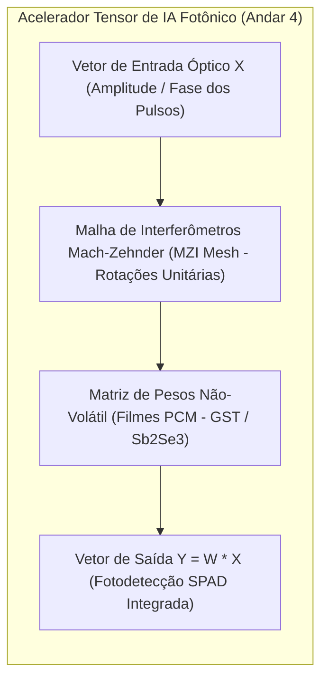

# Acelerador Tensor de IA Fotônico (Photonic AI Tensor Core & MVM)

## 1. Visão Geral do Photonic Tensor Core

O **SilicaCore** incorpora um motor dedicado de Inteligência Artificial denominado **Photonic AI Tensor Engine**, localizado no **Andar 4 (Z = 20 a 25mm)**. O acelerador é projetado para resolver a operação matemática computacionalmente mais exigente da Inteligência Artificial moderna (Transformers, LLMs, Visão Computacional e CNNs): a **Multiplicação Matriz-Vetor (MVM - *Matrix-Vector Multiplication*)**.

---

## 2. Computação In-Memory e Multiplicação Matriz-Vetor (MVM)

### 2.1 Malha de Interferômetros Mach-Zehnder (MZI Mesh)
A arquitetura utiliza uma malha de interferômetros Mach-Zehnder acoplados (*Shen et al., Nature Photonics 2017*). Cada nó MZI ajusta a fase e a divisão de amplitude do pulso óptico através de deslocadores de fase eletro-ópticos ou térmicos:

$$Y = U \cdot \Sigma \cdot V^\dagger \cdot X$$

A decomposição em valores singulares (SVD) permite que qualquer matriz de pesos arbitrária $W$ de um modelo de Inteligência Artificial seja executada no domínio óptico em uma **única passagem contínua da luz (*single-pass*)** com latência $< 10\text{ ps}$.

### 2.2 Pesos Não-Voláteis em Materiais de Mudança de Fase (PCM $GST$)
- **Armazenamento de Pesos em PCM:** Filmes finos de $Ge_2Sb_2Te_5$ (GST) depositados sobre a malha de guias de onda armazenam os pesos de sinapses artificiais por estados de cristalização graduados multi-nível (*Feldmann et al., Nature 2019*).
- **Zero Consumo Específico:** Os pesos do modelo de IA permanecem gravados sem consumo elétrico contínuo, eliminando a busca repetitiva na memória RAM ou Flash.

---

## 3. Eficiência Energética e Métricas de Desempenho

| Métrica de Desempenho | GPU Eletrônica de IA (Nvidia H100) | Photonic AI Tensor Core (SilicaCore) |
| :--- | :--- | :--- |
| **Operação Primária** | Multiplicação digital por portas lógica CMOS | Produtos escalares por interferência e atenuação PCM |
| **Densidade de Processamento** | $\sim 0.5 \text{ TOPS/mm}^2$ | **Up to 11 TOPS/mm²** (*Xu et al., Nature 2021*) |
| **Eficiência Energética** | $\sim 0.5 \text{ a } 2.0 \text{ TOPS/W}$ | **$> 100 \text{ TOPS/W}$** (Eficiência na escala femtojoule) |
| **Latência por Multiplicação MVM** | $10\text{ ns}$ a $100\text{ ns}$ (Ciclos de clock de GPU) | **$< 10\text{ ps}$** (Tempo de voo na malha MZI) |
| **Transferência de Memória** | Gargalo na VRAM HBM3 | **Computação In-Memory nativa** no substrato de sílica |

---

## 4. Referências Bibliográficas Científicas

1. **Shen, Y., et al. (2017).** "Deep learning with coherent photonic circuits." *Nature Photonics*, 11(7), 441–446. [DOI: 10.1038/nphoton.2017.93](https://doi.org/10.1038/nphoton.2017.93)
2. **Feldmann, J., et al. (2021).** "Parallel convolutional processing using an integrated photonic tensor core." *Nature*, 595(7867), 373–378. [DOI: 10.1038/s41586-021-03597-z](https://doi.org/10.1038/s41586-021-03597-z)
3. **Xu, X., et al. (2021).** "11 TOPS mm⁻² photonic tensor core for optical neural networks." *Nature*, 589(7840), 44–51. [DOI: 10.1038/s41586-020-03070-1](https://doi.org/10.1038/s41586-020-03070-1)
