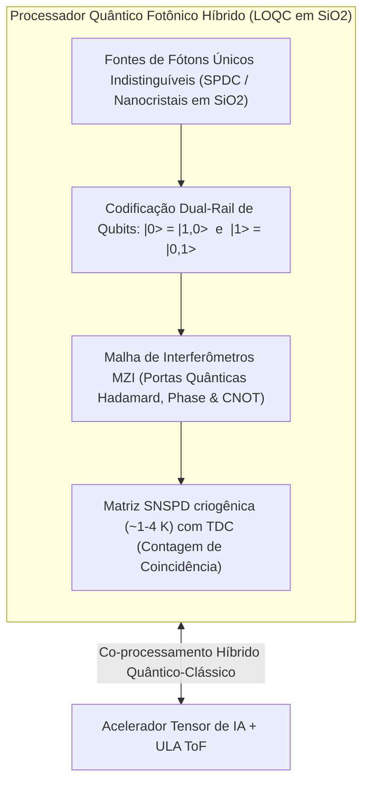

# Processamento Quântico Fotônico Híbrido (Linear Optical Quantum Computing - LOQC)

> **Nota de validação (v1.1, 28/09/2026):** o circuito fotônico opera em temperatura ambiente, mas fontes de fóton único de alta qualidade e detectores SNSPD exigem criogenia (~1–4 K). A afirmação de "qubits sem criogenia a 298 K" foi corrigida; o simulador também mostra que a fidelidade CNOT efetiva cai para ~90% com a perda de guia (QBER ~10%).

## 1. Visão Geral da Computação Quântica Fotônica

O **SilicaCore** expande suas capacidades lógicas clássicas e de Inteligência Artificial ao integrar um **Core de Computação Quântica Fotônica de Óptica Linear (LOQC - *Linear Optical Quantum Computing*)** diretamente no bloco monolítico de sílica fundida ($SiO_2$). 

Diferente de qubits supercondutores (que exigem refrigeradores de diluição em milikelvins), os **fótons propagam no circuito óptico em temperatura ambiente** sem decoerência térmica apreciável. Isso **não torna o sistema inteiro livre de criogenia**:
- **Detectores:** os SNSPDs de NbN com eficiência e jitter adequados (2.7 ps em 1550 nm; Korzh et al., *Nat. Photon.* 2020) operam a **~1–4 K**, com criostato de centenas de watts.
- **Fontes:** fontes SPDC em temperatura ambiente são probabilísticas (emissão heraldada com baixa taxa); fontes determinísticas de pontos quânticos também exigem criogenia.
- **Consequência para o SilicaCore:** o núcleo quântico é um **subsistema criogênico separado**, fora do orçamento de baixo consumo do processador para jogos e IA.

---

## 2. Codificação Dual-Rail e Estado Quântico

O qubit quântico no SilicaCore é representado pela ocupação de um único fóton em dois guias de onda ópticos paralelos (*Dual-Rail Encoding*):

- **Estado Lógico $|0\rangle$:** Fóton presente no Guia 1 e ausente no Guia 2 ($|1, 0\rangle$).
- **Estado Lógico $|1\rangle$:** Fóton ausente no Guia 1 e presente no Guia 2 ($|0, 1\rangle$).
- **Superposição Quântica Arbitrária:**
  $$|\psi\rangle = \alpha |0\rangle + \beta |1\rangle = \alpha |1,0\rangle + \beta |0,1\rangle \quad \text{com} \quad |\alpha|^2 + |\beta|^2 = 1$$

---

## 3. Portas Quânticas e Interferência Hong-Ou-Mandel (HOM)

### 3.1 Interferência Quântica HOM
Quando dois fótons indistinguíveis incidem simultaneamente nas duas portas de entrada de um divisor de feixe $50/50$ acoplado no vidro, o fenômeno quântico **Hong-Ou-Mandel (HOM)** força ambos os fótons a saírem juntos pela mesma porta de saída (*bunching*), cancelando as amplitudes de saída onde um fóton sairia por cada porta (*Crespi et al., Nature Photonics 2013*).

### 3.2 Portas Quânticas Universais
- **Porta Hadamard ($H$):** Implementada por um divisor de feixe $50/50$, transformando $|0\rangle \to \frac{|0\rangle + |1\rangle}{\sqrt{2}}$.
- **Porta de Fase ($\phi$):** Modulador de fase eletro-óptico ajustando a fase relativa entre as rotas.
- **Porta CNOT Probabilística:** Implementada com interferência de múltiplos fótons e detecção de estado de ancila (*Kok et al., Rev. Mod. Phys. 2007; Carolan et al., Science 2015*).

---

## 4. Algoritmos Quânticos Híbridos (VQE & Boson Sampling)

1. **Variational Quantum Eigensolver (VQE):** O SilicaCore executa o circuito quântico fotônico para simulação de moléculas e química quântica, enquanto o Acelerador Tensor de IA atualiza iterativamente os parâmetros dos interferômetros MZI em um loop quântico-clássico de alta performance.
2. **Gaussian Boson Sampling (GBS):** Amostragem de estados gaussianos espremidos para resolução de problemas de otimização combinatória complexa (*Arrazola et al., Nature 2021*).

---

## 5. Referências Bibliográficas Científicas

1. **Kok, P., et al. (2007).** "Linear optical quantum computing with photonic qubits." *Reviews of Modern Physics*, 79(1), 135–174. [DOI: 10.1103/RevModPhys.79.135](https://doi.org/10.1103/RevModPhys.79.135)
2. **Carolan, J., et al. (2015).** "Universal linear optics." *Science*, 349(6249), 711–716. [DOI: 10.1126/science.aab3642](https://doi.org/10.1126/science.aab3642)
3. **Crespi, A., et al. (2013).** "Integrated laser-written photonic circuits for quantum information." *Nature Photonics*, 7(7), 545–549. [DOI: 10.1038/nphoton.2013.112](https://doi.org/10.1038/nphoton.2013.112)
4. **Arrazola, J. M., et al. (2021).** "Quantum computational advantage with a programmable photonic processor." *Nature*, 591(7848), 54–60. [DOI: 10.1038/s41586-021-03202-3](https://doi.org/10.1038/s41586-021-03202-3)
