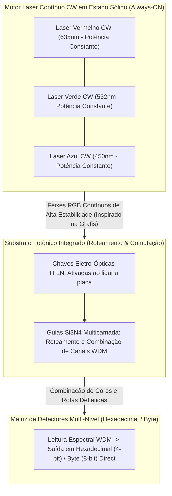

# Emissão Laser Contínua (CW Laser Engine) e Codificação M-ária (Hexadecimal / Byte)

> **Nota de validação (v1.1, 28/09/2026):** o princípio do laser sempre aceso (inspiração Grafis) foi mantido. Duas atualizações: a lógica ToF exige **pulsos**, então o motor CW alimenta um pente de frequências ou laser mode-locked em 1550 nm (que também gera os 64+ canais DWDM); e o roteamento por AOM/EOM e micro-espelhos foi substituído por guias Si₃N₄ e chaves TFLN (doc [11](11-roteamento-e-comutacao-optica.md)).

> **Conceito superado (v1.2, 29/09/2026):** os lasers RGB e a codificação hexadecimal/byte descritos abaixo **não fazem parte da arquitetura proposta**. A plataforma opera em 1550 nm, com fotodiodos InGaAs que não detectam luz visível, e codifica bits pelo tempo de chegada (doc 02). A seção 1.3 continua válida como origem da ideia; o resto fica como registro histórico.

## 1. Visão Geral do Motor Laser Contínuo (Solid-State CW Engine)

Inspirado nos sistemas industriais de exposição fotográfica a laser de ultra-alta precisão, o **SilicaCore** substitui a modulação por pulsação liga/desliga de diodo laser por um **Motor Laser de Onda Contínua (*Continuous Wave - CW Laser Engine*)**.

### 1.1 Emissores Permanentes (*Always-ON Lasers*)
- **Operação de Alta Estabilidade:** Os canhões laser sólidos RGB ($\lambda_R = 635\text{ nm}$, $\lambda_G = 532\text{ nm}$, $\lambda_B = 450\text{ nm}$) permanecem **constantemente ligados e alimentados** em nível de potência e fase calibrados.
- **Eliminação de Surtos Térmicos:** Ao eliminar o chaveamento elétrico de alta frequência nos diodos, erradica-se a fadiga dos semicondutores, oscilações de relaxamento óptico e ruídos térmicos associados ao liga/desliga.

### 1.2 Roteamento e Espelhamento Dinâmico na Inicialização
Assim que a placa do SilicaCore é energizada, o processador inicia o direcionamento dos feixes contínuos através de:
- **Chaves Eletro-Ópticas TFLN:** chaveamento em picossegundos sem partes mecânicas. AOMs (~16.8 ns) e EOM em sílica pura (sem efeito Pockels) foram descartados na validação física (doc 11).
- **Guias de Onda Si₃N₄:** condução e combinação dos feixes até os fotodetectores, com curvas de 50 µm no lugar de micro-espelhos (espelhos com feixe livre perdem ~46.6 dB por porta por difração).

### 1.3 Origem da Ideia e Agradecimento

> **Nota de origem:** a ideia do SilicaCore é do autor (Ricardo Oliveira) e surgiu do seu trabalho com revelação fotográfica na empresa **Grafis**. O colega de trabalho **Valmor Moreira** explicou ao autor o funcionamento das máquinas a laser durante os reparos que faziam juntos; ele não participou da concepção do projeto.
> 
> Na empresa Grafis, operavam-se equipamentos fotográficos industriais equipados com canhões laser sólidos contínuos (RGB) que incidiam sobre um **prisma rotativo e um conjunto de espelhos ópticos**. Ao percorrer o papel fotográfico sensível à luz com velocidade e precisão micrométrica, esse sistema gerava a revelação física da imagem. 
> 
> Entender essa máquina levou o autor ao *insight* que deu origem ao SilicaCore: se os canhões laser permanecem sempre acesos e o prisma/espelhos direcionam o feixe sobre o suporte fotossensível para gravar dados visuais, é perfeitamente viável projetar canhões laser sólidos contínuos integrados em micro-escala direcionados por micro-espelhos e modificadores eletro-ópticos dentro de um bloco de sílica fundida para sensibilizar matrizes de fotodetectores SPAD, realizando computação e armazenamento no tempo de propagação da luz.

---

## 2. Codificação Densa M-ária (Hexadecimal e Byte por Símbolo)

Em vez de limitar a transmissão a um sinal binário simples (`0` ou `1`, $1\text{ bit}$ por feixe), o SilicaCore explora a **combinação de cores RGB e níveis de fase/amplitude** para transmitir valores densos por canal espacial:

> **Por que não funciona:** a fase relativa entre feixes de cores diferentes não é estável (ela gira na frequência da diferença entre as cores, centenas de THz), então "16 combinações de amplitude e fase entre os 3 feixes RGB" não definem estados legíveis. Codificação multinível real usa um único comprimento de onda por canal (PAM4, QAM coerente), e o doc 15 usa níveis de intensidade por cor, não fase entre cores.

### 2.1 Codificação Hexadecimal (4 Bits por Símbolo - 16 Estados)
- **Modulação:** 16 combinações discretas de amplitude e fase entre os 3 feixes RGB.
- **Saída:** Cada canal espacial entrega diretamente um caractere hexadecimal (`0x0` a `0xF`).

### 2.2 Codificação em Byte Completo (8 Bits por Símbolo - 256 Estados)
- **Modulação:** 256 estados discretos de fase por símbolo.
- **Status: não suportado com o ruído de fase atual.** Com $\sigma = 0.012$ rad, os estados ficam a $\approx 1\sigma$ de distância e a taxa de erro de símbolo chega a ~30%. Seria preciso reduzir o ruído de fase em ~7× para o modo Byte funcionar. O modo padrão é o Hexadecimal.

---

## 3. Referências Bibliográficas Científicas & Históricas

1. **Grafis & Registro Prático:** Experiência do autor com equipamentos fotográficos de exposição a laser contínuo com varredura por prisma (Empresa Grafis); funcionamento das máquinas explicado pelo colega Valmor Moreira.

