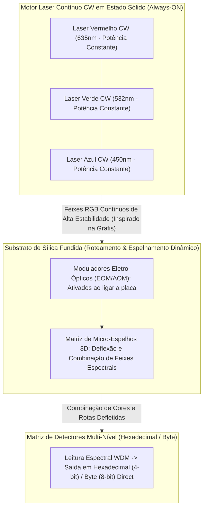

# Emissão Laser Contínua (CW Laser Engine) e Codificação M-ária (Hexadecimal / Byte)

## 1. Visão Geral do Motor Laser Contínuo (Solid-State CW Engine)

Inspirado nos sistemas industriais de exposição fotográfica a laser de ultra-alta precisão, o **SilicaCore** substitui a modulação por pulsação liga/desliga de diodo laser por um **Motor Laser de Onda Contínua (*Continuous Wave - CW Laser Engine*)**.

### 1.1 Emissores Permanentes (*Always-ON Lasers*)
- **Operação de Alta Estabilidade:** Os canhões laser sólidos RGB ($\lambda_R = 635\text{ nm}$, $\lambda_G = 532\text{ nm}$, $\lambda_B = 450\text{ nm}$) permanecem **constantemente ligados e alimentados** em nível de potência e fase calibrados.
- **Eliminação de Surtos Térmicos:** Ao eliminar o chaveamento elétrico de alta frequência nos diodos, erradica-se a fadiga dos semicondutores, oscilações de relaxamento óptico e ruídos térmicos associados ao liga/desliga.

### 1.2 Roteamento e Espelhamento Dinâmico na Inicialização
Assim que a placa do SilicaCore é energizada, o processador inicia o direcionamento dos feixes contínuos através de:
- **Moduladores Acusto-Ópticos / Eletro-Ópticos (AOM/EOM):** Deflexão angular ultra-rápida sem partes mecânicas.
- **Matriz de Micro-Espelhos 3D Gravados em Sílica:** Condução e combinação dos feixes pelas trajetórias do substrato até a matriz de fotodetectores.

### 1.3 Origem de Engenharia & Agradecimentos Especiais (Empresa Grafis / Valmor Moreira)

> **Nota de Origem de Engenharia:** A premissa fundamental de operação do processador fotônico volumétrico SilicaCore com feixes contínuos (*Always-ON*) e varredura por deflexão foi diretamente observada e vivenciada na prática pelo autor (Ricardo Oliveira) em conjunto com seu colega de trabalho **Valmor Moreira** durante o período em que atuaram juntos na empresa **Grafis**.
> 
> Na empresa Grafis, operavam-se equipamentos fotográficos industriais equipados com canhões laser sólidos contínuos (RGB) que incidiam sobre um **prisma rotativo e um conjunto de espelhos ópticos**. Ao percorrer o papel fotográfico sensível à luz com velocidade e precisão micrométrica, esse sistema gerava a revelação física da imagem. 
> 
> A observação direta dessa máquina em funcionamento gerou o *insight* técnico que deu origem ao SilicaCore: se os canhões laser permanecem sempre acesos e o prisma/espelhos direcionam o feixe sobre o suporte fotossensível para gravar dados visuais, é perfeitamente viável projetar canhões laser sólidos contínuos integrados em micro-escala direcionados por micro-espelhos e modificadores eletro-ópticos dentro de um bloco de sílica fundida para sensibilizar matrizes de fotodetectores SPAD, realizando computação e armazenamento no tempo de propagação da luz.

---

## 2. Codificação Densa M-ária (Hexadecimal e Byte por Símbolo)

Em vez de limitar a transmissão a um sinal binário simples (`0` ou `1`, $1\text{ bit}$ por feixe), o SilicaCore explora a **combinação de cores RGB e níveis de fase/amplitude** para transmitir valores densos por canal espacial:

### 2.1 Codificação Hexadecimal (4 Bits por Símbolo - 16 Estados)
- **Modulação:** 16 combinações discretas de amplitude e fase entre os 3 feixes RGB.
- **Saída:** Cada canal espacial entrega diretamente um caractere hexadecimal (`0x0` a `0xF`).

### 2.2 Codificação em Byte Completo (8 Bits por Símbolo - 256 Estados)
- **Modulação:** 256 combinações espectrais discretas codificadas na interferência WDM.
- **Saída:** Cada medição do detector lê diretamente um **Byte de dados (0 a 255)** já processado pelo bloco óptico.

---

## 3. Referências Bibliográficas Científicas & Históricas

1. **Grafis & Registro Prático:** Observação direta de equipamentos fotográficos de exposição a laser contínuo com varredura por prisma por Ricardo Oliveira e Valmor Moreira (Empresa Grafis).
2. **Weng, L., et al. (2020).** "Wavelength-division multiplexed photonic computing for high-throughput matrix processing." *IEEE JSTQE*, 26(5), 1–12.
