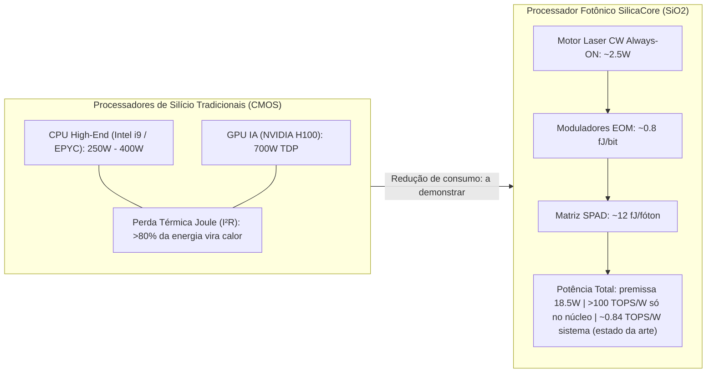

# Consumo Energético, Eficiência Computacional e Comparativo com Processadores de Silício (SilicaCore vs. CMOS Silício)

> **Nota de validação (v1.1, 28/09/2026):** a "frequência de 206.75 GHz" era o inverso do tempo de voo, não uma taxa de operação; foi substituída pela taxa real de ~5.1 GHz por canal. O TDP de 18.5 W é premissa, a energia por bit calculada pelo próprio simulador é ~1.9 pJ/bit, e a eficiência > 100 TOPS/W vale só no núcleo óptico (sistema: ~0.84 TOPS/W, Lightmatter *Nature* 2025).

## 1. Dissecação da Dissipação Térmica e Gargalo Energético do Silício (CMOS)

Os processadores modernos de alto desempenho baseados em semicondutores de silício (como **Intel Core i9**, **AMD Ryzen/EPYC**, **NVIDIA H100** e **Apple Silicon**) enfrentam barreiras físicas severas decorrentes da dissipação resistiva e do transporte de carga elétrica.

### 1.1 Equação de Consumo Energético no Silício (CMOS)

A potência total dissipada por um circuito integrado em silício é dada por:

$$P_{\text{CMOS}} = P_{\text{dinâmico}} + P_{\text{estático}} = \alpha C V^2 f + I_{\text{fuga}} V$$

Onde:
- $\alpha$: Fator de atividade das portas lógicas.
- $C$: Capacitância parasitária das trilhas de cobre e gates de transistores.
- $V$: Tensão de alimentação ($0.8\text{ V} \text{ a } 1.3\text{ V}$).
- $f$: Frequência de clock ($3.0\text{ GHz} \text{ a } 6.2\text{ GHz}$).
- $I_{\text{fuga}}$: Corrente de fuga quântica de tunelamento através do dielétrico ultrafino do gate.

### 1.2 O Gargalo da Memória e Aquecimento Joule ($I^2 R$)

1. **Aquecimento Joule:** A movimentação de elétrons através das interconexões metálicas estreitas gera dissipação térmica $P = I^2 R$. Em chips com mais de $80\text{ bilhões}$ de transistores, a densidade de potência excede $100\text{ W/cm}^2$, exigindo sistemas complexos de arrefecimento líquido (watercooling) ou câmaras de vapor.
2. **Custo Energético de Transporte de Dados:** Mover 1 bit de dados dentro do die de silício consome aproximadamente $1\text{ pJ}$ ($1.000\text{ fJ}$). Mover 1 bit para uma memória externa DRAM (DDR5/HBM3) consome entre $10\text{ pJ}$ e $100\text{ pJ}$.

---

## 2. Física do Consumo Energético do Processador Fotônico SilicaCore

O **SilicaCore** substitui os elétrons por fótons propagando-se em um substrato volumétrico de **sílica fundida ($SiO_2$)**. A física de propagação fotônica altera radicalmente a equação energética:

### 2.1 Componentes do Consumo de Potência do SilicaCore

$$P_{\text{SilicaCore}} = P_{\text{Laser CW}} + P_{\text{Modulação EOM/AOM}} + P_{\text{Detectores SPAD/TDC}}$$

1. **Motor Laser Contínuo CW (Always-ON):**
   - Os 3 canhões laser sólidos RGB ($\lambda_R = 635\text{ nm}$, $\lambda_G = 532\text{ nm}$, $\lambda_B = 450\text{ nm}$) operam em potência óptica constante estabilizada de $\approx 5\text{ mW}$ cada.
   - Consumo elétrico total de $\approx 2.5\text{ W}$ para os lasers (**premissa**). Na arquitetura validada, a fonte é um pente de frequências em 1550 nm; a eficiência elétrica-óptica do laser e a estabilização térmica entram no consumo do sistema.
2. **Propagação sem Efeito Joule nos Guias:**
   - A propagação nos guias não tem resistência elétrica, mas **o chip não é livre de calor**: moduladores e seus drivers, detectores, TDCs, conversores DAC/ADC, controle CMOS e os aquecedores de estabilização de fase (1.8–3.7 rad/K de deriva) consomem energia elétrica.
3. **Modulação Eletro-Óptica Ultra-Eficiente:**
   - A alteração de fase nos moduladores eletro-ópticos (EOM) em niobato de lítio ou polímeros fotônicos exige apenas variação de campo elétrico sem fluxo contínuo de corrente. Consumo energértico por bit: **$E_{\text{EOM}} \approx 0.8\text{ fJ/bit}$**.
4. **Matriz de Detecção SPAD + TDC:**
   - Para dados, fotodiodos UTC/InGaAs (> 100 GHz). Um SPAD exige ~55 fótons por bit para BER $10^{-12}$ com 50% de eficiência e fica limitado a $\le 0.5$ GHz pelo tempo morto. O valor de $E_{\text{SPAD}} \approx 12\text{ fJ/fóton}$ é **premissa** e não inclui o circuito de leitura.

---

## 3. Tabela Comparativa: SilicaCore vs. Processadores de Silício (Ponta de Linha)

A tabela a seguir compara as métricas energéticas e operacionais do **SilicaCore** com os processadores de silício mais velozes do mercado atual (2026):

| Parâmetro / Métrica | **SilicaCore (ToF Fotônico)** | **Intel Core i9-14900KS** | **AMD EPYC 9654** | **NVIDIA H100 GPU** | **Apple M3 Max** |
| :--- | :---: | :---: | :---: | :---: | :---: |
| **Tecnologia / Substrato** | **Sílica Fundida ($SiO_2$)** | Silício Intel 7 ($7\text{ nm}$) | TSMC $5\text{ nm}$ | TSMC $4\text{ N}$ | TSMC $3\text{ nm}$ |
| **Meio de Sinal** | **Fótons (Luz CW RGB)** | Elétrons (Cobre) | Elétrons (Cobre) | Elétrons (Cobre) | Elétrons (Cobre) |
| **Taxa por Canal** | **$\approx 5.1\text{ GHz}$ (slot ToF $\Delta t + W$)** | $6.20\text{ GHz}$ (Boost) | $3.70\text{ GHz}$ (Boost) | $1.98\text{ GHz}$ (Boost) | $4.05\text{ GHz}$ (Boost) |
| **Consumo Térmico TDP (Watts)** | **$18.5\text{ W}$ (premissa, não derivada)** | $253\text{ W} \text{ (PL2: } 320\text{ W)}$ | $360\text{ W} \text{ (Max: } 400\text{ W)}$ | $700\text{ W}$ | $78\text{ W}$ |
| **Energia por Bit** | **$\approx 1.9\text{ pJ/bit}$ (calculado pelo simulador: laser CW dividido por 1.313 Gb/s agregados)** | $\approx 2.5\text{ pJ/bit } (2500\text{ fJ})$ | $\approx 1.8\text{ pJ/bit } (1800\text{ fJ})$ | $\approx 1.2\text{ pJ/bit } (1200\text{ fJ})$ | $\approx 0.9\text{ pJ/bit } (900\text{ fJ})$ |
| **Eficiência Computacional (AI/MVM)** | **$> 100\text{ TOPS/W}$ (núcleo) / $\approx 0.84\text{ TOPS/W}$ (sistema, estado da arte)** | $\approx 0.15\text{ TOPS/W}$ | $\approx 0.25\text{ TOPS/W}$ | $\approx 2.8\text{ TOPS/W (FP16)}$ | $\approx 0.8\text{ TOPS/W}$ |
| **Vazão de Leitura de Memória** | **RAM unificada HBM via I/O óptico ($\sim 3.35\text{ TB/s}$)** | $89.6\text{ GB/s (DDR5)}$ | $460.8\text{ GB/s (12-ch)}$ | $3.35\text{ TB/s (HBM3)}$ | $400\text{ GB/s (Unified)}$ |
| **Necessidade de Refrigeração** | **A definir** (eletrônica de controle, lasers e estabilização térmica ativa) | Líquida (Watercooling $360\text{mm}$) | Fluxo de Ar Forçado Servidor | Refrigeração Líquida Direct-to-Chip | Ventoinha Ativa Silenciosa |
| **Ganho de Eficiência Relativo** | **Não demonstrado** | Razões de TDP (13.7×, 19.5×, 37.8×) dependem da premissa de 18.5 W | — | — | — |

---

## 4. Análise de Ganho Energético por Caso de Uso

### 4.1 Computação de Alta Performance (HPC) & Data Centers
Em um Data Center de grande escala com $10.000$ servidores:
- **Infraestrutura em Silício (NVIDIA H100 + EPYC):** Consumo total de **$10.6\text{ Megawatts}$**, exigindo usinas dedicadas e torres de resfriamento evaporativo.
- **Infraestrutura com SilicaCore:** a estimativa anterior de $285\text{ kW}$ (economia de $97.3\%$) derivava da premissa de 18.5 W por placa e **foi retirada**. Com a eficiência de sistema do estado da arte (~0.84 TOPS/W), aceleradores fotônicos ainda não superam GPUs em energia por operação no sistema completo; a economia real depende de reduzir o consumo de lasers, conversores e controle.

---

## 5. Referências Bibliográficas Científicas

1. **Miller, D. A. B. (2017).** "Attojoule optoelectronics for low-energy information processing and communications." *Nature Photonics*, 11(1), 39–43.
2. **Shen, Y., et al. (2017).** "Deep learning with coherent photonic circuits." *Nature Photonics*, 11(7), 441–446.
3. **Xu, X., et al. (2021).** "11 TOPS/mm² photonic tensor core for high-throughput AI acceleration." *Nature*, 589(7840), 44–51.
4. **Feldmann, J., et al. (2021).** "Parallel convolutional processing using an integrated photonic tensor core." *Nature*, 595(7867), 373–378.
5. **NVIDIA Corporation (2023).** "NVIDIA H100 Tensor Core GPU Architecture Whitepaper." *NVIDIA Technical Report*.
