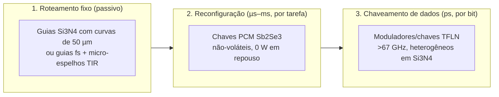

# Roteamento e Comutação Óptica: do Espelho Interno ao Comutador em Picossegundos

## 1. O Problema dos Espelhos Internos

A lógica ToF do SilicaCore depende de desviar um pulso para a linha rápida ($d_1$) ou para a linha atrasada ($d_0$). Na arquitetura original, esse desvio é feito por espelhos internos em um bloco de sílica com feixe livre. O modelo físico em `simulations/go/pkg/optical/budget.go` mostra seis obstáculos:

| Obstáculo | Número (simulador, 1550 nm) | Consequência |
| :--- | :--- | :--- |
| **Difração do feixe livre** | Cintura de 5 µm vira raio de **~2.8 mm** após 40.7 mm | **~46 dB** de perda por porta: o feixe não chega ao detector |
| **Sílica não é eletro-óptica** | Sem efeito Pockels (vidro amorfo). Kerr DC: $\Delta n \lesssim 10^{-9}$ | Reflexão interna total só abaixo de **0.002°** de rasância: "espelho EO" em SiO₂ inviável |
| **AOM é lento** | Trânsito acústico em 100 µm de sílica: **16.8 ns** | 3 ordens de grandeza acima da escala de ps |
| **Perda acumulada** | Espelho metálico: 2–5% por reflexão. Bragg: banda e ângulo estreitos | Sem regeneração, a cascata de portas morre em poucas etapas |
| **Tolerância angular** | Deslocamento $= 2\,\delta\theta\,L$ → $\delta\theta < 0.007°$ para 5 µm a 20 mm | Alinhamento de fabricação impraticável |
| **Espalhamento e crosstalk** | Rayleigh $\propto 1/\lambda^4$: 450 nm espalha **~140×** mais que 1550 nm | Luz parasita entre caminhos num bloco aberto |

> **Conclusão:** o espelho *passivo* não é o problema central. O problema é o **comutador ativo** que escolhe o caminho, e ele não pode ser feito na própria sílica.

---

## 2. Separação em Três Funções

A palavra "espelho" no projeto misturava três funções com requisitos físicos muito diferentes:

| Função | Velocidade | Material recomendado | Estado da arte |
| :--- | :--- | :--- | :--- |
| **Roteamento fixo** | — | **Si₃N₄ sobre SiO₂ multicamada**: curvas de 50 µm, acopladores entre camadas de 0.01 dB | Shang et al., *Opt. Express* 23, 21334 (2015); perdas de 0.7 dB/m em guias de alto aspecto |
| (alternativa em vidro 3D) | — | Guias gravados por laser fs + **micro-espelhos TIR em fenda de ar** (FLICE, 45°) | Perda típica 0.3 dB/cm, benchmark 0.05 dB/cm (*Sci. Rep.* 2018) |
| **Reconfiguração** | µs | **Sb₂Se₃** em guia Si₃N₄ com aquecedor de ITO transparente | >1.4×10⁸ ciclos, 25 dB de extinção, >6 bits multinível (Yu et al., arXiv:2604.11649, 2026); ~0.1 dB por π com afunilamento |
| **Chaveamento rápido** | ps | **Niobato de lítio em filme fino (TFLN)** ligado a Si₃N₄ | Transições LN↔Si₃N₄ <0.1 dB, guia <0.1 dB/cm (Churaev et al., *Nat. Commun.* 14, 3499, 2023); moduladores de 0.2 dB de perda e 67 GHz |

**Por que o GST sai:** o $Ge_2Sb_2Te_5$ absorve fortemente em 1550 nm no estado cristalino. O Sb₂Se₃ é transparente no infravermelho próximo e agora atinge resistência de ciclos compatível com reconfiguração frequente.

---

### 2.1 Validação Eletromagnética (FDTD 2D com Meep)

As perdas de curva e de transição usadas no modelo eram premissas da literatura. Elas foram verificadas com simulação eletromagnética FDTD (Meep 1.34, `simulations/fdtd/`, dados em `simulations/results/fdtd_*.csv`).

**Método.** As estruturas reais são 3D, mas a máquina disponível (4 núcleos, 7 GB) só comporta 2D. O **método do índice efetivo** reduz cada seção transversal a um perfil 2D: a curva é simulada no plano do chip e a transição num corte vertical (propagação × altura), com a largura do taper convertida em índice de camada. A transmissão é medida por decomposição em modos (modo fundamental na entrada e na saída). Todas as geometrias usam objetos com suavização subpixel e tempo de simulação fixo de 2,5× o trânsito do pulso. Cada resultado foi repetido com resolução maior (20→30 px/µm nas curvas, 50→70 px/µm na transição).

> Estes números são uma **indicação de consistência em aproximação planar**, não uma comprovação: efeitos 3D, rugosidade de litografia e conversão entre polarizações ficam de fora. Por isso o modelo mantém margens conservadoras.

**Curvas de 90° em Si₃N₄ grosso (800 nm), perda por curva:**

| Raio | Guia monomodo (0,7 µm) | Guia multimodo (1,2 µm) |
| :---: | :---: | :---: |
| 10 µm | 0,138 dB | — |
| 20 µm | **0,029 dB** (0,031 dB com 30 px/µm) | 0,103 dB (0,109 dB com 30 px/µm) |
| 30 µm | **0,012 dB** | — |
| 50 µm | **0,0026 dB** | — |

**Curvas em Si₃N₄ fino (200 nm × 1,2 µm), perda por curva:** 3,77 dB (20 µm), 1,35 dB (30 µm), 0,22 dB (50 µm), 0,060 dB (80 µm) e 0,039 dB (100 µm).

**Transição adiabática Si₃N₄ → filme de LN (300 nm, gap de 100 nm):**

| Comprimento do taper | Perda |
| :---: | :---: |
| 5 µm | 1,05 dB |
| 10 µm | 0,14 dB |
| 25 µm | **0,0017 dB** (0,0016 dB com 70 px/µm; 0,0027 dB partindo do guia monomodo de 0,7 µm) |
| 50 µm | 0,0013 dB |
| 100 µm | 0,0005 dB |

**O que os dados mostram:**
1. **A largura do guia importa mais que o raio.** O guia de 1,2 µm suporta um segundo modo lateral (corte em ~0,65 µm no modelo 2D), e a curva transfere potência para ele: 0,10 dB em 20 µm contra 0,029 dB do guia monomodo. **Guia recomendado: 800 nm × 0,7 µm** (índice de grupo ~2,06, próximo do 2,0 usado no modelo).
2. **A premissa de 0,01 dB por curva do modelo vale para raios a partir de ~31 µm** no guia monomodo, e fica conservadora acima disso (0,0026 dB em 50 µm). **Regra de projeto: espirais de atraso com raio ≥ 30 µm.**
3. **A transição satura a partir de ~25 µm** de taper. O modelo mantém **0,1 dB por transição**, valor próximo do medido em chips reais (< 0,1 dB; Churaev et al., 2023), para absorver os efeitos 3D e de fabricação que a simulação 2D não captura.
4. **Nesta geometria, o Si₃N₄ fino exige raios muito maiores** (0,06 dB só com 80 µm), por isso as espirais compactas usam o nitreto grosso. A plataforma multicamada de Shang et al. (2015) reporta curvas de 50 µm com outra seção transversal; a comparação direta exige simular aquela geometria.

**Duas armadilhas numéricas encontradas e corrigidas** (registradas no código): (i) o critério `stop_when_fields_decayed` do Meep encerrava a simulação antes de o pulso chegar ao monitor, dando perdas falsas de até 32 dB; (ii) descrever a curva por função de material desliga a suavização subpixel, e a borda em escada inflava a perda em ~40%.

## 3. Orçamento de Potência por Porta ToF (Simulador, Seção 10)

Premissas: 0 dBm por canal (linha de pente de frequência), sensibilidade de fotodiodo de −10 dBm (margem de 10 dB), 4 curvas/espelhos por porta, caminho atrasado de $t_0 \approx 196.7$ ps.

| Plataforma | Perda por porta | Portas em cascata sem regenerar | Deriva de fase |
| :--- | :---: | :---: | :---: |
| Bloco SiO₂ + espelhos internos (atual) | 46.6 dB | **0** (sem comutador em ps) | 1.78 rad/K |
| Guias fs em vidro + micro-espelhos TIR + TFLN | 6.2 dB | **1** | 1.78 rad/K |
| **Si₃N₄ multicamada + TFLN heterogêneo** | **1.3 dB** | **7** | 3.72 rad/K |

A plataforma Si₃N₄ + TFLN é a única com cascata útil. Mesmo nela, **a cada ~7 portas é preciso regenerar o sinal** (amplificador SOA ou conversão O-E-O). Esse é o critério de *restauração de nível lógico* de Miller (*Nat. Photon.* 4, 3, 2010), que nenhuma porta óptica puramente passiva satisfaz.

A deriva de fase térmica (1.8–3.7 rad/K) é irrelevante para ToF (que lê tempo, não fase), mas **exige estabilização ativa** em tudo que é interferométrico: malha MZI do acelerador de IA e codificação M-ária por fase.

---

## 4. Correção do Orçamento Temporal (Simulador, Seção 10.1)

A documentação anterior afirmava margem de 8.9σ e BER $< 10^{-12}$. O critério correto para decisão entre duas janelas é $Q = \Delta t / 2\sigma$:

- Conceito original (sílica + SPAD): $Q = 100 / (2 \times 11.24) = 4.45$ → **BER ≈ 4.3×10⁻⁶** com limiar no meio; o Monte Carlo com janela mede ~2×10⁻⁵ porque conta as duas caudas.
- Plataforma adotada (Si₃N₄ + fotodiodo InGaAs, σ ≈ 2,12 ps): $Q \approx 23.5$ com o mesmo $\Delta t$ (`go run ./cmd/tofplatform`, doc 02).
- Para BER $10^{-12}$: $Q = 7.03$ → **σ total ≤ 7.1 ps** com $\Delta t = 100$ ps.
- **Taxa real por canal:** o slot de símbolo precisa conter as duas janelas: $\Delta t + W \approx 195$ ps → **~5 GHz por canal**, não 206 GHz.
- **Detector:** SPADs têm tempo morto de ~1–2 ns no melhor caso (≤0.5 GHz). Para dados, usar **fotodiodos UTC** (>100 GHz). SPAD fica restrito ao núcleo quântico.

---

## 5. Direção Recomendada: Race Logic Fotônica

A lógica ToF é, em essência, **race logic** (Madhavan, Sherwood & Strukov, ISCA 2014): o valor é o tempo de chegada de uma frente de onda.

| Operação | Implementação óptica |
| :--- | :--- |
| `MIN` (OR temporal) | Combinador + primeira detecção |
| `MAX` (AND temporal) | Última chegada entre entradas |
| `+ constante` | Trecho de guia de atraso (espiral Si₃N₄) |
| Inibição | Chave TFLN bloqueando o caminho |

Os atrasos são **programados por chaves Sb₂Se₃** uma vez por problema, e a luz percorre a rede em picossegundos. Isso encaixa exatamente no que a física permite hoje (reconfiguração lenta, propagação rápida). Resolve nativamente menor caminho em grafos, alinhamento de sequências e DTW, que servem para pathfinding de NPCs em jogos, por exemplo.

### 5.1 Protótipo Simulado (`pkg/optical/racelogic.go`, simulador seção 12)

**Mapeamento físico:**
- **Aresta** = linha de atraso programável: 4 estágios binários de espiral Si₃N₄ selecionados por chaves Sb₂Se₃ (pesos 1–15). Unidade de peso = **100 ps** (escolhida pela campanha estatística abaixo).
- **Nó** = detecta a primeira chegada e re-emite. Um fotodiodo por aresta de entrada, com OR eletrônico (sem combinador passivo com perda), mais um modulador TFLN por aresta de saída.
- A latência de regeneração do nó (20 ps) é **descontada do atraso de cada aresta**. Sem isso, caminhos com mais saltos seriam penalizados e a corrida daria a resposta errada.
- **Ruído:** jitter de 1.5 ps rms por nó e erro estático de 0.5 ps rms por aresta, acumulando a cada salto.

**Campanha estatística** (`go run ./cmd/racestats`): mapa 16×16, **10 chips fabricados independentemente** (erro estático de aresta sorteado por chip) × **10⁴ consultas de origem aleatória** = 10⁵ consultas e 2,55×10⁷ distâncias decodificadas por unidade de atraso. Limite superior com 95% de confiança: regra de 3/N sem erros, intervalo de Wilson com erros.

| Unidade (ps) | Q no pior caminho (32 saltos) | Distâncias erradas | Taxa por distância (limite 95%) | Previsto (gaussiano) | Consultas com algum erro |
| :---: | :---: | :---: | :---: | :---: | :---: |
| 35 | 1.96 | 101.390 | 3.98×10⁻³ (4.00×10⁻³) | 3.68×10⁻³ | 17.6% |
| 50 | 2.80 | 3.136 | 1.23×10⁻⁴ (1.27×10⁻⁴) | 1.08×10⁻⁴ | 0.83% |
| 75 | 4.19 | 3 | 1.2×10⁻⁷ (3.5×10⁻⁷) | 9.3×10⁻⁸ | 0.002% |
| **100** | **5.59** | **0** | **0 (< 1.2×10⁻⁷)** | 2.0×10⁻¹¹ | **0 (< 3×10⁻⁵)** |

**Validação do modelo de ruído por número de saltos** (unidade 50 ps; CSV completo em `simulations/results/race_logic_hops_16x16.csv`):

| Saltos | Distâncias | Erro medido | Erro previsto por $\sigma\sqrt{h}$ |
| :---: | ---: | :---: | :---: |
| 12 | 1.530.455 | 7.2×10⁻⁶ | 5.0×10⁻⁶ |
| 16 | 1.272.043 | 9.4×10⁻⁵ | 7.7×10⁻⁵ |
| 20 | 627.896 | 4.8×10⁻⁴ | 4.1×10⁻⁴ |
| 24 | 182.707 | 1.31×10⁻³ | 1.25×10⁻³ |
| 28 | 31.964 | 2.60×10⁻³ | 2.81×10⁻³ |
| 32 | 1.558 | 5.1×10⁻³ | 5.2×10⁻³ |

O erro medido segue a previsão gaussiana de ruído acumulado por salto. O excesso de ~14% no total vem da própria corrida: quando dois caminhos têm comprimento quase igual, o nó dispara pelo mais adiantado dos dois ruídos, o que desloca a média para cedo. A amostra piloto de 200 consultas mostrava "0 erros" com 50 ps; com 10⁵ consultas, 0.83% delas têm algum erro. **Resultado reportável:** com unidade de 100 ps, **0 erros em 2,55×10⁷ distâncias** (taxa < 1.2×10⁻⁷ com 95% de confiança).

**Tempo por consulta com unidade de 100 ps** (origem única, todas as distâncias):

| Mapa | Corrida da luz | Leitura TDC (12 bits a 100 Gb/s) | Total | Dijkstra (Go, i3-3217U 2012) | Área das espirais |
| :--- | ---: | ---: | ---: | ---: | :--- |
| 8×8 | 6.0 ns | 7.7 ns | 13.7 ns | ~20 µs | 151 mm² |
| 16×16 | 11.5 ns | 30.7 ns | 42.2 ns | ~50–100 µs | 648 mm² |
| 32×32 | 20.0 ns | 122.9 ns | 142.9 ns | ~0.3 ms | 2.677 mm² (não cabe num retículo) |
| 64×64 | 41.9 ns | 491.5 ns | 533.5 ns | ~2 ms | 10.879 mm² (não cabe) |

**Leitura honesta dos resultados:**
1. **Não é O(1).** A corrida cresce com a maior distância do grafo ($D \times 100$ ps), e a leitura cresce com o número de nós ($N \times 12$ bits). A partir de 8×8, **a leitura eletrônica domina o tempo**, não a luz.
2. **Ganho contra o melhor algoritmo.** Com pesos inteiros de 1 a 15, o Dijkstra com fila de baldes (Dial) leva 25,4 µs no i3-3217U (~600× mais lento que a corrida) e ~1,8 µs estimados numa CPU atual (**~42×**). Num mapa fixo, uma tabela pré-calculada devolve as 256 distâncias em ~0,1 µs no i3 (poucos ns numa CPU atual) e vence o chip (`go run ./cmd/dijkstrabench`; artigo, seção 5.4.1).
3. **Área é o limite de escala:** com estágios binários, toda aresta carrega a espiral completa (~222 mm com unidade de 100 ps). Com passo de 3 µm eram 648 mm², mas voltas vizinhas acoplam (L_c ≈ 27 mm, `simulations/fdtd/spiral_crosstalk.py`); com o passo de 4 µm necessário, o 16×16 ocupa ~864 mm², pouco acima do retículo, e pede duas camadas de guias (doc 14, seção 7).
6. **Comparação com CMOS:** uma race logic síncrona a 3 GHz resolve o mesmo mapa em ~40 ns, sem erros, com ~0,007 mm² e ~0,8 nJ por consulta (`go run ./cmd/cmosrace`). A corrida óptica só é ~3× mais rápida na fase da corrida e perde por ordens de grandeza em área e energia.
4. **Hardware pesado:** o 16×16 usa 960 fotodiodos, 960 moduladores TFLN, 7.680 chaves Sb₂Se₃ e 256 TDCs. Com um modulador compartilhado por nó, a divisão de fan-out (6 dB) estoura a margem: 11.24 dB contra 10 dB (com modulador por aresta: 5.22 dB).
5. **Programação:** gravar os atrasos leva ~1 µs (premissa otimista: 7680 chaves Sb₂Se₃ em paralelo; a cristalização costuma exigir pulsos mais longos e o pico de potência dos aquecedores não foi modelado). Trocar a origem não exige reprogramar.

**Nicho:** mapas que mudam entre lotes de consultas (custos de terreno ou de tráfego atualizados com frequência), em blocos de até ~16×16. Com 100 consultas por mudança, o ganho estimado contra uma CPU atual é de ~34×; com mapa fixo, a tabela pré-calculada é melhor. **Riscos ainda não modelados:** diafonia entre voltas vizinhas das espirais (passo de 3 µm ao longo de até 222 mm) e latência real do nó (20 ps é otimista; o resultado vale enquanto ela for menor que a unidade de 100 ps).

### 5.2 Composição Multi-chip (`cmd/racemultichip`)

Blocos de 16×16, um por chip, compostos de dois modos:

| Modo | Mapa | Resultado |
| :--- | :--- | :--- |
| **Exato** (corrida única atravessando chips; 1.5 dB por face) | 32×32, 100 ps | 0 erros em ~3×10⁶ distâncias; 10.9 ns origem→destino |
| | 64×64, 100 ps | **1.52×10⁻⁴ erros por distância** (120 saltos no pior caminho) |
| | 64×64, 150 ps | 0 erros em ~1.2×10⁷ distâncias; 20.5–30.7 ns; aresta de borda a 9.3 dB |
| **Hierárquico** (HPA\*, pontos de passagem na borda; sem óptica entre chips) | 32×32 e 64×64 | 9–57% de rotas ótimas; excesso médio de 3–13%; busca eletrônica de 15–464 µs domina o tempo |

**Conflito de escala:** mapas mais profundos exigem unidade de atraso maior. Com 150 ps, o bloco 16×16 ocupa 971 mm² e deixa de caber no retículo (12×12 cabe, com 534 mm²), e a aresta de borda só fecha a margem com acoplamento ≤ 1.5 dB por face. Detalhes na seção 5.5 do [artigo preliminar](../papers/artigo-preliminar.md).

Trabalho relacionado mais próximo: **CPU totalmente óptica da Akhetonics** (Kissner et al., arXiv:2403.00045, 2024), com registradores em linha de atraso, memória PCM de escrita única e regeneração 2R. Opera abaixo de 1 GHz no demonstrador e é a referência de comparação honesta para o SilicaCore.

---

## 6. Rota do Nióbio

O Brasil detém ~97% das reservas economicamente exploráveis de nióbio e ~90% da produção mundial (CBMM, Araxá). A questão para o SilicaCore é **qual forma química do nióbio** serve a qual função:

| Forma | Função no SilicaCore | Decisão | Motivo |
| :--- | :--- | :---: | :--- |
| **Niobato de lítio em filme fino (LiNbO₃ / TFLN)** | Chaveamento rápido de dados (ps) | **Adotado** | Efeito Pockels forte ($\chi^{(2)}$), moduladores com 0.2 dB de perda e >67 GHz, transições para Si₃N₄ <0.1 dB (Churaev et al., 2023) |
| **Nitreto de nióbio (NbN) em SNSPD** | Detecção de fóton único | **Restrito a testes criogênicos e núcleo quântico** | Jitter recorde de 2.7 ps em 1550 nm (Korzh et al., 2020), mas opera a ~1–4 K, tem tempo de recuperação de ns e exige criostato de centenas de watts, o que é incompatível com um processador de baixo consumo |
| **Nióbio metálico (Nb)** | Espelho refletor interno | **Descartado** | Metal de transição com absorção ôhmica. Reflete menos que o ouro (~98% em 1550 nm), então perde mais que 2–5% por reflexão. Além disso, o roteamento por espelhos já foi substituído por guias (seção 2) |
| **Pentóxido de nióbio (Nb₂O₅)** | Guia de onda de alto índice | **Descartado** | Índice ~2.2–2.3 é atraente, mas a perda medida em 1550 nm é ~2.4 dB/cm, contra <0.1 dB/cm do Si₃N₄. Com contraste de índice parecido, não oferece curvas menores que o Si₃N₄ |

**Oportunidade nacional:** o gargalo do TFLN não é o minério, e sim o crescimento do cristal de LiNbO₃ (Czochralski) e a produção de wafers de filme fino (Smart Cut). Hoje esses wafers vêm de NanoLN (China), Partow e G&H (EUA) e NGK (Japão). Desenvolver no Brasil a cadeia do cristal ao wafer TFLN agrega valor ao nióbio nacional e é uma linha de pesquisa adequada para editais de iniciação científica e inovação.

---

## 7. Referências

1. **Miller, D. A. B. (2010).** "Are optical transistors the logical next step?" *Nature Photonics*, 4, 3–5.
2. **Churaev, M., et al. (2023).** "A heterogeneously integrated lithium niobate-on-silicon nitride photonic platform." *Nature Communications*, 14, 3499. [DOI: 10.1038/s41467-023-39047-7](https://doi.org/10.1038/s41467-023-39047-7)
3. **Shang, K., et al. (2015).** "Low-loss compact multilayer silicon nitride platform for 3D photonic integrated circuits." *Optics Express*, 23(16), 21334.
4. **Yu, X., et al. (2026).** "High-Endurance, Low-loss Sb₂Se₃ Optical Switches on Silicon Nitride using Transparent Conductive Heaters." [arXiv:2604.11649](https://arxiv.org/abs/2604.11649)
5. **Alam, M. S., et al. (2024).** "Fast Cycling Speed with Multimillion Cycling Endurance of Ultra-Low Loss Phase Change Material (Sb₂Se₃)." *Advanced Functional Materials*. [DOI: 10.1002/adfm.202310306](https://doi.org/10.1002/adfm.202310306)
6. **Integrated electro-optics on thin-film lithium niobate (2025).** *Nature Reviews Physics*. [DOI: 10.1038/s42254-025-00825-5](https://www.nature.com/articles/s42254-025-00825-5)
7. **Femtosecond-laser-written microstructured waveguides in BK7 glass (2018).** *Scientific Reports*, 8. [DOI: 10.1038/s41598-018-28631-3](https://www.nature.com/articles/s41598-018-28631-3)
8. **Madhavan, A., Sherwood, T., & Strukov, D. (2014).** "Race Logic: A hardware acceleration for dynamic programming algorithms." *ISCA 2014*.
9. **Kissner, M., et al. (2024).** "An All-Optical General-Purpose CPU and Optical Computer Architecture." [arXiv:2403.00045](https://arxiv.org/abs/2403.00045)
10. **Free-running single-photon detection via GHz-gated InGaAs/InP APD, up to 500 Mcount/s (2023).** *Sensors*. [PMC9961215](https://www.ncbi.nlm.nih.gov/pmc/articles/PMC9961215/)
11. **Korzh, B., et al. (2020).** "Demonstration of sub-3 ps temporal resolution with a superconducting nanowire single-photon detector." *Nature Photonics*, 14, 250–255. [DOI: 10.1038/s41566-020-0589-x](https://www.nature.com/articles/s41566-020-0589-x)
12. **Low loss optical channel waveguides for the infrared range using niobium based hybrid sol–gel material (2011).** *Optics Communications*. [Link](https://www.sciencedirect.com/science/article/abs/pii/S0030401810014173)
13. **Lithium niobate/lithium tantalate single-crystal thin films for post-Moore era chip applications (2024).** *Moore and More*. [DOI: 10.1007/s44275-024-00005-0](https://link.springer.com/article/10.1007/s44275-024-00005-0)
14. **IBRAM.** "Brazil's niobium 'monopoly' generates global covetousness, controversy and myths." [Link](https://ibram.org.br/en/noticia/monopolio-brasileiro-do-niobio-gera-cobica-mundial-controversia-e-mitos/)
