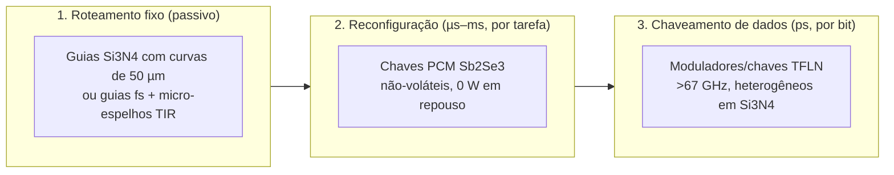

# Roteamento e Comutação Óptica: do Espelho Interno ao Comutador em Picossegundos

## 1. O Problema dos Espelhos Internos

A lógica ToF do SilicaCore depende de desviar um pulso para a linha rápida ($d_1$) ou para a linha atrasada ($d_0$). Na arquitetura original, esse desvio é feito por espelhos internos em um bloco de sílica com feixe livre. O modelo físico em `simulations/go/pkg/optical/budget.go` mostra seis obstáculos:

| Obstáculo | Número (simulador, 1550 nm) | Consequência |
| :--- | :--- | :--- |
| **Difração do feixe livre** | Cintura de 5 µm vira raio de **~2.8 mm** após 40.7 mm | **~46 dB** de perda por porta: o feixe não chega ao detector |
| **Sílica não é eletro-óptica** | Sem efeito Pockels (vidro amorfo). Kerr DC: $\Delta n \lesssim 10^{-9}$ | Reflexão interna total só abaixo de **0.002°** de rasância: "espelho EO" em SiO₂ inviável |
| **AOM é lento** | Trânsito acústico em 100 µm de sílica: **16.8 ns** | 3 ordens de grandeza acima da escala de ps |
| **Perda acumulada** | Espelho metálico: 2–5% por reflexão. Bragg: banda e ângulo estreitos | Sem regeneração, a cascata de portas morre em poucas etapas |
| **Tolerância angular** | Deslocamento $= 2\,\delta\theta\,L$ → $\delta\theta < 0.007°$ para 5 µm a 20 mm | Alinhamento de fabricação impraticável |
| **Espalhamento e crosstalk** | Rayleigh $\propto 1/\lambda^4$: 450 nm espalha **~140×** mais que 1550 nm | Luz parasita entre caminhos num bloco aberto |

> **Conclusão:** o espelho *passivo* não é o problema central. O problema é o **comutador ativo** que escolhe o caminho, e ele não pode ser feito na própria sílica.

---

## 2. Separação em Três Funções

A palavra "espelho" no projeto misturava três funções com requisitos físicos muito diferentes:

| Função | Velocidade | Material recomendado | Estado da arte |
| :--- | :--- | :--- | :--- |
| **Roteamento fixo** | — | **Si₃N₄ sobre SiO₂ multicamada**: curvas de 50 µm, acopladores entre camadas de 0.01 dB | Shang et al., *Opt. Express* 23, 21334 (2015); perdas de 0.7 dB/m em guias de alto aspecto |
| (alternativa em vidro 3D) | — | Guias gravados por laser fs + **micro-espelhos TIR em fenda de ar** (FLICE, 45°) | Perda típica 0.3 dB/cm, benchmark 0.05 dB/cm (*Sci. Rep.* 2018) |
| **Reconfiguração** | µs | **Sb₂Se₃** em guia Si₃N₄ com aquecedor de ITO transparente | >1.4×10⁸ ciclos, 25 dB de extinção, >6 bits multinível (Yu et al., arXiv:2604.11649, 2026); ~0.1 dB por π com afunilamento |
| **Chaveamento rápido** | ps | **Niobato de lítio em filme fino (TFLN)** ligado a Si₃N₄ | Transições LN↔Si₃N₄ <0.1 dB, guia <0.1 dB/cm (Churaev et al., *Nat. Commun.* 14, 3499, 2023); moduladores de 0.2 dB de perda e 67 GHz |

**Por que o GST sai:** o $Ge_2Sb_2Te_5$ absorve fortemente em 1550 nm no estado cristalino. O Sb₂Se₃ é transparente no infravermelho próximo e agora atinge resistência de ciclos compatível com reconfiguração frequente.

---

## 3. Orçamento de Potência por Porta ToF (Simulador, Seção 10)

Premissas: 0 dBm por canal (linha de pente de frequência), sensibilidade de fotodiodo de −10 dBm (margem de 10 dB), 4 curvas/espelhos por porta, caminho atrasado de $t_0 \approx 196.7$ ps.

| Plataforma | Perda por porta | Portas em cascata sem regenerar | Deriva de fase |
| :--- | :---: | :---: | :---: |
| Bloco SiO₂ + espelhos internos (atual) | 46.6 dB | **0** (sem comutador em ps) | 1.78 rad/K |
| Guias fs em vidro + micro-espelhos TIR + TFLN | 6.2 dB | **1** | 1.78 rad/K |
| **Si₃N₄ multicamada + TFLN heterogêneo** | **1.3 dB** | **7** | 3.72 rad/K |

A plataforma Si₃N₄ + TFLN é a única com cascata útil. Mesmo nela, **a cada ~7 portas é preciso regenerar o sinal** (amplificador SOA ou conversão O-E-O). Esse é o critério de *restauração de nível lógico* de Miller (*Nat. Photon.* 4, 3, 2010), que nenhuma porta óptica puramente passiva satisfaz.

A deriva de fase térmica (1.8–3.7 rad/K) é irrelevante para ToF (que lê tempo, não fase), mas **exige estabilização ativa** em tudo que é interferométrico: malha MZI do acelerador de IA e codificação M-ária por fase.

---

## 4. Correção do Orçamento Temporal (Simulador, Seção 10.1)

A documentação anterior afirmava margem de 8.9σ e BER $< 10^{-12}$. O critério correto para decisão entre duas janelas é $Q = \Delta t / 2\sigma$:

- Geometria atual: $Q = 100 / (2 \times 11.24) = 4.45$ → **BER ≈ 4.3×10⁻⁶** (Monte Carlo mede ~2×10⁻⁵).
- Para BER $10^{-12}$: $Q = 7.03$ → **σ total ≤ 7.1 ps** com $\Delta t = 100$ ps.
- **Taxa real por canal:** o slot de símbolo precisa conter as duas janelas: $\Delta t + W \approx 195$ ps → **~5 GHz por canal**, não 206 GHz.
- **Detector:** SPADs têm tempo morto de ~1–2 ns no melhor caso (≤0.5 GHz). Para dados, usar **fotodiodos UTC** (>100 GHz). SPAD fica restrito ao núcleo quântico.

---

## 5. Direção Recomendada: Race Logic Fotônica

A lógica ToF é, em essência, **race logic** (Madhavan, Sherwood & Strukov, ISCA 2014): o valor é o tempo de chegada de uma frente de onda.

| Operação | Implementação óptica |
| :--- | :--- |
| `MIN` (OR temporal) | Combinador + primeira detecção |
| `MAX` (AND temporal) | Última chegada entre entradas |
| `+ constante` | Trecho de guia de atraso (espiral Si₃N₄) |
| Inibição | Chave TFLN bloqueando o caminho |

Os atrasos são **programados por chaves Sb₂Se₃** uma vez por problema, e a luz percorre a rede em picossegundos. Isso encaixa exatamente no que a física permite hoje (reconfiguração lenta, propagação rápida). Resolve nativamente menor caminho em grafos, alinhamento de sequências e DTW, que servem para pathfinding de NPCs em jogos, por exemplo.

Trabalho relacionado mais próximo: **CPU totalmente óptica da Akhetonics** (Kissner et al., arXiv:2403.00045, 2024), com registradores em linha de atraso, memória PCM de escrita única e regeneração 2R. Opera abaixo de 1 GHz no demonstrador e é a referência de comparação honesta para o SilicaCore.

---

## 6. Referências

1. **Miller, D. A. B. (2010).** "Are optical transistors the logical next step?" *Nature Photonics*, 4, 3–5.
2. **Churaev, M., et al. (2023).** "A heterogeneously integrated lithium niobate-on-silicon nitride photonic platform." *Nature Communications*, 14, 3499. [DOI: 10.1038/s41467-023-39047-7](https://doi.org/10.1038/s41467-023-39047-7)
3. **Shang, K., et al. (2015).** "Low-loss compact multilayer silicon nitride platform for 3D photonic integrated circuits." *Optics Express*, 23(16), 21334.
4. **Yu, X., et al. (2026).** "High-Endurance, Low-loss Sb₂Se₃ Optical Switches on Silicon Nitride using Transparent Conductive Heaters." [arXiv:2604.11649](https://arxiv.org/abs/2604.11649)
5. **Alam, M. S., et al. (2024).** "Fast Cycling Speed with Multimillion Cycling Endurance of Ultra-Low Loss Phase Change Material (Sb₂Se₃)." *Advanced Functional Materials*. [DOI: 10.1002/adfm.202310306](https://doi.org/10.1002/adfm.202310306)
6. **Integrated electro-optics on thin-film lithium niobate (2025).** *Nature Reviews Physics*. [DOI: 10.1038/s42254-025-00825-5](https://www.nature.com/articles/s42254-025-00825-5)
7. **Femtosecond-laser-written microstructured waveguides in BK7 glass (2018).** *Scientific Reports*, 8. [DOI: 10.1038/s41598-018-28631-3](https://www.nature.com/articles/s41598-018-28631-3)
8. **Madhavan, A., Sherwood, T., & Strukov, D. (2014).** "Race Logic: A hardware acceleration for dynamic programming algorithms." *ISCA 2014*.
9. **Kissner, M., et al. (2024).** "An All-Optical General-Purpose CPU and Optical Computer Architecture." [arXiv:2403.00045](https://arxiv.org/abs/2403.00045)
10. **Free-running single-photon detection via GHz-gated InGaAs/InP APD, up to 500 Mcount/s (2023).** *Sensors*. [PMC9961215](https://www.ncbi.nlm.nih.gov/pmc/articles/PMC9961215/)
