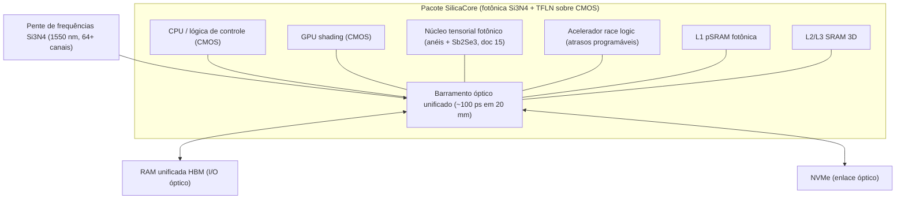

# Memória Unificada Óptica para Jogos e IA Local

## 1. Objetivo

Um processador de alta velocidade e baixo consumo, otimizado para **jogos** e **IA local**. CPU, GPU, acelerador de IA, cache, RAM e armazenamento ficam lado a lado no mesmo pacote, ligados por luz.

## 2. "Tudo na Velocidade da Luz": o que a Física Permite

A latência de uma memória tem duas parcelas:

$$t_{\text{acesso}} = \underbrace{\frac{d \cdot n_g}{c}}_{\text{transporte (luz)}} + \underbrace{t_{\text{célula}}}_{\text{mecanismo de armazenamento}}$$

O **transporte** pode ser óptico em todos os níveis. Dentro de um pacote de 20 mm ele leva **~130 ps**. Quem domina a latência é a **célula**: o tempo para o bit ser lido do meio físico que o guarda. O simulador (seção 11) mostra:

| Nível | Tecnologia | Transporte | Célula | Capacidade |
| :--- | :--- | ---: | ---: | :--- |
| L1 / registradores | SRAM fotônica (micro-anéis acoplados, 40 GHz, projeto simulado) | 7 ps | 25 ps | ~1 KB por retículo inteiro |
| L2 / L3 | SRAM eletrônica empilhada sob o die fotônico | 13 ps | 2 ns | 64–256 MB |
| Pesos de IA | PCM Sb₂Se₃ em guia Si₃N₄ (>6 bits/célula) | 33 ps | ~100 ps | limitada por área |
| RAM unificada | HBM/LPDDR via I/O óptico co-empacotado | 133 ps | ~30 ns | 64–192 GB |
| Armazenamento | NVMe flash via enlace óptico | 334 ps | ~50 µs | 1–8 TB |
| Arquivo | Voxels 5D em vidro (Project Silica, escrita única) | — | ms–s | TB/placa |

**Conclusão:** "L1 = L2 = L3 = RAM na mesma velocidade" não é alcançável com capacidade de gigabytes. O que é alcançável é:
1. **Transporte uniforme na velocidade da luz** entre todos os blocos (barramento óptico com latência plana de ~100 ps).
2. **Memória unificada** (CPU, GPU e IA enxergam o mesmo espaço de endereços, sem cópias), como em arquiteturas de memória unificada atuais, mas com banda óptica.
3. **Hierarquia rasa**: poucos níveis, todos próximos.

### 2.1 Por que a RAM em linha de atraso não escala

Uma linha recirculante guarda só os bits "em voo": $N = R \cdot \tau \cdot N_{\text{canais}}$.
- Laço de 96.7 ps, 64 canais a 100 Gbps: **619 bits**.
- Para 16 GB: **~3.000 km de guia de onda**, com amplificação a cada volta (acumulando ruído ASE).

A linha de atraso serve como **registrador/buffer** (como na CPU óptica da Akhetonics), não como RAM principal.

### 2.2 SRAM fotônica (L1)

A pSRAM com micro-anéis acoplados em cruz foi **projetada** no PDK GlobalFoundries 45SPCLO e, em simulação, lê e escreve a **40 GHz** com **0.6 pJ/bit** de energia de chaveamento (arXiv:2503.19544). Cada bit ocupa 330 × 290 µm², então um retículo inteiro guardaria ~9 kbit (~1 KB). É candidata a poucos registradores ópticos, não a uma cache L1.

---

## 3. IA Local: Pesos no Chip ou Streaming?

O maior gargalo de um LLM local é a geração token a token: **cada token lê todos os pesos uma vez**. O simulador (seção 11.1) compara duas opções.

| Modelo (4 bits) | Tamanho | Área de PCM para guardar tudo no chip | Limite por banda (HBM3, 3.35 TB/s) |
| :--- | ---: | ---: | ---: |
| 1B | 0.5 GB | 250 cm² | ~6.700 tok/s |
| 8B | 4 GB | 2.000 cm² | ~840 tok/s |
| 70B | 35 GB | 17.500 cm² | ~96 tok/s |

Um retículo de litografia tem **8.6 cm²**, mesmo com pitch otimista de 5 µm e 6 bits/célula. **Pesos de LLM não cabem inteiros em PCM fotônica no chip.** Arquitetura recomendada:

- **Pesos em RAM unificada de alta banda** (HBM), entregues por **I/O óptico** ao núcleo tensorial fotônico.
- **PCM Sb₂Se₃ no chip** para as camadas mais usadas (embeddings, adaptadores LoRA, modelos pequenos de visão e voz), computando em memória sem mover dados.
- **KV-cache e ativações** em SRAM eletrônica: exigem escrita constante, e PCM tem ciclos limitados (~10⁸).

### 3.1 Referências reais de aceleradores fotônicos de IA (2024–2025)

| Sistema | Resultado | Eficiência real |
| :--- | :--- | :--- |
| **Lightmatter** (Ahmed et al., *Nature* 640, 2025) | 4 núcleos tensoriais 128×128, 6 chips em 3D. Roda ResNet, BERT e Atari com precisão próxima de FP32 | 65.5 TOPS (ABFP16) com **78 W elétricos + 1.6 W ópticos** ≈ **0.84 TOPS/W no sistema** |
| **Lightelligence PACE** (Hua et al., *Nature* 640, 2025) | >16.000 componentes, matriz 64×64. Resolve Ising com latência de ~5 ns | ~500× mais rápido que GPU nessa tarefa |
| **Taichi** (Xu et al., *Science* 384, 2024) | Chiplet difrativo + interferométrico | 160 TOPS/W (no chiplet, sem periféricos) |

**Correção importante:** os ">100 TOPS/W" do SilicaCore valem **no núcleo óptico**. No sistema completo (lasers, conversores DAC/ADC, controle CMOS, estabilização térmica), o estado da arte publicado está na ordem de **1 TOPS/W**. A engenharia de baixo consumo precisa atacar exatamente esses periféricos.

---

## 4. Jogos: Onde a Óptica Ganha e Onde Não Ganha

| Carga de trabalho de jogo | Óptica ajuda? | Motivo |
| :--- | :---: | :--- |
| Upscaling neural, geração de quadros, denoise de ray tracing | **Sim** | São multiplicações matriz-vetor em INT8/FP8: o ponto forte do núcleo tensorial fotônico |
| Pathfinding de NPCs, navegação em grafos | **Sim** | Race logic fotônica (doc 11, seção 5) |
| Interconexão CPU↔GPU↔RAM | **Sim** | Banda alta e energia/bit baixa via I/O óptico co-empacotado |
| Shading, rasterização, física com ramificações e FP32 | **Não** | Não-linear, alta precisão e cheio de desvios: continua em lógica eletrônica |
| "Ray tracing óptico nativo" | **Não** | A luz no vidro não traça uma cena virtual; ray tracing é geometria numérica |

---

## 5. Diagrama da Arquitetura Proposta

---

## 6. Referências

1. **Ahmed, S. R., et al. (2025).** "Universal photonic artificial intelligence acceleration." *Nature*, 640, 368–374.
2. **Hua, S., et al. (2025).** "An integrated large-scale photonic accelerator with ultralow latency." *Nature*, 640, 361–367. [DOI: 10.1038/s41586-025-08786-6](https://www.nature.com/articles/s41586-025-08786-6)
3. **Xu, Z., et al. (2024).** "Large-scale photonic chiplet Taichi empowers 160-TOPS/W artificial general intelligence." *Science*, 384, 202–209.
4. **Design of Energy-Efficient Cross-coupled Differential Photonic-SRAM (pSRAM) Bitcell (2025).** [arXiv:2503.19544](https://arxiv.org/abs/2503.19544)
5. **Alexoudi, T., Kanellos, G. T., & Pleros, N. (2020).** "Optical RAM and integrated optical memories: a survey." *Light: Science & Applications*, 9, 91. [DOI: 10.1038/s41377-020-0325-9](https://www.nature.com/articles/s41377-020-0325-9)
6. **Anderson, P., et al. (2023).** "Project Silica: Towards Sustainable Cloud Archival Storage in Glass." *SOSP 2023*. [PDF](https://www.microsoft.com/en-us/research/wp-content/uploads/2023/09/ProjectSilica-SOSP23.pdf)
7. **Yu, X., et al. (2026).** Sb₂Se₃ switches on Si₃N₄. [arXiv:2604.11649](https://arxiv.org/abs/2604.11649)
8. **Kissner, M., et al. (2024).** All-optical general-purpose CPU. [arXiv:2403.00045](https://arxiv.org/abs/2403.00045)
