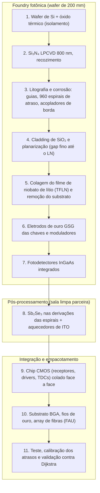

# Fabricação e Prototipagem: Como o SilicaCore Seria Produzido

> **Escopo.** Este documento descreve como o chip de race logic 16×16 (RL-16) seria fabricado com a tecnologia disponível em 2026, e o roteiro de protótipos que leva da bancada em fibra ([doc 13](13-bancada-experimental-em-fibra.md)) até o chip completo. Nada disto foi fabricado ainda. Custos não são estimados aqui: dependem de cotação com cada fornecedor.

## 1. Modelo de produção: sem fábrica própria

Uma fábrica de semicondutores própria custa bilhões e não se justifica para um acelerador de pesquisa. O caminho realista é o modelo usado por startups de fotônica (*fab-lite*):

| Papel | Quem faz | O que entrega |
| :--- | :--- | :--- |
| Projeto (design house) | Equipe do SilicaCore | Layout do chip, simulação, testes, software de programação dos mapas |
| Foundry fotônica | LIGENTEC (Si₃N₄ AN800 + TFLN + fotodetectores InGaAs) | Wafer com guias, espirais, chaves TFLN e detectores |
| Pós-processamento | Sala limpa parceira (ex.: LNNano/CNPEM, Campinas) | Deposição das chaves Sb₂Se₃ com aquecedores de ITO |
| Foundry CMOS | Wafer compartilhado (MPW) de CMOS | Chip de eletrônica: receptores, comparadores, drivers e TDCs |
| Empacotamento | Casa de empacotamento fotônico | União dos dois chips, fibras, fios de ouro, substrato BGA |
| Teste e calibração | Laboratório da equipe | Medição dos atrasos, calibração e validação contra Dijkstra |

Os protótipos usam **wafers compartilhados (MPW)**: vários projetos dividem o mesmo wafer e o custo. A LIGENTEC anuncia cerca de 15 rodadas por ano entre suas plataformas.

## 2. Por que essas escolhas de foundry

| Requisito do projeto (validado nos docs 11 e artigo) | Oferta encontrada em 2026 |
| :--- | :--- |
| Si₃N₄ de 800 nm, guia monomodo 800 nm × 0,7 µm, curvas de R ≥ 30 µm | **LIGENTEC MPW-AN800**: Si₃N₄ de 800 nm em fábrica de 200 mm |
| Chaves eletro-ópticas de niobato de lítio em filme fino sobre Si₃N₄ | **LIGENTEC MPW-LN**: Si₃N₄ de 800 nm com moduladores TFLN (processo da linha de Churaev et al., 2023) |
| Fotodetectores rápidos em cada nó | **Integração de fotodetectores InGaAs** nas rodadas AN800 a partir de 2026 |
| Alternativa só de TFLN | **CCRAFT** (spin-off do CSEM): foundry de TFLN com rodadas MPW |
| Eletrônica e óptica no mesmo chip (alternativa) | **GlobalFoundries Fotonix (45SPCLO)**: CMOS de 45 nm + fotônica de silício + guias de SiN + fotodetectores de germânio, monolítico em 300 mm |

O Sb₂Se₃ ainda não faz parte do catálogo de nenhuma foundry: as chaves com aquecedores de ITO transparente sobre Si₃N₄ foram demonstradas em pesquisa (Yu et al., 2026), por isso entram como pós-processamento.

## 3. Fluxo de fabricação do chip completo



### Detalhe por etapa

| Etapa | Processo | Por que importa para o desempenho |
| :--- | :--- | :--- |
| 1–2 | Óxido térmico + Si₃N₄ LPCVD de 800 nm | Guia de baixa perda (< 0,1 dB/cm) e índice de grupo ~2,06, que define o comprimento de cada atraso |
| 3 | Litografia das espirais (4 estágios binários por aresta, R ≥ 30 µm) | O erro de comprimento vira erro de tempo: 1 µm de guia ≈ 6,9 fs. A premissa de 0,5 ps rms por aresta equivale a ~70 µm de tolerância após calibração |
| 4 | Cladding e planarização | O gap de óxido entre Si₃N₄ e LN (100 nm no FDTD) controla a transição adiabática, que satura com taper ≥ 25 µm |
| 5–6 | Colagem do TFLN e eletrodos de ouro | Chaves e moduladores de re-disparo acima de 67 GHz; 960 moduladores no RL-16 |
| 7 | Fotodetectores InGaAs | Um por aresta de entrada: 960 no RL-16 |
| 8 | Sb₂Se₃ + ITO | 7680 chaves não-voláteis que selecionam os estágios de atraso (os pesos do mapa); 0 W para manter o mapa |
| 9 | Chip CMOS colado face a face (flip-chip ou hybrid bonding) | É o que permite ~20 ps de latência por nó; com eletrônica fora do encapsulamento a latência sobe para nanossegundos |
| 10 | Encapsulamento: BGA, fios de ouro, FAU com fibras | O acoplamento fibra-chip deve ficar em ≤ 1,5 dB; o laser (pente de frequências em 1550 nm) fica fora, ligado por fibra |
| 11 | Teste e calibração | Mede cada atraso, corrige o erro estático e compara a corrida com Dijkstra em milhares de origens |

## 4. Seção transversal do chip (não em escala)

```text
   array de fibras (FAU) ──►┃
                             ┃  ┌──────────── chip CMOS (receptores, drivers, TDCs) ────────────┐
                             ┃  └──────┬───────────────┬──────────────────────┬────────────────┘
                             ┃         │ micro-bumps   │                      │
   ──────────────────────────╂─────────┴───────────────┴──────────────────────┴───────────────
   óxido de topo + ITO       ┃   [ITO]      [Au GSG]         [InGaAs PD]         [pads]
   Sb₂Se₃                    ┃   ▒▒▒▒
   filme de LN (300 nm)      ┃          ████████████
   gap de SiO₂ (100 nm)      ┃
   Si₃N₄ (800 nm × 0,7 µm)   ┃   ▀▀▀▀   ▀▀▀▀▀▀▀▀▀▀▀▀   ▀▀▀▀  espirais de atraso  ▀▀▀▀
   óxido térmico (isolamento)┃
   wafer de silício          ┃
```

## 5. Roteiro de protótipos

O RL-16 ocupa 648 mm², quase um retículo inteiro (858 mm²): não cabe numa rodada compartilhada e exige rodada dedicada. Por isso os protótipos crescem por etapas, e cada uma mede premissas do simulador.

| Geração | O que é fabricado | Onde | O que mede |
| :--- | :--- | :--- | :--- |
| **G0 · Bancada em fibra** | Porta ToF, um nó e grafo 3×3 com peças comerciais | Laboratório ([doc 13](13-bancada-experimental-em-fibra.md)) | Jitter, Q, latência do nó e curva de erro por salto |
| **G1 · Chip passivo** | Espirais com R = 20–50 µm, curvas, cruzamentos, acopladores de borda, linhas de atraso de comprimentos conhecidos | MPW AN800 | Perda por curva e por cm, índice de grupo, precisão dos atrasos (valida o FDTD 2D e a premissa de 0,5 ps) |
| **G1b · Duas camadas** | Espirais divididas entre duas camadas de Si₃N₄ com acopladores verticais | Pesquisa em sala limpa / foundry com multicamada | Perda por transição vertical, precisão dos atrasos, área real (decide o RL-32) |
| **G2 · Chip ativo** | Chaves TFLN, transição Si₃N₄→LN e fotodetectores InGaAs; uma porta ToF no chip | MPW-LN + fotodetectores | Perda real da chave e da transição (premissa de 1,0 dB), resposta dos detectores, Q da porta |
| **G2b · Pesos programáveis** | Sb₂Se₃ + ITO depositados sobre dies de G1/G2 | Sala limpa parceira | Perda por chave (premissa de 0,25 dB), ciclos, tempo de programação (premissa de 1 µs) |
| **G3 · Primeiro nó real** | Grafo 2×2 ou 3×3 fotônico + chip CMOS de receptores, drivers e TDCs colado face a face | MPW-LN + MPW CMOS + empacotamento | Latência (premissa de 20 ps) e jitter (1,5 ps) do nó integrado; primeira corrida no chip |
| **G4 · RL-16** | Chip 16×16 completo com CMOS 3D e encapsulamento BGA | Rodada dedicada + empacotamento | Todos os números do artigo e do site, agora medidos |

Um grafo 4×4 (48 arestas) ocuparia cerca de 32 mm² de espirais com unidade de 100 ps (0,675 mm² por aresta), o que o torna candidato para G3 em rodada compartilhada.

## 6. Premissas do simulador e onde cada uma será medida

| Premissa | Valor no modelo | Geração que mede |
| :--- | :--- | :--- |
| Perda de propagação Si₃N₄ | 0,1 dB/cm | G1 |
| Perda por curva (R ≥ 30 µm) | 0,01 dB | G1 |
| Erro estático de atraso por aresta | 0,5 ps rms | G1 (antes da calibração) e G3 (depois) |
| Perda da chave TFLN com transições | 1,0 dB | G2 |
| Perda da chave Sb₂Se₃ | 0,25 dB | G2b |
| Tempo de programação do mapa | 1 µs | G2b |
| Latência e jitter do nó | 20 ps, 1,5 ps rms | G0 (bancada, em ns) e G3 (integrado) |
| Potência de receptores e TDCs | 5 mW e 4,1 mW por canal | G3 |
| Acoplamento chip-chip (multi-chip) | ≤ 1,5 dB por face | G4 |

## 7. Subindo em vez de espalhar: empilhamento em camadas

A área é o principal limite de escala (648 mm² para o 16×16). A resposta natural é a que motivou o cubo original: **crescer para cima**. A forma de subir, porém, precisa respeitar a física dos guias:

| Forma de empilhar | Viável? | Motivo |
| :--- | :--- | :--- |
| Cubo maciço de vidro com guias gravados por laser de femtossegundo | Não para as espirais | Contraste de índice baixo (Δn ~ 5×10⁻³) exige curvas de ~15–30 mm; uma espiral de atraso ocuparia centímetros |
| **Si₃N₄ multicamada** (planos de guias separados por óxido) | Sim | Curvas de dezenas de µm em cada plano; acopladores verticais entre camadas com ~0,01 dB (Shang et al., 2015) |
| **Chips fotônicos empilhados** (3D, como memória HBM) | Sim, mais caro | Cada chip é um andar; acoplamento vertical ou por fibra entre andares |

**Ganho de área com N camadas** (unidade de 100 ps, Si₃N₄ grosso, espaçamento de 3 µm entre espirais):

| Mapa | 1 camada | 2 camadas | 4 camadas | 8 camadas |
| :--- | ---: | ---: | ---: | ---: |
| 16×16 | 648 mm² | 324 mm² | 162 mm² | 81 mm² |
| 32×32 | 2677 mm² | 1339 mm² | **669 mm² (cabe no retículo)** | 335 mm² |

Dividir os estágios de atraso de cada aresta entre camadas custa só os acopladores verticais (~0,02 dB por ida e volta), desprezível frente à margem de 10 dB. O calor não limita: o chip inteiro dissipa ~9 W.

**Ressalvas:**
- O Si₃N₄ multicamada demonstrado usa filmes finos (200 nm), porque camadas grossas de 800 nm acumulam tensão e racham ao empilhar. No FDTD deste projeto, o guia fino perde 0,22 dB por curva com R = 50 µm e só cai para 0,06 dB com 80 µm, e seu índice de grupo menor (~1,75) alonga cada espiral em ~18%. Parte do ganho de área se perde.
- Empilhar Si₃N₄ grosso é possível em pesquisa (processo damasceno, que evita as rachaduras), mas não está no catálogo das foundries em 2026.
- Cada camada acrescenta etapas de deposição, planarização e alinhamento, e reduz o rendimento.

**Protótipo proposto (G1b):** duas camadas de Si₃N₄ com espirais divididas entre elas e acopladores verticais, medindo perda por transição, precisão dos atrasos e área real ocupada. É o teste que decide se o RL-32 (32×32) pode existir num único chip.

## 8. Riscos de fabricação

- **Área:** 960 espirais com todos os estágios binários ocupam 648 mm². Empilhar camadas (seção 7) e compartilhar atrasos entre arestas são os dois caminhos para reduzi-la.
- **Integração de três tecnologias** (Si₃N₄/TFLN, Sb₂Se₃ e CMOS): cada interface acrescenta perda e rendimento menor. G2b e G3 existem para medir isso antes do chip completo.
- **Rendimento:** com 7680 chaves e 960 detectores, defeitos individuais precisam ser tolerados; a programação pode contornar arestas defeituosas marcando-as como caminhos proibidos.
- **Calibração:** o erro de fabricação dos atrasos só atinge 0,5 ps rms com medição e correção por chip; o teste precisa ser automatizado.
- **Dependência de fornecedores externos:** foundries estrangeiras e wafers de TFLN importados. Desenvolver no Brasil a cadeia do cristal ao wafer TFLN (doc 11, seção 6) reduziria essa dependência.

## 9. Referências

1. LIGENTEC — MPW (AN150, AN350, AN800, LN; ~15 rodadas por ano). [ligentec.com/offering/mpw](https://www.ligentec.com/offering/mpw/)
2. LIGENTEC — Moduladores TFLN sobre Si₃N₄. [ligentec.com/thin-film-lithium-niobate-modulators](https://www.ligentec.com/thin-film-lithium-niobate-modulators/)
3. CSEM / CCRAFT — Foundry de TFLN. [csem.ch/en/tailored-services/tfln-foundry-services](https://www.csem.ch/en/tailored-services/tfln-foundry-services/)
4. GlobalFoundries Fotonix — plataforma monolítica CMOS + fotônica de silício em 300 mm. [Optica webinar (2025)](https://www.optica.org/events/webinar/2025/10_october/300-mm_monolithic_cmos_silicon_photonics_foundry_technology/)
5. Churaev, M., et al. (2023). A heterogeneously integrated lithium niobate-on-silicon nitride photonic platform. *Nature Communications*, 14, 3499.
6. Yu, X., et al. (2026). High-endurance, low-loss Sb₂Se₃ optical switches on silicon nitride using transparent conductive heaters. [arXiv:2604.11649](https://arxiv.org/abs/2604.11649)
7. LNNano/CNPEM — Salas limpas e instalações abertas. [lnnano.cnpem.br](https://lnnano.cnpem.br/instalacoes-divisoes/)
8. Shang, K., et al. (2015). Low-loss compact multilayer silicon nitride platform for 3D photonic integrated circuits. *Optics Express*, 23(16), 21334.
