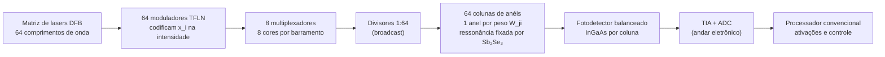

# O Andar de IA: Unidade Tensorial Fotônica (PTU) sobre o Processador Convencional

> **Status (v1.0, 29/09/2026):** projeto conceitual com orçamento calculado de baixo para cima. Nada aqui foi fabricado ou simulado em FDTD. Todos os números vêm de `simulations/ptu/ptu_budget.py` (resultados em `simulations/results/ptu_budget_rin150.txt` e `ptu_budget_rin160.txt`) e das premissas da seção 9. Este documento substitui a arquitetura esboçada no [doc 07](07-acelerador-tensor-ia-fototectonico.md).

## 1. O que este andar faz e o que ele não faz

O RL-16 resolve caminho mínimo por corrida de luz. Ele **não** executa redes neurais. Uma rede neural gasta quase todo o seu tempo numa só operação, a multiplicação matriz-vetor:

$$y_j = \sum_{i=1}^{N} W_{ji}\, x_i \qquad (j = 1 \dots M)$$

A proposta é um **andar dedicado** a essa operação, empilhado com o processador convencional (CPU/GPU/SoC) no mesmo encapsulamento. O processador continua fazendo tudo o que não é multiplicação de matrizes: funções de ativação, softmax, normalização, controle e memória. O andar fotônico faz as multiplicações.

| Tarefa | Quem executa |
| :--- | :--- |
| Multiplicação matriz-vetor (camadas lineares, convoluções) | **PTU fotônica** |
| Ativações (ReLU, GELU), softmax, LayerNorm, somas residuais | Processador convencional, após o ADC |
| Caminho mínimo, Viterbi, DTW, busca do mínimo (top-k) | RL-16 (race logic, docs 02 e 11) |
| Pesos de modelos grandes, KV-cache | RAM unificada (doc 12) |

## 2. Arquitetura escolhida: *broadcast-and-weight* com anéis e Sb₂Se₃

Entre as duas famílias publicadas de processadores fotônicos de MVM, a escolha é a **incoerente com multiplexação por comprimento de onda** (WDM). A malha de interferômetros Mach-Zehnder (Shen et al., 2017) fica fora por dois motivos: exige estabilidade de fase entre centenas de braços, e os pesos precisam ser recalculados por decomposição SVD.



**Como o cálculo acontece:**
1. Cada entrada $x_i$ recebe sua própria cor (comprimento de onda $\lambda_i$). Um modulador TFLN ajusta a intensidade daquela cor ao valor de $x_i$.
2. As 64 cores são divididas igualmente entre as 64 colunas (*broadcast*). Cada coluna recebe uma cópia do vetor inteiro.
3. Em cada coluna, um microanel sintonizado em $\lambda_i$ desvia uma fração da cor $i$ para a porta *drop*, e o resto segue pela porta *through*. Essa fração é o peso $W_{ji}$.
4. Um fotodetector balanceado mede *drop* menos *through*. A fotocorrente é a soma de todas as cores, ou seja, o produto escalar $\sum_i W_{ji} x_i$. O resultado sai com **sinal**, com pesos entre −1 e +1.
5. O TIA converte a corrente em tensão e o ADC digitaliza. O processador aplica a ativação e devolve o próximo vetor.

**Por que Sb₂Se₃ nos anéis:** o Sb₂Se₃ é quase transparente em 1550 nm (Delaney et al., 2020). Ele muda o **índice**, não a absorção, e é exatamente isso que desloca a ressonância de um anel. O peso fica gravado sem consumo, a mesma propriedade usada nas chaves do RL-16. Com isso o andar de IA reaproveita o processo de pós-deposição já previsto no doc 14 (etapa 8).

**Por que 8 cores por barramento, e não 64:** um anel de Si₃N₄ com R = 30 µm tem período espectral (FSR) de 6,19 nm. Com 64 cores espaçadas 0,8 nm (100 GHz), a faixa total ocupa 50 nm e cada anel responderia a várias cores. Por isso as 64 entradas são divididas em 8 grupos de 8 cores (5,6 nm por grupo). Os fotodetectores dos 8 grupos de uma coluna são ligados em paralelo, e as correntes se somam no mesmo nó elétrico. Essa soma é incoerente, então não há interferência.

## 3. Onde fica o andar: empilhamento com o processador

A ideia de um "andar acima" do processador convencional tem uma justificativa forte, que é a **banda entre os dois andares**. Uma PTU 64×64 a 10 GS/s com 6 bits troca **7,68 Tb/s** com a eletrônica. Um andar com 8 PTUs troca ~61 Tb/s (~7,7 TB/s). Isso não passa por pinos de um encapsulamento lado a lado, mas passa com folga por **hybrid bonding** (ligação cobre-cobre direta entre chips, com milhares de contatos por mm²). O empilhamento, então, não é estética: ele é o que torna a PTU utilizável.

O cuidado é **térmico**. A ressonância de um anel de Si₃N₄ se desloca ~0,02 nm por kelvin. A largura útil do anel para sinais de 10 GHz é ~0,16 nm, então **8 K de variação tiram o anel do lugar**. Um processador sob carga varia dezenas de graus.

| Opção | Ordem dos andares (de baixo para cima) | Vantagem | Problema |
| :--- | :--- | :--- | :--- |
| **A · PTU no topo** (a ideia original) | substrato → processador → eletrônica da PTU → **PTU** → dissipador | Fotônica mais perto do dissipador e da borda para fibras | Todo o calor do processador atravessa os anéis; o controle de ressonância fica no pior caso (~4 W por PTU) |
| **B · PTU como base** (recomendada) | substrato → **PTU (interposer fotônico)** → eletrônica da PTU → processador → dissipador | O calor do processador vai direto para o dissipador; os anéis ficam numa região de temperatura mais estável | As conexões do processador com o substrato precisam atravessar a PTU (TSVs) |

As duas opções são "andares" do mesmo cubo e usam as mesmas peças. A opção B é o caminho que a indústria já segue em interposers fotônicos. A opção A é viável se o andar fotônico tiver isolamento térmico e controle ativo dos anéis, e o custo disso aparece no orçamento como a faixa superior de "controle dos anéis".

```
  Opção B (recomendada), seção transversal, não em escala

  ┌──────────────────── dissipador ────────────────────┐
  │  Processador convencional (CPU/GPU/SoC)   ~quente   │
  ├──────────────── hybrid bonding Cu–Cu ──────────────┤
  │  Eletrônica da PTU: DACs, TIAs, ADCs, drivers       │
  ├──────────────── hybrid bonding Cu–Cu ──────────────┤
  │  PTU fotônica: Si₃N₄ + TFLN + anéis Sb₂Se₃ + InGaAs │◄── fibras / lasers
  │  (TSVs levam alimentação e sinais do processador)  │    pela borda
  ├─────────────────────── BGA ────────────────────────┤
  └───────────────────── substrato ────────────────────┘
```

O RL-16 e suas camadas (doc 14, seção 7) podem ocupar outros andares fotônicos do mesmo empilhamento ou ficar lado a lado com a PTU no interposer.

## 4. Orçamento de ruído: quantos bits a luz entrega

A precisão de um cálculo analógico é limitada pelo ruído. O script procura a menor fotocorrente de fundo de escala $I_{fs}$ em que o ruído analógico total fica igual ao ruído de quantização de um conversor de *B* bits:

$$\sqrt{\sigma_{TIA}^2 + 2qI_{fs}\Delta f + \mathrm{RIN}\cdot\Delta f\cdot I_{fs}^2} \;=\; \frac{2I_{fs}}{2^{B}\sqrt{12}}$$

com $\Delta f$ = 5 GHz (metade da taxa de 10 GS/s), $\sigma_{TIA}$ = 20 pA/√Hz × √Δf = 1,41 µA e perda óptica total de 9 dB (seção 9).

| Bits efetivos | Fotocorrente de fundo de escala | Potência por cor (antes das perdas) | Laser (elétrico, 64 cores) |
| ---: | ---: | ---: | ---: |
| 4 | 40 µA | 0,32 mW | 0,10 W |
| 5 | 82 µA | 0,65 mW | 0,21 W |
| **6** | **173 µA** | **1,37 mW** | **0,44 W** |
| 7 | 418 µA | 3,32 mW | 1,06 W |
| 8 (laser com RIN −150 dB/Hz) | 19,8 mA | 157 mW | 50 W, inviável |
| 8 (laser com RIN −160 dB/Hz) | 858 µA | 6,82 mW | 2,18 W |

**Leitura:** até 6–7 bits a luz é barata. Em 8 bits o **ruído de intensidade do laser (RIN)** vira o limite: com um laser DFB comum (−150 dB/Hz), o próprio laser impede os 8 bits. Por isso o ponto de projeto é **6 bits efetivos**, e a opção de 8 bits exige lasers de baixo ruído (≤ −160 dB/Hz). Isso é suficiente para inferência com modelos quantizados em INT4 e, com treino ciente de ruído, INT8. **Não é suficiente para treinar redes**.

## 5. Orçamento de energia e desempenho de uma PTU 64×64

Vazão: 64 × 64 = 4096 multiplicações-acumulações (MAC) por amostra × 10 GS/s = 4,1 × 10¹³ MAC/s = **81,9 TOPS** (2 operações por MAC).

| Bloco | Como é calculado | 6 bits | 8 bits (RIN −160) |
| :--- | :--- | ---: | ---: |
| Lasers | 64 cores × potência por cor ÷ eficiência de 20% | 0,44 W | 2,18 W |
| DACs + drivers dos moduladores | 64 × 10 GS/s × 1 pJ | 0,64 W | 0,64 W |
| ADCs | 64 × 10 GS/s × 30 fJ/passo × 2^B | 1,23 W | 4,92 W |
| TIAs | 64 × 15 mW | 0,96 W | 0,96 W |
| Controle dos anéis | 4096 anéis × 0,1 a 1 mW | 0,41–4,10 W | 0,41–4,10 W |
| Controle digital e buffers | estimado | 0,30 W | 0,30 W |
| **Total** | | **4,0–7,7 W** | **9,4–13,1 W** |
| **Eficiência** | | **10,7–20,6 TOPS/W** | **6,3–8,7 TOPS/W** |
| **Energia por MAC** | | **97–187 fJ** | **230–320 fJ** |

Três conclusões honestas:
- **Os conversores dominam, não a luz.** Em 6 bits, o laser é ~6–11% da conta. ADCs, TIAs e DACs somam ~2,8 W. Isso bate com o que o doc 10 e o sistema publicado da Lightmatter mostram: a periferia elétrica define a eficiência.
- **O controle dos anéis é a maior incerteza.** Ele varia 10× entre a hipótese otimista (anéis corrigidos de fábrica pelo Sb₂Se₃ e temperatura do chip estável) e a pessimista (aquecedor ativo em cada anel). Medir essa faixa é o objetivo do protótipo T1.
- **Comparação justa:** uma H100 entrega 1979 TOPS em INT8 denso a 700 W, ~2,8 TOPS/W (~707 fJ/MAC) **incluindo a memória HBM**. A PTU em 6 bits fica 4 a 7 vezes melhor **sem contar a memória** e com 2 bits a menos de precisão. A vantagem é real, mas é de uma ordem de grandeza, não de mil vezes.

Latência de uma multiplicação: DAC (~1 ns) + luz no chip (~0,1–0,2 ns) + TIA e ADC (~2–3 ns) ≈ **3–5 ns**. Um vetor novo pode entrar a cada 100 ps (pipeline).

## 6. Área, capacidade e o que cabe no andar

| Item | Valor |
| :--- | ---: |
| Célula de peso (anel R = 30 µm com acopladores) | 80 × 80 µm |
| Anéis de uma PTU (4096) | 26,2 mm² |
| Moduladores TFLN (64 × ~0,5 mm²) | 32 mm² |
| Divisores, detectores, roteamento | ~10 mm² |
| **PTU 64×64** | **~68 mm², 1,2 TOPS/mm²** |
| **Andar com 8 PTUs** (cabe no retículo de 858 mm²) | **~546 mm², 655 TOPS, 32–61 W em 6 bits, 32 768 pesos** |

A densidade de potência do andar (≤ 11 W/cm²) é baixa perto de um processador (50–100 W/cm²). O limite real é a **capacidade**: 32 768 pesos gravados por andar. O andar opera de dois modos:

| Modo | Como os pesos entram | Serve para | Limite |
| :--- | :--- | :--- | :--- |
| **A · Pesos fixos** (Sb₂Se₃) | Gravados uma vez, 0 W para manter | Modelos pequenos sempre ligados: palavra-chave de voz, detecção de pessoas, filtros de imagem, adaptadores, *embeddings* de busca | O modelo inteiro precisa caber em ~33 mil pesos por andar; reprogramar a PCM leva µs a ms por célula |
| **B · Pesos dinâmicos** (aquecedor ou fase TFLN por anel) | Carregados da RAM por bloco e reutilizados | Camadas maiores com muito reuso: convoluções e *prefill* de LLM com lote | Cada bloco de 4096 pesos em 6 bits atualizado a 100 MHz pede 2,5 Tb/s por PTU; o bloco precisa servir ~100 vetores para compensar |

**LLMs grandes continuam limitados pela memória.** Gerar um token de um modelo de 8B parâmetros em 4 bits exige ler ~4 GB da RAM. Nenhuma velocidade de cálculo muda isso (doc 12). A PTU acelera a parte do trabalho limitada por cálculo, não a leitura dos pesos.

## 7. Como o software usa o andar

1. **Quantização:** o modelo é convertido para INT4/INT8 e treinado com ruído injetado igual ao medido no chip (*noise-aware training*).
2. **Mapeamento:** cada camada é cortada em blocos de 64×64. Convoluções viram multiplicações de matriz (im2col), e os blocos são distribuídos entre as 8 PTUs.
3. **Calibração:** na inicialização, o controlador mede a matriz efetiva de cada PTU. Isso inclui a diafonia entre canais vizinhos (−20 dB) e entre ordens do anel (−17 dB). O controlador corrige tudo digitalmente, porque são erros lineares e estáticos.
4. **Execução:** o processador envia vetores pelo hybrid bonding, recebe as saídas digitalizadas, aplica ativações e repete.
5. **Monitoramento:** vetores de teste periódicos detectam deriva térmica e disparam a recalibração dos anéis.

## 8. Roteiro de protótipos (alinhado ao doc 14)

| Geração | O que é feito | Onde | O que mede |
| :--- | :--- | :--- | :--- |
| **T0 · Simulação** | Modelo de ruído e energia (`ptu_budget.py`) + rede pequena (MNIST, palavra-chave) executada com o ruído injetado | Computador | Queda de acurácia em 4, 5 e 6 bits; decide o tamanho mínimo útil |
| **T1 · Banco de pesos passivo** | 4×4 com anéis Si₃N₄ e Sb₂Se₃, lasers e moduladores externos | MPW AN800 + pós-deposição (mesmo die de G2b) | Precisão dos pesos (bits), deriva térmica por kelvin, potência de controle por anel |
| **T2 · PTU 16×16 ativa** | Moduladores TFLN, divisores, anéis, detectores balanceados no chip; ADCs externos | MPW-LN + fotodetectores | Bits efetivos reais a 1–10 GS/s; primeira inferência (MNIST) no chip |
| **T3 · PTU 64×64 + eletrônica** | Chip fotônico unido por hybrid bonding a um chip CMOS com DACs, TIAs e ADCs | MPW-LN + MPW CMOS + empacotamento 3D | TOPS/W medido e comparação com a tabela da seção 5 |
| **T4 · Andar de IA** | 8 PTUs como interposer sob um processador comercial (opção B) | Rodada dedicada + parceiro de empacotamento | Desempenho em modelos reais, estabilidade térmica sob carga do processador |

## 9. Premissas do cálculo e onde cada uma será medida

| Premissa | Valor usado | Mede em |
| :--- | :--- | :--- |
| Perda óptica total (acoplamento 1,5 + modulador 2,0 + mux 1,5 + divisor 1,5 + propagação 1,0 + anel 1,0 + detector 0,5 dB) | 9,0 dB | T1, T2 |
| Ruído de entrada do TIA | 20 pA/√Hz | T2, T3 |
| RIN do laser | −150 dB/Hz (DFB comum); −160 dB/Hz na opção de 8 bits | Bancada |
| Eficiência do laser (tomada → luz na fibra) | 20% | Datasheet do laser |
| Responsividade InGaAs | 1,0 A/W | T2 |
| DAC + driver | 1 pJ por amostra | T3 |
| ADC (figura de mérito de Walden) | 30 fJ/passo | T3 |
| TIA | 15 mW por canal | T3 |
| Controle de ressonância por anel | 0,1–1 mW | T1 |
| Deslocamento térmico do anel | 0,02 nm/K | T1 |
| Célula de peso | 80 × 80 µm | T1 |
| Modulador TFLN | ~0,5 mm² | T2 |

Para refazer o cálculo com outras premissas:

```bash
python3 simulations/ptu/ptu_budget.py --rin -160 --size 32 --rate 5e9
```

## 10. Riscos

| Risco | Efeito | Mitigação |
| :--- | :--- | :--- |
| Deriva térmica dos anéis sob o processador | Pesos errados; controle custa até 4 W por PTU | Opção B de empilhamento; correção de fábrica com Sb₂Se₃; recalibração periódica |
| Precisão real abaixo de 6 bits | Acurácia cai em modelos INT8 | Treino ciente de ruído; modelos INT4; medir em T0 antes de fabricar |
| Níveis de Sb₂Se₃ instáveis ou com poucos estados | Pesos com menos resolução | Modo B com fase dinâmica; ajuste fino por aquecedor |
| Capacidade de pesos pequena | Poucos modelos cabem inteiros | Foco em modelos pequenos sempre ligados; modo B para camadas com reuso |
| Custo dos ADCs rápidos | Domina a energia | Reduzir taxa por coluna, compartilhar ADCs no tempo, ou somar vários ciclos no analógico antes de converter |

## 11. Referências

1. **Tait, A. N., et al. (2017).** "Neuromorphic photonic networks using silicon photonic weight banks." *Scientific Reports*, 7, 7430.
2. **Feldmann, J., et al. (2021).** "Parallel convolutional processing using an integrated photonic tensor core." *Nature*, 589, 52–58.
3. **Xu, X., et al. (2021).** "11 TOPS photonic convolutional accelerator for optical neural networks." *Nature*, 589, 44–51.
4. **Shen, Y., et al. (2017).** "Deep learning with coherent nanophotonic circuits." *Nature Photonics*, 11, 441–446.
5. **Ríos, C., et al. (2019).** "In-memory computing on a photonic platform." *Science Advances*, 5, eaau5759.
6. **Delaney, M., et al. (2020).** "A new family of ultralow loss reversible phase-change materials for photonic integrated circuits: Sb₂S₃ and Sb₂Se₃." *Advanced Functional Materials*, 30, 2002447.
7. **Wang, C., et al. (2018).** "Integrated lithium niobate electro-optic modulators operating at CMOS-compatible voltages." *Nature*, 562, 101–104.
8. **Ahmed, S. R., et al. (2025).** "Universal photonic artificial intelligence acceleration." *Nature*. (Sistema Lightmatter: 65,5 TOPS com 78 W elétricos + 1,6 W ópticos.)
9. **Walden, R. H. (1999).** "Analog-to-digital converter survey and analysis." *IEEE Journal on Selected Areas in Communications*, 17(4), 539–550.
10. **NVIDIA (2022).** *H100 Tensor Core GPU Datasheet* (1979 TOPS INT8 denso, 700 W, SXM).
